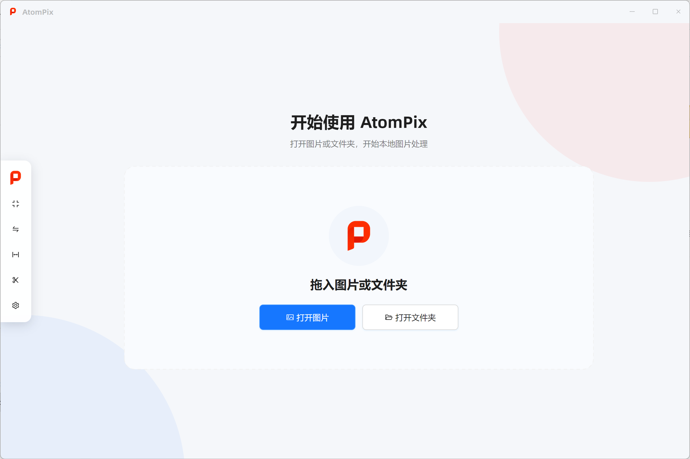
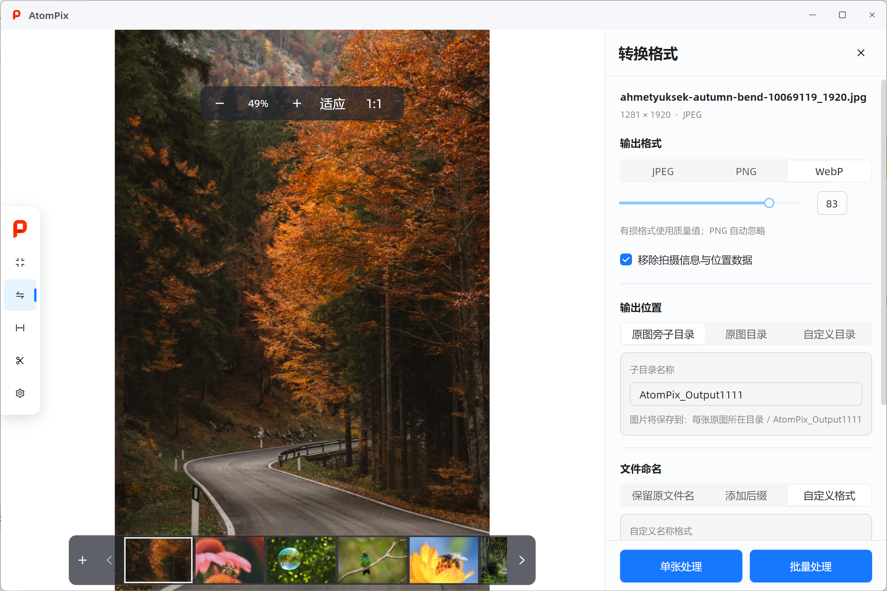
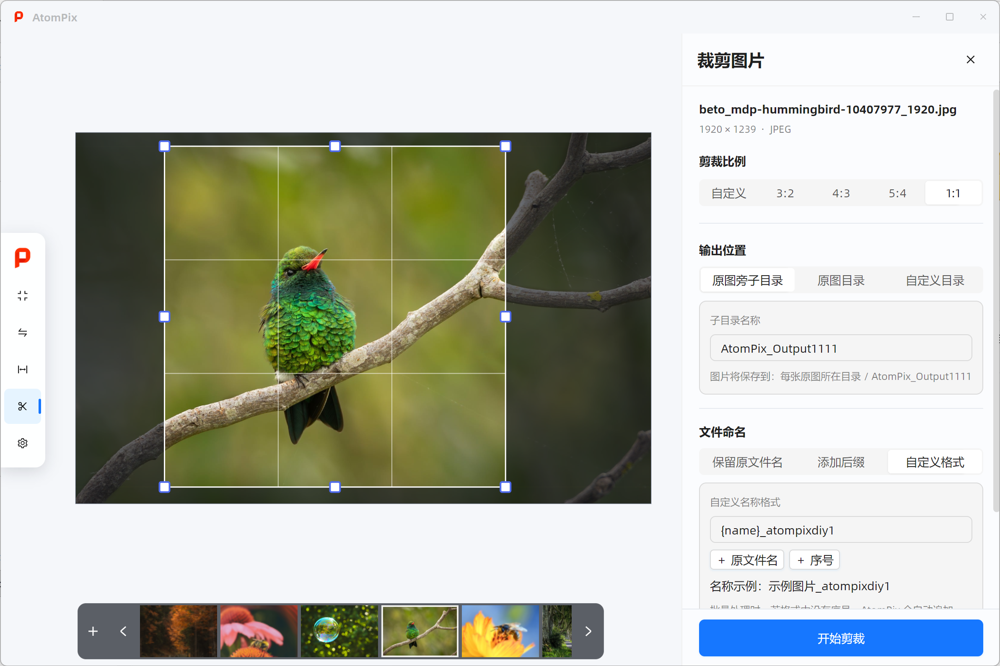
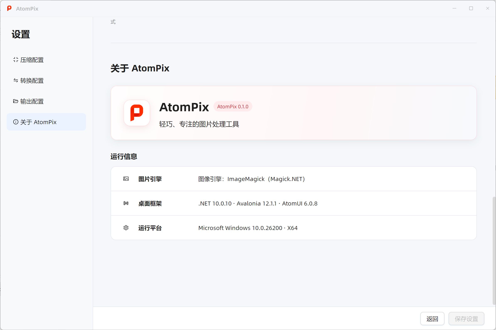

# AtomPix

[English](./README.md) | 简体中文

[](https://github.com/AtomUI/AtomPix/actions/workflows/ci.yml)
[](https://github.com/AtomUI/AtomPix/releases)
[](https://github.com/AtomUI/AtomUI)
[](LICENSE)


AtomPix 是一款轻巧、专注的本地图片浏览与处理桌面工具。

打开一张图片或整个文件夹，在流畅的图片画廊中浏览，然后完成压缩体积、转换格式、调整尺寸或裁剪。图片不需要上传到远程服务；当前版本的全部功能均可直接使用，不需要账号或订阅。



## 功能概览

AtomPix 将主要工作流集中在一个简洁的界面中：

```text
AtomPix
├─ 打开图片或文件夹
├─ 浏览与预览
├─ 压缩体积
├─ 转换格式
├─ 调整尺寸
├─ 裁剪图片
└─ 设置
```

压缩、转换和调整尺寸既可以处理当前图片，也可以处理图片走廊中的完整集合；裁剪则明确保持为单张图片操作。

## 图片浏览器

图片浏览器是 AtomPix 的主要工作区域。

你可以：

- 通过系统选择器打开一张或多张图片。
- 打开文件夹，浏览其当前层级中的受支持图片。
- 从其他位置继续向当前图片走廊追加图片。
- 点击缩略图直接切换当前图片。
- 让图片适应可用区域、按原始大小显示，或者放大和缩小。
- 在浏览和处理之间切换，不需要创建一套独立的“批量任务页面”。

图片走廊中的高亮项是“单张处理”的目标。对于压缩、转换和调整尺寸，“批量处理”会在点击开始时冻结整个图片走廊，形成一次批量请求。

## 压缩图片

AtomPix 可以压缩静态 JPEG、PNG 和 WebP 图片，不会暗中改变图片的像素尺寸或文件格式。

当前提供：

- 智能
- 高质量
- 平衡
- 极限压缩
- 自定义质量

JPEG 和 WebP 使用有损质量参数，PNG 执行无损优化。是否移除拍摄信息和位置数据由独立选项控制。只要编码与写出成功，结果就会被保留；即使原图已经高度优化、输出体积反而增加，也不会被误判为失败或静默丢弃。

单张和批量压缩都会使用真实输入、输出体积展示“减少”“未变化”或“增加”。

## 转换格式

将受支持的静态图片转换为 JPEG、PNG 或 WebP。有损格式可以调整质量，PNG 会自动忽略质量参数。

透明图片转换为 JPEG 时，AtomPix 会使用已配置的背景色铺设透明区域，而不是依赖图片引擎不确定的默认行为；转换为支持透明度的 PNG 或 WebP 时则会保留透明区域。



## 调整尺寸

调整尺寸只改变图片宽度和高度，不裁剪内容，也不自动增加留白。

提供两种方式：

- **按像素**：输入宽度和高度，可以保持原图比例，也可以禁止放大小于目标尺寸的图片。
- **按百分比**：使用同一个百分比同步缩放宽度和高度。

保持宽高比时，修改任意一边会自动计算另一边；同时提供两个像素约束时，AtomPix 会把完整图片等比放入指定边界。批量调整尺寸共享同一套处理规则，但每张图片会根据自己的原始尺寸计算最终结果。

## 裁剪图片

裁剪只保留当前图片中的矩形区域。你可以在画布上拖动选区和控制点，也可以精确输入宽度、高度、X 和 Y 坐标。

AtomPix 提供自由裁剪以及 `3:2`、`4:3`、`5:4`、`1:1` 常用比例。裁剪区域始终限制在原图内部，结果保持原图片格式。当前版本的裁剪仅支持单张处理。



## 输出与批量处理

四项图片处理功能使用一致的输出规则：

- 保存到原图旁的子目录、原图目录或自定义目录。
- 保留原文件名、添加后缀或使用自定义命名格式。
- 遇到已有输出时自动重命名、跳过，或覆盖与输入图片无关的已有文件。
- 永远不允许原地覆盖输入图片。

批量压缩、转换和调整尺寸会显示实时项目数量与处理进度。失败或未完成的项目可以整理为下一次任务，不会改写已经结束的处理结果。多图片输出会在必要时自动加入稳定序号，避免计划文件名互相冲突。

## 设置

设置以普通内容页面呈现，而不是模态弹窗。你可以保存默认压缩参数、转换参数、输出位置、命名方式、同名处理、透明背景和元数据策略。新任务会读取最新保存的默认值；已经开始的任务继续使用提交时冻结的配置快照。



## 下载

请前往 [GitHub Releases](https://github.com/AtomUI/AtomPix/releases) 下载最新版本。

AtomPix 提供以下自包含发布包：

- Windows x64
- macOS x64 与 Apple Silicon
- Linux x64 与 ARM64

发布包已经包含所需的 .NET 运行时，普通用户不需要额外安装 .NET SDK。

## 从源码运行

从源码构建需要安装 .NET 10 SDK。

```powershell
dotnet restore AtomPix.slnx --configfile NuGet.config
dotnet build AtomPix.slnx -c Release --no-restore
dotnet run --project src/AtomPix.Desktop/AtomPix.Desktop.csproj
```

Desktop 界面基于 Avalonia 与 AtomUI 构建，图片画廊使用 AtomUI Labs ImageGallery，图片处理由 Magick.NET 提供。

## 当前版本边界

AtomPix 当前专注于主流静态图片处理。动画 GIF、多帧 WebP、TIFF 编辑、批量裁剪、云端处理、账号系统、插件，以及图层、滤镜、画笔、文字等完整图片编辑器能力暂不属于当前版本范围。

## 开源协议

AtomPix 是自由软件，采用 [GNU General Public License 第 3 版或任何后续版本](LICENSE)授权，对应的 SPDX 标识为 `GPL-3.0-or-later`。
