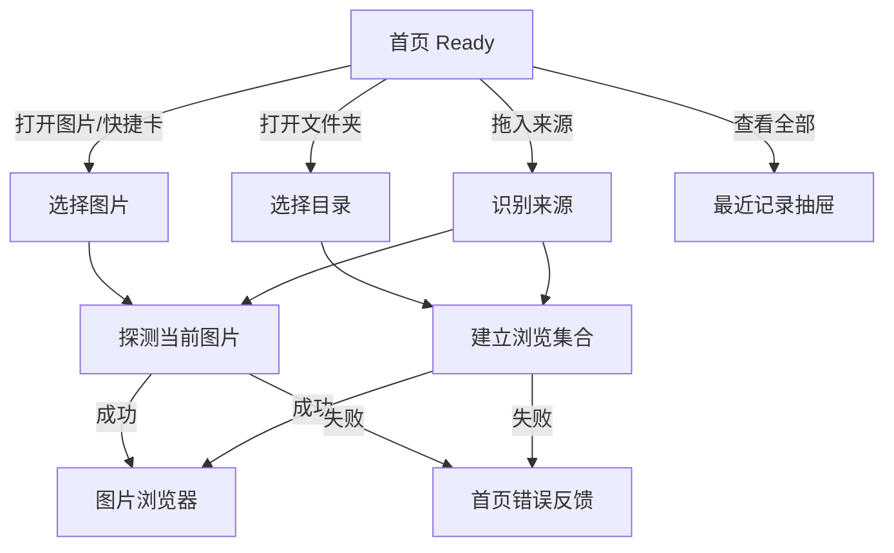
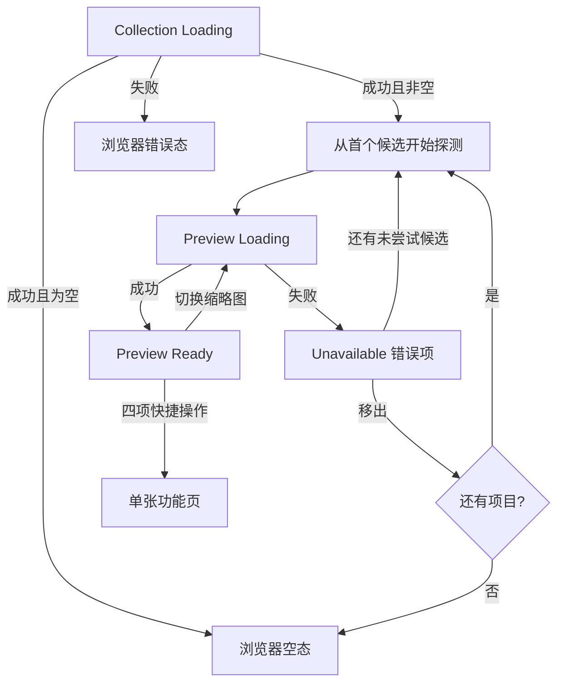
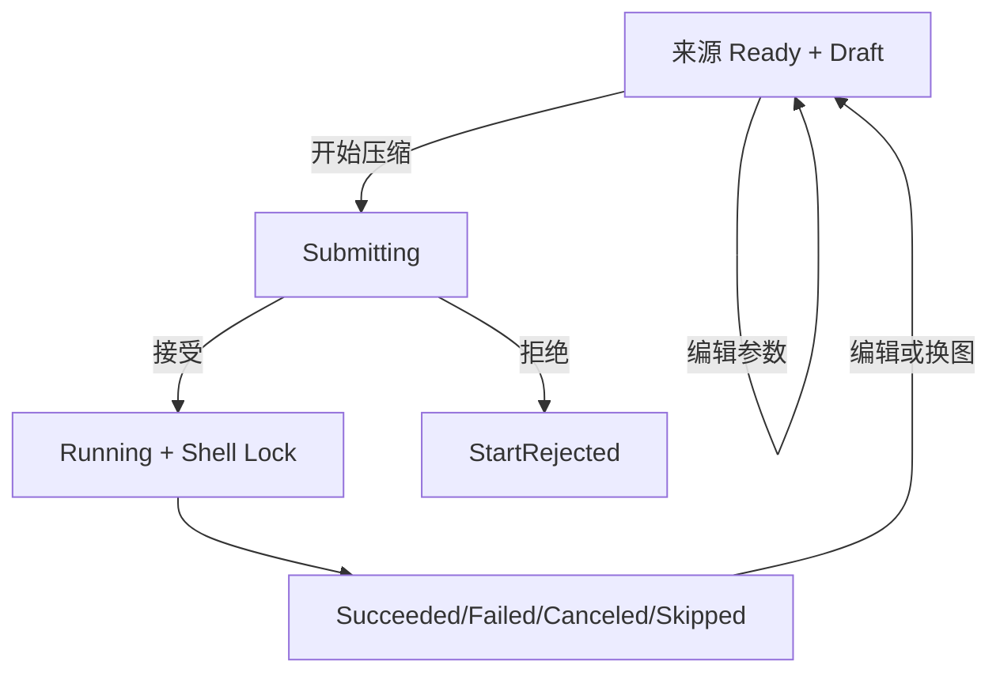
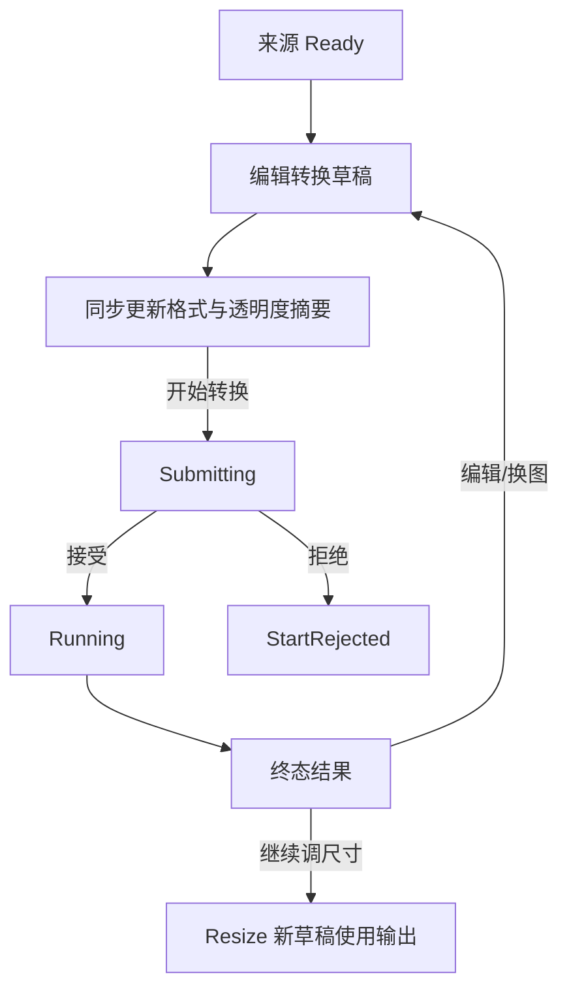
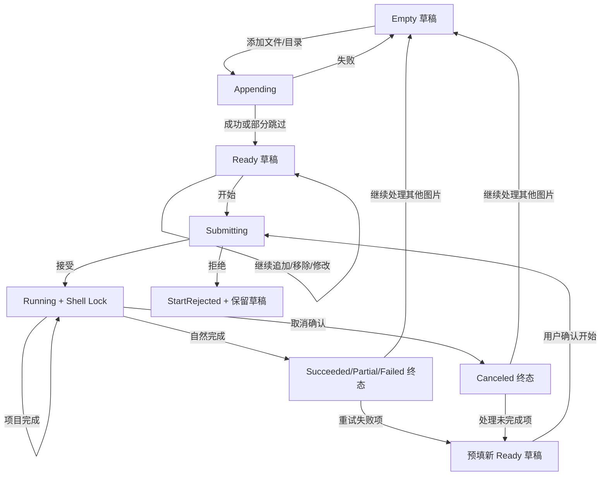
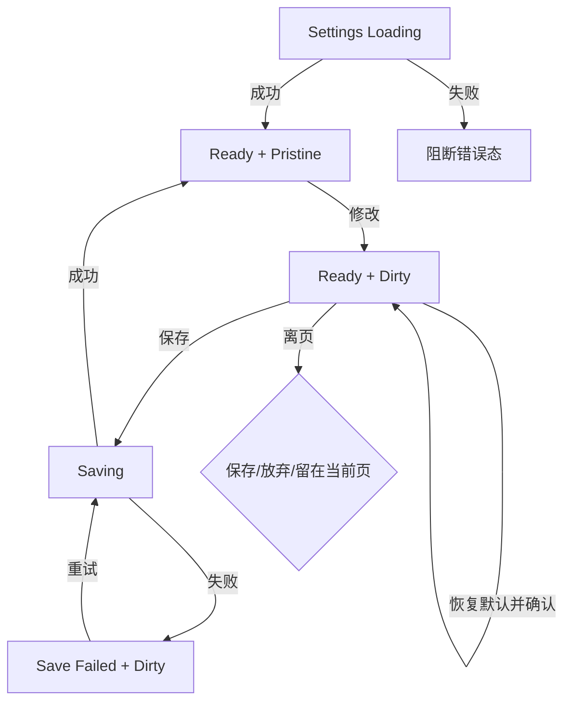
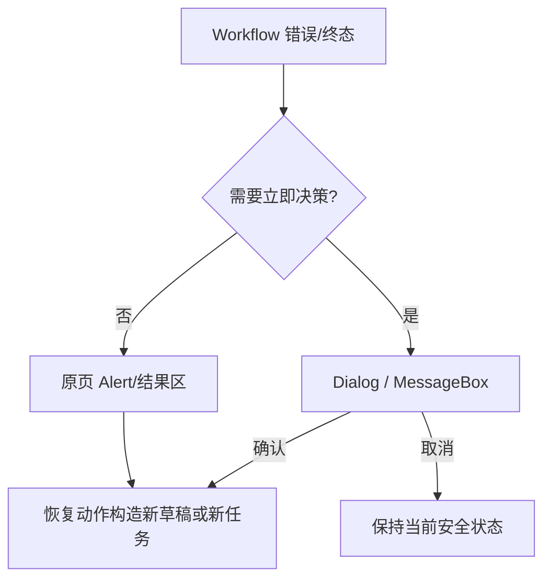
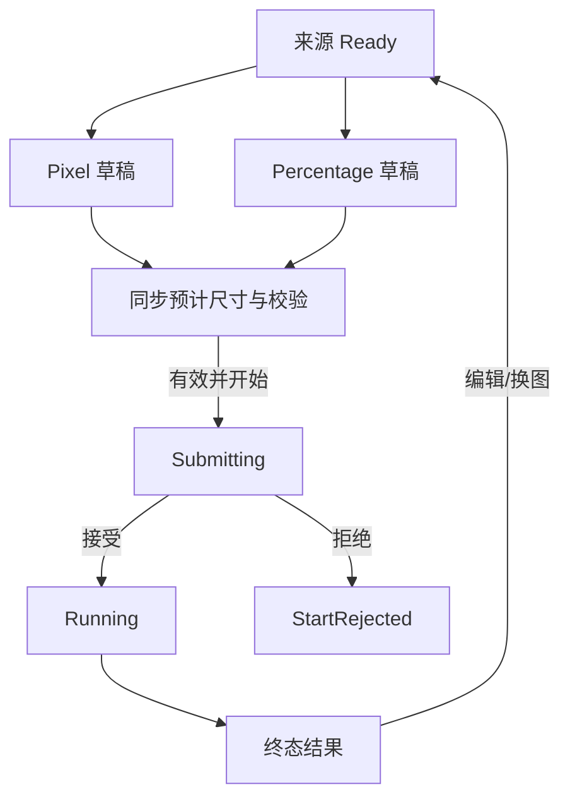
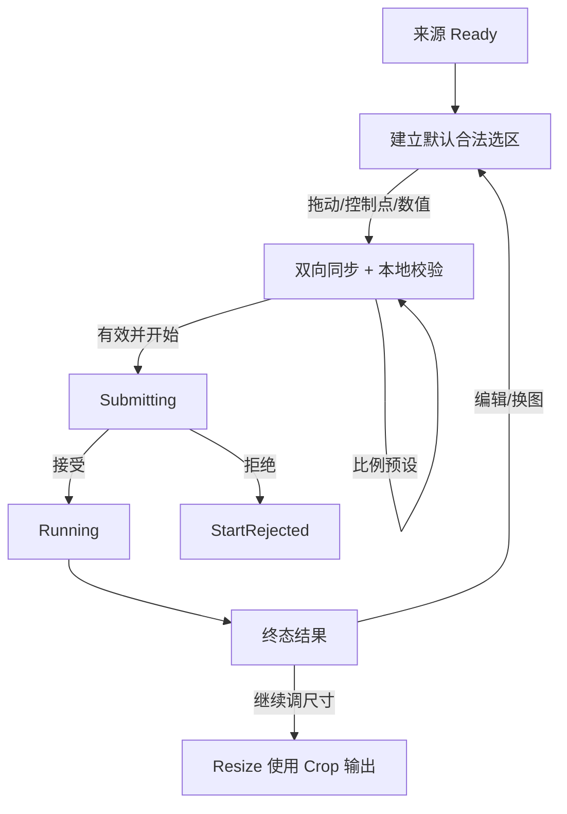

# AtomPix Desktop 交互状态与流转设计

> 文档状态：MVP UI 实现基线
>
> 基线时间：2026-08-06
>
> 适用范围：`docs/ui-prototype/` 中 01–10 页面及其补充状态画板

## 1. 目标与边界

本文档定义 AtomPix Desktop 层的页面状态、控件可用性、异步竞争处理、错误呈现和页面流转，作为 ViewModel 与 UI 测试的直接实现依据。

状态如何投影为 AtomUI 公开组件、独立包和必要的 AtomPix 自定义控件，以 [AtomUI 组件映射与实现基线](atomui-component-mapping.md) 为准；组件默认行为不得反向改变本文的状态规则。

本文件不定义 Core 状态机如何迁移，也不定义 Workflow 如何驱动 `ImageJob` / `BatchJob`。Desktop 只消费 Workflow 返回的拒绝、进度快照和终态结果，并将其投影为界面状态。

```text
用户操作 / 系统事件
        -> Desktop 本地状态
        -> Workflow Request
        -> Workflow 进度或结果
        -> Desktop 界面投影
```

强约束：

- 同一窗口同一时间最多运行一个正式图片任务。
- 正式任务运行时锁定主导航、任务输入和参数，只保留取消与安全的只读操作。
- UI 不直接修改 Core `ImageJob` / `BatchJob`，也不把可变任务对象暴露给 View。
- `Succeeded`、`Failed`、`Canceled` 等只描述任务终态，不作为整个页面的唯一状态。
- 所有 `CanExecute`、`IsVisible` 和 `IsLoading` 均从状态派生，不保存互相重复的可写布尔值。

## 2. 公共状态模型

### 2.1 内容加载状态

图片、文件夹、设置和最近记录统一使用以下语义：

```text
ContentState<T>
  Empty
  Loading(previousValue?)
  Ready(value)
  Failed(error, previousValue?)
```

- `Loading` 允许携带旧值，用于换图或刷新时避免界面闪空；旧值必须标记为不可执行目标。
- `Failed` 可以保留旧值用于恢复展示，但不得把失败的新来源当作当前有效输入。
- 新请求开始时递增版本号并取消旧请求；完成回调只有版本号仍为最新时才能写入状态。

### 2.2 表单草稿与校验

草稿不是单一枚举，因为 `Dirty` 与 `Invalid` 可以同时成立：

```text
Draft<T>
  OriginalValue
  CurrentValue
  ValidationErrors

IsDirty = CurrentValue != OriginalValue
IsValid = ValidationErrors.Count == 0
```

- Desktop 可以做即时格式和联动校验，Workflow 仍必须执行正式业务校验。
- 页面离开不清除单张功能草稿；草稿仅在当前应用会话内保留。
- 关闭应用不持久化压缩、转换、Resize 或 Crop 草稿。
- 设置草稿是例外：有未保存修改时离页或关闭应用必须提供“保存 / 放弃 / 留在当前页”。

### 2.3 原图预览与预计结果

- `CreatePreviewWorkflow` 只为浏览器和单张功能页生成原图的显示预览，不接受压缩、转换、Resize 或 Crop 参数。
- 第一阶段压缩和转换参数变化只更新草稿、校验及格式/透明度摘要，不触发处理后效果预览，也不估算输出文件体积。
- 压缩或转换成功后，Desktop 根据 Workflow 返回的实际输入、输出字节数显示体积变化；运行前不展示伪造的预计值。
- Resize 预计尺寸与 Crop 选区摘要是 Desktop 本地同步计算，不调用正式图片处理 Workflow，因此继续实时显示。
- 用户命名压缩预设与处理效果预览都属于后续优化范围，不进入第一阶段 ViewModel 状态模型。

### 2.4 正式任务执行状态

```text
ExecutionUiState
  Idle
  Submitting
  Running(JobProgressView)
  Ended(ExecutionEndView)

ExecutionEndView
  StartRejected(ErrorView)       // 尚未形成 Core Job
  JobCompleted(JobResultView)    // Core Job 的终态投影
```

`JobResultView.Status` 允许：

```text
Succeeded
PartiallySucceeded   // 仅批量
Failed
Canceled
Skipped
```

- 点击开始后立即进入 `Submitting`，防止重复提交。
- Workflow 接受任务并返回运行快照后进入 `Running`。
- 输入探测、设置加载或输出路径等前置失败映射为 `StartRejected`。
- `StartRejected` 与 `JobCompleted(Failed)` 都在原页结果区域展示，但诊断信息保留两者差异。
- 终态后修改参数或更换图片会回到新草稿；上次输出只读保留，不删除磁盘文件。

终态体积变化是结果视图的可选只读投影：

- `Reduced` 显示“减少 {Abs(SizeDeltaBytes)}（{Abs(SizeDeltaRatio)}）”。
- `Unchanged` 显示“文件大小未变化”。
- `Increased` 显示“增加 {SizeDeltaBytes}（{SizeDeltaRatio}）”，任务仍保持成功并展示输出动作。
- 变化类型或差值为空时不显示体积文案；不能把缺失数据解释为 `0 B`。
- 批量页直接使用 `BatchResult.TotalSizeChangeKind` 和成功可比较项统计。没有可比较项时显示“暂无可比较结果”；失败、取消、跳过和未开始项只进入各自状态计数。

### 2.5 Shell 前台任务锁

```text
ShellInteractionState
  Normal
  ForegroundTaskLocked(jobId, jobType)
```

处于 `ForegroundTaskLocked` 时：

- 禁用主导航、换图、参数、批量任务类型、添加/移除输入和设置入口。
- 单张任务保留直接取消；批量任务取消前确认。
- 允许查看当前进度、已产生的只读结果，以及打开已经存在的输出目录。
- 关闭窗口时确认取消；确认后等待 Workflow 返回终态再关闭。
- 不支持导航后后台继续、暂停、恢复或并行正式任务。

### 2.6 命令派生基线

```text
CanStart =
  Input is Ready
  && Draft.IsValid
  && Execution is not Submitting/Running

CanCancel = Execution is Running

CanChangeInput = Execution is not Submitting/Running

CanEditParameters = Execution is not Submitting/Running
```

ViewModel 不得额外维护可写的 `IsStartEnabled`、`IsCancelEnabled`、`IsParameterEnabled`，避免与真实状态漂移。

## 3. 反馈与恢复层级

| 情况 | UI 载体 | 规则 |
| --- | --- | --- |
| 字段格式、范围、必填错误 | 字段内联错误 | 保持焦点上下文；禁用开始按钮。 |
| 预览失败、追加跳过统计、保存成功 | Alert / 轻量通知 | 不阻断当前编辑。 |
| 正式任务失败或取消 | 原页结果区域 | 展示原因、状态和恢复动作。 |
| 覆盖选择、批量取消、恢复默认、未保存离页 | AtomUI `Dialog` / `MessageBox` | 明确主次动作；关闭等同取消。 |
| 文件/目录选择 | 系统选择器 | 用户取消时恢复原状态，不显示错误。 |
| 未预期异常 | 原页错误 + 可复制诊断编号 | 显示 `APX-` + 12 位十六进制 DiagnosticId；不展示 OperationId、底层异常或日志原文。 |

错误文案根据 `AtomPixErrorCode` 本地化；`OperationCanceled` 使用中性提示，不使用红色严重错误样式。

普通校验、已知可恢复错误、Skip 和用户取消不生成诊断编号。`Unexpected`、`Unknown` 或 Desktop 全局错误边界才显示 DiagnosticId；复制动作只复制编号本身。日志默认脱敏且只保存在本地，第一阶段不提供日志浏览器、自动上传或遥测开关。完整规则见 [诊断与本地日志设计](../infrastructure/diagnostics-and-logging.md)。

## 4. 01 首页 / 空态

状态组成：

```text
OpenSourceState
RecentItemsState
RecentDrawerState
DragDropState
```

| 控件 | 显示 | 启用 | Loading | 动作与流转 | 失败与恢复 |
| --- | --- | --- | --- | --- | --- |
| 拖入图片或文件夹 | 始终 | Shell Normal | 拖入时高亮 | 判断单文件/单目录，进入 `OpenSourceState.Loading` | 类型不支持时原地 Alert；不导航。 |
| 打开图片 | 始终 | Shell Normal 且未打开选择器 | 按钮 Loading | 系统单选；成功后进入浏览器 | 取消无反馈；探测失败留在首页并显示恢复动作。 |
| 打开文件夹 | 始终 | Shell Normal 且未打开选择器 | 按钮 Loading | 系统单目录；成功后进入浏览器 | 取消无反馈；不可访问时留在首页。 |
| 最近项目 | 有记录 | 未处于打开中 | 当前项 Loading | 文件/目录复用对应打开流程 | 路径失效时保留记录，显示移除或重新定位。 |
| 查看全部 | 最近记录非空 | RecentItems Ready | 无 | 打开右侧抽屉 | 加载失败显示抽屉错误态。 |
| 抽屉移除 | 抽屉打开 | 非保存中 | 当前项 Loading | 只删除最近记录，不删除磁盘内容 | 保存失败恢复项目并提示。 |
| 抽屉清空 | 抽屉打开且非空 | 非保存中 | 整体 Loading | 确认后清空最近记录 | 保存失败保留原列表。 |
| 四张快捷操作卡 | 始终 | Shell Normal | 无 | 打开系统图片选择器，成功后进入对应单张功能页 | 取消留在首页；失败显示原地 Alert。 |



## 5. 02 图片浏览器

状态组成：

```text
CollectionState = ContentState<BrowserCollection>
ThumbnailState[] = Loading | Ready | Unavailable
CurrentSelection
CurrentPreviewState
ZoomState
```

浏览器不提供搜索、添加更多图片或拖入追加入口。更换浏览来源必须返回首页。

文件夹来源通过 `OpenFolderWorkflow` 建立轻量候选集合。Desktop 不自行枚举、过滤、排序或去重，也不把结果转换为 `BatchInputPlan`。集合成功但没有候选图片时直接进入浏览器空态。

| 控件 | 显示 | 启用 | Loading | 动作与流转 | 失败与恢复 |
| --- | --- | --- | --- | --- | --- |
| 返回/面包屑 | 始终 | Shell Normal | 无 | 返回首页；通过图片展示适配器释放集合预览资源 | 无。 |
| 缩略图 | 集合非空 | 项目非当前且非 Loading | 项目骨架屏 | 设为当前项并启动最新优先预览 | 失败项保留错误占位。 |
| 上一张/下一张 | 集合至少两项 | 存在对应项目且当前预览非 Loading | 无 | 改变当前索引 | 跳到错误项时显示错误预览。 |
| 缩小/放大 | 当前预览 Ready | 未达到最小/最大缩放 | 无 | 更新 ZoomState | 无。 |
| 适应 | 当前预览 Ready | 当前不是 Fit | 无 | 设置 Fit | 窗口变化时重新计算。 |
| 1:1 | 当前预览 Ready | 当前不是 ActualSize | 无 | 设置 ActualSize | 无。 |
| 压缩/转换/Resize/Crop | 当前项和预览 Ready | Shell Normal，且当前格式、帧数受对应操作支持 | 无 | 捕获当前路径并进入对应单张页 | 当前文件已删除时禁用；Resize/Crop 对 GIF、多帧 WebP、TIFF 禁用并提示先转换。 |
| 在文件夹中显示 | 当前项存在 | 系统支持且路径存在 | 短 Loading | 调用 Desktop 系统交互 | 系统调用失败显示轻量错误。 |
| 移出错误项 | 当前项 Unavailable | Shell Normal | 无 | 只移出浏览集合并选择最近有效项 | 列表空时进入浏览器空态。 |



### 5.1 文件夹集合、探测与缩略图调度

- `OpenFolderWorkflow` 返回候选列表后，Desktop 从排序后的首项开始调用 `OpenImageWorkflow`；失败项标记为 `Unavailable` 并继续尝试下一项，直到找到首个可用项或所有候选项均失败。
- 当前选中项的 Probe 和主预览优先于缩略图队列。缩略图只为可见区域及少量预取窗口延迟请求，并使用有界并发，不能因为大目录一次性启动无界任务。
- 主预览和缩略图都调用 `CreatePreviewWorkflow`；Desktop 通过不同 `MaxPixelSize` 区分用途，并由框架图片展示适配器把编码字节转换为 Bitmap，ViewModel 不直接持有 Avalonia 类型。
- 每次打开来源生成新的集合代次标识。打开另一个来源、返回首页或页面销毁时取消旧枚举、Probe 和 Preview 请求；不能取消的晚返回结果也必须因代次不匹配而被忽略。
- 当前项快速切换采用 latest-wins；旧 Preview 晚返回时不得覆盖新选择，也不得错误改变 `CurrentSelection`。
- 损坏、伪装格式、加载期间被删除或读取失败的项目保留为 `Unavailable` 占位。用户移出它时只修改内存浏览集合，不操作磁盘文件。
- 第一阶段预览缓存仅属于当前浏览会话，以规范化路径和预览尺寸为键；离开集合后释放 Bitmap，不建立持久化磁盘缩略图缓存。
- 第一阶段不监听目录变化。文件新增不会自动追加；文件删除或替换在对应项下次 Probe/Preview 时投影为不可用或新结果。

## 6. 03 单张压缩

状态组成：来源、原图显示预览、压缩草稿、正式任务和上次结果。原图显示预览只跟随来源，不跟随压缩参数重新编码。

| 控件 | 显示 | 启用 | Loading | 动作与流转 | 失败与恢复 |
| --- | --- | --- | --- | --- | --- |
| 更换图片 | 始终 | `CanChangeInput` | 来源 Loading | 保留模式/质量/元数据/输出策略，重载来源和原图预览 | 取消保留旧图；失败恢复旧图。 |
| 压缩模式 | 来源 Ready | `CanEditParameters` | 无 | 在 Smart/高质量/平衡/极限/自定义间切换并更新 Draft；会话内保留最近合法的自定义质量 | Smart 内部参数不可编辑；只提交当前模式的有效参数。 |
| 自定义质量滑块/整数输入 | Custom 且当前输出使用有损质量 | `CanEditParameters` | 无 | `1..100` 双向同步，只更新 Draft | 空值、非整数或越界时内联报错并禁用开始；无损输出隐藏或禁用并说明原因。 |
| 元数据 | 来源 Ready | `CanEditParameters` | 无 | 更新独立 MetadataPolicy | ICC 不受该开关控制。 |
| 输出位置/子目录/自定义目录 | 来源 Ready | `CanEditParameters` | 目录选择时短 Loading | 在子目录、原目录、自定义目录间切换；自定义目录由系统选择器写回；只在提交时构造不可变 `OutputPolicy` | 当前模式要求的目录为空或非法时内联报错并禁用开始；取消目录选择保留原值。 |
| 文件名格式/占位符/冲突策略 | 来源 Ready | `CanEditParameters` | 无 | 编辑 `{name}` 等命名模板并选择跳过、覆盖或自动重命名；开始时冻结为本次请求快照 | 模板非法时内联报错；输出与源文件同路径时由 Workflow 拒绝，Desktop 弹窗引导改为自动重命名，不自动重试。 |
| 开始压缩 | 始终 | `CanStart` | Submitting/Running | 提交参数快照并锁定 Shell | StartRejected/Failed 在结果区展示。 |
| 取消 | Running | 是 | 取消中 | 单张直接取消 | 终态为中性 Canceled。 |
| 再次处理/编辑参数 | Ended | 是 | 无 | 回到新草稿；保留上次结果只读卡 | 不删除旧输出。 |
| 打开输出/继续调尺寸 | Succeeded | 输出存在 | 短 Loading | 打开目录；或以本次输出进入 Resize | 输出被删除时提示并禁用跨功能。 |



## 7. 04 单张转换

转换页复用单张执行状态；运行前摘要只展示确定的输出格式、尺寸是否变化和透明度处理规则，不展示预计文件体积。

| 控件 | 显示 | 启用 | Loading | 动作与流转 | 失败与恢复 |
| --- | --- | --- | --- | --- | --- |
| 更换图片 | 始终 | `CanChangeInput` | 来源 Loading | 保留目标格式、质量、透明背景色、元数据和输出策略 | 取消/失败恢复旧图。 |
| 输出格式 | 来源 Ready | `CanEditParameters` | 无 | 同步更新扩展名、质量适用性和透明度提示 | 不支持组合内联说明。 |
| 输出质量 | JPEG/WebP 且适用 | `CanEditParameters` | 无 | 更新 Draft | PNG 时隐藏或禁用且不提交质量。 |
| 透明区域背景色 | `Probe.HasTransparency && OutputFormat == JPEG` | `CanEditParameters` | 无 | 色块打开颜色选择器；支持 `#RRGGBB` 输入及白/黑快捷项 | 非法 HEX 内联报错并使 `CanStart = false`；PNG/WebP 隐藏但保留草稿值。 |
| 拍摄信息 | 来源 Ready | `CanEditParameters` | 无 | “移除拍摄信息与位置数据”勾选映射 `Remove`，未勾选映射 `Preserve`；ICC 不受该开关控制 | 说明色彩配置仍会保留。 |
| 输出位置/子目录/自定义目录 | 来源 Ready | `CanEditParameters` | 目录选择时短 Loading | 在子目录、原目录、自定义目录间切换；自定义目录由系统选择器写回；只在提交时构造不可变 `OutputPolicy` | 当前模式要求的目录为空或非法时内联报错并禁用开始；取消目录选择保留原值。 |
| 文件名格式/占位符/冲突策略 | 来源 Ready | `CanEditParameters` | 无 | 编辑命名模板并选择跳过、覆盖或自动重命名；扩展名由目标格式决定 | 模板非法时内联报错；源文件冲突由 Workflow 拒绝并进入统一恢复弹窗。 |
| 开始转换/取消 | 始终/Running | `CanStart`/Running | 正式任务 Loading | 与单张公共流程一致 | 原页结果区域恢复。 |
| 再次处理/继续调尺寸 | Ended/Succeeded | 对应条件 | 无 | 新任务；跨功能使用本次输出 | 不修改旧输出。 |



透明度交互基线：

- Desktop 使用 `HasTransparency` 而不是 `HasAlphaChannel`；完全不透明的 RGBA 图片不显示背景色控件或透明警告。
- 背景色为不透明 sRGB，文本只接受六位 `#RRGGBB`；失焦或提交前规范成大写形式。
- 目标 PNG / WebP 时始终提示“保留透明区域”，不提供主动铺底开关。
- 目标 JPEG 时，输出预览在透明图下绘制当前背景色；这只是 UI 预览，最终文件仍由 Workflow 和图片处理器生成。
- 成功摘要使用 `TransparencyProcessingResult` 显示“无透明区域”“已保留透明区域”或“已使用 `#RRGGBB` 填充”，不得仅根据草稿推断。
- `MetadataPolicy` 在 UI 上是一个互斥二选一复选框：勾选“移除拍摄信息与位置数据”为 `Remove`，未勾选为 `Preserve`；辅助文案说明 ICC 色彩配置始终尽量保留，方向信息在 AutoOrient 后规范化。

## 8. 05 批量任务

状态组成：

```text
BatchInputPlanState = Empty | Appending | Ready | AppendFailed
BatchDraft
BatchExecutionState = Idle | Submitting | Running | Ended
BatchItemView[] = Pending | Running | Succeeded | Failed | Skipped | Canceled
```

| 控件 | 显示 | 启用 | Loading | 动作与流转 | 失败与恢复 |
| --- | --- | --- | --- | --- | --- |
| 三类任务标签（压缩/转换/调整尺寸） | 草稿/终态 | 非运行；终态需先选择空白或恢复草稿动作 | 无 | 草稿内切换类型并重建对应参数 | 不修改已结束任务；MVP 不显示批量裁剪。 |
| 添加文件 | 草稿 | 非 Appending 且非运行 | 按钮 Loading | 多选并调用追加流程 | 取消无反馈；跳过统计用通知。 |
| 添加文件夹 | 草稿 | 非 Appending 且非运行 | 按钮 Loading | 单目录、非递归追加 | 失败保留已有列表。 |
| 移除输入 | 草稿有项目 | 非 Appending 且非运行 | 无 | 只修改输入计划 | 不触碰源文件。 |
| 修改任务设置 | 草稿 | 非运行 | 无 | 编辑 Draft | 运行时只读展示提交快照。 |
| 输出位置/子目录/自定义目录 | 草稿 | 非运行 | 目录选择时短 Loading | 全批次共享一套位置策略；自定义目录由系统选择器写回；提交时冻结到批量请求快照 | 当前模式要求的目录为空或非法时内联报错并禁用开始；取消目录选择保留原值。 |
| 文件名格式 | 草稿 | 非运行 | 无 | 编辑 `OutputNamingPolicy`；默认多项格式 `{name}_atompix_{index}` | 未知/未闭合占位符或非法文件名内联报错并禁用开始。 |
| `{name}` / `{index}` 快捷项 | 草稿 | 非运行 | 无 | 在光标位置插入占位符 | `{index}` 已存在时禁用该快捷项。 |
| 冲突策略 | 草稿 | 非运行 | 无 | 全批次选择跳过、覆盖或自动重命名并展示当前值 | 输出与任一输入同路径时 Workflow 阻断整批启动；Desktop 弹窗可把草稿改为自动重命名，但不自动再次提交。 |
| 实际格式与输出示例 | 输入非空 | 只读 | 追加/移除时短 Loading | 显示 EffectivePattern 和前两至三项名称 | 多项格式缺少 `{index}` 时提示将自动追加；不作为最终业务裁判。 |
| 批量转换透明背景色 | 转换草稿、目标 JPEG、至少一项 `HasTransparency` | 非运行且 HEX 有效 | Probe 未完成项显示统计中 | 编辑全批次共享颜色并显示受影响项数量 | 无透明项或 PNG/WebP 时隐藏；探测失败项不计入预计数量，仍由 Workflow 正式校验。 |
| 开始任务 | 草稿 | 输入非空、参数有效、非 Appending | Submitting | 创建不可变请求快照并锁定 Shell | StartRejected 保留草稿。 |
| 取消任务 | Running | 是 | 取消中 | 弹窗确认；已完成结果保留 | 关闭弹窗继续运行。 |
| 行查看/查看原因 | 项目已有终态 | 是 | 短 Loading | 打开只读详情 | 无。 |
| 总体体积变化 | 终态或运行中已有可比较成功项 | 只读 | 无 | 投影 Core 批量体积统计，显示比较项数和减少/不变/增加 | 无可比较项显示“暂无可比较结果”；不从行重新求和。 |
| 使用自动重命名处理 | Skipped 且原因为目标已存在 | 任务已终态 | 无 | 复制该输入和原参数，以 AutoRename 建立新 Ready 草稿 | 不修改旧任务；用户再次点击开始后才创建任务。 |
| 重试失败项 | 有 Failed | 任务已终态 | 无 | 按原顺序复制 Failed 输入和已提交参数，建立新 Ready 草稿 | 允许先重新定位、移除或修改输出设置；不修改旧任务。 |
| 处理未完成项 | Canceled 或批量级中止且存在未完成输入 | 任务已终态 | 无 | 排除旧任务中 Succeeded/Skipped，建立预填新草稿 | 与空白的“继续处理其他图片”区分。 |
| 打开输出目录 | 目录已建立 | 系统支持 | 短 Loading | Desktop 系统交互 | 目录失效时提示重新选择。 |
| 继续处理其他图片 | 任务已终态 | 是 | 无 | 清空界面任务结果，进入新的 Empty 草稿 | 不删除磁盘输出。 |

批量压缩选择 Custom 时只维护一个共享质量值。混合批次存在 JPEG/WebP 等有损项目时显示质量控件并说明受影响项目数；全部输入都是无损格式时禁用控件并提示“不使用质量参数”。第一阶段不提供逐项质量覆盖，运行和恢复草稿都复制提交时的完整 `CompressionProfile` 快照。

### 8.1 实时批量进度投影

- 点击开始时，Desktop 冻结输入顺序并按索引建立全部 `Pending` 行，然后调用批量 Workflow 并传入本次调用专属的 `IProgress<BatchExecutionProgress<TItemResult>>`。
- `Submitting` 期间等待 Workflow 完成权威 `BatchOutputPlan`；任务接受后，每行立即使用计划中的固定序号和 OutputPath，运行期间不再根据完成状态重新命名。
- 第一条合法进度表示 Core BatchJob 已经存在且进入 Running；Desktop 保存 BatchId、进入 `Running + Shell Lock`，并把其 `Sequence` 记为当前最大序号。
- 后续消息必须同时满足：属于当前调用代次、BatchId 一致、`Sequence` 严格增大、Index 在冻结输入范围内、InputPath 与该索引一致。违反任一条件时忽略消息并记录诊断。
- `ChangedItem = null` 只用于初始汇总。Running 变化把对应行设为处理中并显示不确定进度；终态变化使用 Result 更新该行的状态、输出、大小与错误原因。
- 整体进度条使用 `Summary.CompletionRatio`，成功、失败、跳过和取消数量直接投影 Summary，不从可见行重新计算。
- 用户确认取消后，Desktop 本地显示“取消中”，但不得提前把当前行或父任务写成 Canceled；等待 Workflow 完成 Core 迁移并返回终态。
- `ExecuteAsync` 返回后，Desktop 进入 `Ended`，以完整 `BatchResult` 重建并校正终态行。此后即使 UI 调度队列仍收到旧进度，也必须忽略。
- 进度回调只负责快速复制不可变消息并调度到 UI 线程，不执行文件 IO、图片解码或可能阻塞 Workflow 的工作；展示异常由 Desktop 错误边界处理，不能反馈为任务失败。
- 第一阶段没有单张图片内部百分比。当前行显示不确定进度动画，整体比例只在项目进入终态时阶梯式增加。

### 8.2 终态恢复草稿

- Desktop 在提交时保留 `SubmittedBatchSnapshot`，内容与实际传给 Workflow 的任务类型、输入顺序和参数一致。任务接受后，运行中的 UI 编辑或默认设置变化不得回写该快照。
- “重试失败项”只复制 `BatchResult.Items` 中的 Failed；“处理未完成项”还需要用提交快照补回 Canceled 和从未产生结果的输入；两者都保持原顺序。
- `Skipped` 不是失败。MVP 中只有 `OutputFileAlreadyExists + OverwritePolicy.Skip` 产生该状态，行级动作使用“使用自动重命名处理”，而不是“重试失败”。
- 恢复动作把当前终态视图切换为新的 Ready 草稿，不进入 Submitting。用户再次点击开始时才冻结新快照、创建新任务并锁定 Shell。
- 新草稿默认复制旧提交参数，不重新加载当前默认设置；用户主动修改后使用新值。原失败原因作为草稿提示保留，但 Workflow 仍执行全部正式校验。
- 新任务拥有独立 JobId、进度和结果。旧任务保持只读，新旧成功/失败/跳过统计不合并；第一阶段不持久化重试来源关系。
- 恢复动作形成的新草稿按其当前输入顺序重新编号；旧任务的序号和文件名只读保留。
- “继续处理其他图片”清空输入形成 Empty 草稿；“处理未完成项”形成预填 Ready 草稿，不能复用同一命令语义。

批量 Resize 的 `BatchDraft` 只保存一套共享 `ResizePolicy`，不为列表项目保存逐项覆盖：

- 默认勾选“保持比例”。
- 保持比例且同时填写 Width / Height 时，标签和帮助文案使用“最大宽度 / 最大高度”，每行按自己的原图比例显示预计输出尺寸。
- 保持比例且只填写一边时，该边是每个项目的共同约束，另一边逐项计算。
- 关闭保持比例后 Width / Height 都必须为正整数，并持续显示非阻断变形警告；用户确认有效参数后仍可开始。
- 参数、输入列表或某项 Probe 信息变化时，只重算预计尺寸，不生成真实处理预览。
- 无法预探测的项目显示“预计尺寸不可用”，不伪造数值；Workflow 执行结果是最终事实。
- 任务进入 `Submitting` 时冻结共享规则、编码策略、输出策略和输入顺序；运行期间所有预计值切换为只读提交快照。

批量转换同样只保存一套共享 `TransparencyPolicy`。目标 JPEG 时，各项目按自己的真实透明探测结果决定是否铺底；目标 PNG / WebP 时透明度保留。终态恢复草稿复制旧提交颜色，不重新加载当前默认设置。



## 9. 06 设置

设置采用显式保存，不显示“自动保存”文案。

```text
SettingsLoadState
SettingsDraft
SettingsSaveState = Idle | Saving | Saved | Failed
```

| 控件 | 显示 | 启用 | Loading | 动作与流转 | 失败与恢复 |
| --- | --- | --- | --- | --- | --- |
| 设置子菜单 | Load Ready | 非 Saving | 无 | 切换同一 SettingsDraft 的分区 | 不丢失未保存修改。 |
| 处理默认值/主题/语言/最近设置 | Load Ready | 非 Saving | 无 | 更新 Draft | 字段错误内联。 |
| 默认压缩模式/自定义质量 | Load Ready | 非 Saving | 无 | Custom 时显示 `1..100` 双向同步控件，并把模式与质量作为一个 DefaultCompressionProfile 保存 | Custom 缺少合法质量时阻止保存；Smart 不显示内部参数。 |
| 默认透明区域背景色 | Load Ready | 非 Saving | 无 | 更新 `DefaultConversionProfile.TransparencyPolicy`；色块、HEX、白/黑快捷项与转换页一致 | 非法 HEX 保留草稿并阻止保存。 |
| 默认移除拍摄信息与位置数据 | Load Ready | 非 Saving | 无 | 勾选写入 `Remove`，未勾选写入 `Preserve`；一次同步更新压缩、转换和同格式编码三个默认 Profile | 三处不一致的设置文件加载失败；ICC 始终尽量保留，不得把开关描述为删除所有 Profile。 |
| Resize/Crop 同格式编码摘要 | Load Ready | 只读 | 无 | 显示“有损质量 90、元数据跟随公共开关、ICC 保留” | 第一阶段不提供独立质量编辑控件。 |
| 默认文件名格式 | Load Ready | 非 Saving | 无 | 编辑不含扩展名的基础格式，默认 `{name}_atompix` | 批量多项自动派生 `{index}`；非法格式阻止保存。 |
| 保存设置 | Load Ready | Dirty、Valid、非 Saving | 按钮 Loading | 保存当前完整快照；成功更新 OriginalValue | 失败保留 Draft 与 Dirty。 |
| 恢复默认 | Load Ready | 非 Saving | 无 | 确认后只替换 Draft 并标记 Dirty | 用户仍需保存。 |
| 离页/关闭 | Dirty | 是 | 无 | `Dialog` / `MessageBox`：保存、放弃、留在当前页 | 保存失败阻止离页。 |
| 打开隐私说明 | 始终 | Shell Normal | 短 Loading | 打开本地说明 | 不依赖网络。 |

设置分区：

- 处理默认值：压缩、转换、默认透明区域背景色和公共输出默认值；背景色初始为白色 `#FFFFFF`。
- 外观与语言：主题可编辑；语言第一阶段显示跟随系统/当前支持项，不承诺完整本地化。
- 最近记录：启用开关和最大条数；列表本体在首页抽屉管理。
- 关于 AtomPix：版本、Schema、许可证和本地处理说明，只读。



## 11. 08 错误与边界状态

08 是错误呈现画板，不是独立页面。恢复动作必须路由回来源 ViewModel。

| 错误/状态 | 呈现 | 主要动作 | 次要动作 | 状态结果 |
| --- | --- | --- | --- | --- |
| `InvalidImageFile` | 原页错误卡或 `Dialog` | 选择其他图片 | 关闭 | 保留原文件；不创建任务。 |
| 动画/多帧 | 浏览器说明 | 仅查看预览 | 移出当前集合/任务 | 四类处理入口禁用。 |
| `OperationCanceled` | 原页中性终态 | 处理未完成项（批量） | 继续处理其他图片 | 前者建立预填新草稿，后者建立空白草稿；不显示为 Failed。 |
| 普通输出冲突 | `Dialog` / 策略表单 | Skip / Overwrite / AutoRename | 取消 | 重新提交明确策略。 |
| `OutputPathConflictsWithInput` | 阻断 `Dialog` | 改为自动重命名 | 返回修改 | 无 Job；修改 Draft 后回到 Idle，不自动开始，不提供继续覆盖。 |
| `SettingsLoadFailed` | 设置阻断态 | 打开设置位置 | 恢复默认并确认 | 未确认不得覆盖原文件。 |
| 批量部分完成 | 批量终态区 | 重试失败项 | 打开输出目录 | 新建失败项任务。 |
| 输入文件缺失 | 行级错误详情 | 重新定位 | 移出后重试 | 更新新任务输入，不改旧任务。 |
| 输出权限失败 | 原页结果区 + 目录选择 | 选择其他目录 | 关闭 | 新输出策略产生新任务。 |
| `InputFileTooLarge` / `ImageDimensionsExceedLimit` | 原页错误卡；批量为行级失败 | 选择其他图片/移出 | 查看实际值与上限 | 单张无 Job；批量当前项 Failed 并继续。不得提供“自动缩小后继续”。 |
| `ImageResourceLimitExceeded` | 原页结果区；批量为行级失败 | 选择较小图片或降低合法目标尺寸后建立新任务 | 关闭其他程序后重试 | 旧任务保持 Failed；批量继续处理后续较小图片。 |
| `InsufficientDiskSpace` | 阻断错误区 | 释放空间或选择其他输出目录 | 处理未完成项 | 单张失败；批量中止并保留已完成结果，剩余项进入新草稿。 |



源文件冲突弹窗的单张标题为“无法覆盖原始图片”，正文说明当前输出位置和文件名会覆盖源文件。批量标题保持一致，正文使用 `ConflictCount` 显示“有 N 张图片的输出路径与任务输入相同”。主按钮把当前草稿的 `OverwritePolicy` 改为 `AutoRename` 并重新计算输出摘要；次按钮和关闭弹窗都保留原草稿等待用户修改。两条路径都不自动再次调用 Workflow。

资源错误文案必须展示可理解的实际值和上限，例如“图片为 180 MP，当前版本最多处理 128 MP”。运行上限属于内部保护，不在设置页展示可编辑的 Memory/Map/Disk 数字。无任务时 Desktop 不显示或暗示 AtomPix 已经占用了这些额度。

## 12. 09 单张调整尺寸

Resize 预计尺寸由原图尺寸和草稿同步计算；不生成真实处理预览。

Resize 页面展示公共输出位置、命名和冲突策略编辑器，但不展示输出格式、编码质量或元数据控件。输出格式固定为输入格式；点击“开始调整”时，ViewModel 从已加载设置中取得公共 `SameFormatEncodingPolicy` 并与 `ResizePolicy`、当前编辑器构造的 `OutputPolicy` 一起形成不可变 `ResizeImageRequest`。初始公共默认值为有损质量 `90`、移除拍摄信息与位置数据但保留 ICC。任务一旦被 Workflow 接受，后续设置或输出编辑变化不得回写到该次运行快照。

| 控件 | 显示 | 启用 | Loading | 动作与流转 | 失败与恢复 |
| --- | --- | --- | --- | --- | --- |
| 更换图片 | 始终 | `CanChangeInput` | 来源 Loading | 保留模式和用户约束，按新图重算 | 无法得到正尺寸时 Draft Invalid。 |
| Pixel/百分比 | 来源 Ready | `CanEditParameters` | 无 | 切换控件组；保留各模式会话值 | 只提交当前模式字段。 |
| Width/Height | Pixel | `CanEditParameters` | 无 | 按保持比例规则联动预计值 | 错误内联；不裁剪、不补边。 |
| 保持比例 | Pixel | `CanEditParameters` | 无 | 重算预计尺寸 | 关闭后要求两边均为正整数。 |
| 25/50/75/自定义 | Percentage | `CanEditParameters` | 无 | 同步选择值并重算 | 百分比必须为十进制正数，允许小数和大于 100 的放大。 |
| 编码摘要 | 来源 Ready | 只读 | 无 | 显示“保留原格式”、当前拍摄信息策略及“ICC 保留”；不提供质量编辑 | 设置缺失或非法时禁止开始，并引导恢复默认设置。 |
| 输出位置/文件名/冲突策略 | 来源 Ready | `CanEditParameters` | 目录选择时短 Loading | 编辑公共 `OutputPolicy`；开始时连同尺寸和编码策略一起冻结 | 条件字段或模板非法时内联报错并禁用开始；源文件冲突进入统一恢复弹窗。 |
| 开始/取消 | 始终/Running | `CanStart`/Running | 正式任务 Loading | 单张公共流程 | 原页终态恢复。 |
| 再次处理/打开输出 | Ended/Succeeded | 对应条件 | 无 | 新任务/系统交互 | 不删除旧输出。 |



## 13. 10 单张裁剪

Crop 的画布选框、数值输入、选中比例和本地校验全部属于 Desktop；比例只约束选框编辑，提交时转换为自动方向校正后原图逻辑坐标系中的不可变 `CropRectangle`。

Crop 页面展示公共输出位置、命名和冲突策略编辑器，但不展示输出格式、编码质量或元数据控件。输出格式固定为输入格式；点击“开始裁剪”时，ViewModel 从已加载设置中取得公共 `SameFormatEncodingPolicy`，并与最终 `CropRectangle`、当前编辑器构造的 `OutputPolicy` 一起形成不可变 `CropImageRequest`。第一阶段只接受 JPEG、PNG、BMP 和单帧 WebP。任务一旦被 Workflow 接受，后续设置、输出编辑或 UI 选框变化不得回写到运行快照。

| 控件 | 显示 | 启用 | Loading | 动作与流转 | 失败与恢复 |
| --- | --- | --- | --- | --- | --- |
| 更换图片 | 始终 | `CanChangeInput` | 来源 Loading | 保留比例，重置为新图最大合法选区 | 旧绝对坐标不复用。 |
| 拖动选框 | 来源 Ready | `CanEditParameters` | 无 | 更新 X/Y；边界内钳制 | 数值输入实时同步。 |
| 8 个控制点 | 来源 Ready | `CanEditParameters` | 无 | 更新 W/H 和必要的 X/Y；比例锁定时保持锚点 | 最小 1×1，不能越界。 |
| 比例预设 | 来源 Ready | `CanEditParameters` | 无 | 以当前中心为优先调整，越界时平移回图内 | 无法保持中心时采用最大合法区域。 |
| W/H/X/Y | 来源 Ready | `CanEditParameters` | 无 | 更新选框；失焦/确认时完成钳制 | 编辑期间错误内联，非法时禁用开始。 |
| 重置为整张图片 | 来源 Ready | `CanEditParameters` | 无 | 自由比例 + X0/Y0/原图 W/H | 无。 |
| 编码摘要 | 来源 Ready | 只读 | 无 | 显示“保留原格式”、当前拍摄信息策略及“ICC 保留”；不提供质量编辑 | 设置缺失或非法时禁止开始，并引导恢复默认设置。 |
| 输出位置/文件名/冲突策略 | 来源 Ready | `CanEditParameters` | 目录选择时短 Loading | 编辑公共 `OutputPolicy`；开始时连同选区和编码策略一起冻结 | 条件字段或模板非法时内联报错并禁用开始；源文件冲突进入统一恢复弹窗。 |
| 开始/取消 | 始终/Running | `CanStart`/Running | 正式任务 Loading | 单张公共流程 | 原页终态恢复。 |
| 继续调尺寸 | Succeeded | 输出存在 | 无 | 本次 Crop 输出进入 Resize 新草稿 | 输出失效时禁用并提示。 |

Crop 第一阶段仅支持单张。“添加到批量裁剪”和批量任务页中的裁剪标签都不进入 MVP。



## 14. ViewModel 测试基线

Desktop 项目出现后，状态逻辑应在不创建窗口的情况下测试：

- 每个控件矩阵至少有一个 `CanExecute` 正例和反例。
- Shell 在 `Submitting/Running` 锁定，在所有终态恢复。
- 用户快速换图或快速改变压缩参数时，旧请求不能覆盖新状态。
- 自定义压缩质量的滑块/输入双向同步、边界校验、无损格式适用性、批量共享快照和默认设置持久化符合本文规则；Smart 参数不可编辑。
- 预览失败不禁用正式开始；正式任务失败进入原页终态区。
- 单张取消不弹确认；批量取消和关窗必须确认。
- 单张终态编辑创建新草稿且不删除旧输出。
- 转换页只按 `HasTransparency` 条件显示背景色；HEX 校验、格式切换草稿保留和三种透明结果文案符合本文规则。
- 批量运行期间输入和参数不可变；失败项、未完成项和 Skipped 冲突恢复先产生新草稿，再由用户启动新任务。
- 批量 JPEG 转换只保存一套共享背景色，并正确统计真实透明项目；恢复草稿复制旧颜色快照。
- 设置 Dirty 离页、保存失败、恢复默认和放弃修改符合本文规则。
- 浏览器错误项保留、禁用四项处理并可以移出集合。
- 文件/文件夹选择和打开目录通过可替换的 Desktop 适配服务测试，不创建真实窗口或系统对话框；分别覆盖选择成功、用户取消、平台不可用和调用失败。
- 用户取消选择保持原页面和原草稿，不进入 `Failure`；选择成功的路径才交给对应 Workflow。拖放与选择器入口最终复用同一组 ViewModel 命令语义。
- 未预期异常显示的 DiagnosticId 能定位唯一脱敏日志事件；已知错误和用户取消不显示编号。复制编号不得混入路径、异常消息或其他剪贴板内容。
- 07 不注册导航路由或 ViewModel。

## 15. Workflow 输入依赖

截至 2026-08-07，本文第 4–13 节的主要功能交互已进入生产 Desktop：拖放、浏览器按需缩略图/切换/缩放/按需原始像素 1:1/移除、逐功能快捷操作能力判断、五页 OutputPolicy 编辑与提交、批量恢复、设置 Dirty 流程、失效最近记录重新定位、导航选中同步和 Crop 键盘微调均有实现。Desktop 无窗口自动化为 `40 passed`，另有 `6` 项真实渲染、输入、控件定位与虚拟化 UI 自动化；跨平台原生流水线结果和多 DPI 仍按外部发布验收执行。屏幕阅读器、UIA 动作模式和全页面纯键盘焦点不属于当前版本需求。

Desktop 实现本文状态需要 Workflow 最终提供三类稳定输入：

```text
StartRejected(error)
RunningSnapshot(jobId, jobType, progress, currentInput?)
JobCompleted(result)
```

本节只定义 UI 所需语义，不在 Desktop 中伪造业务状态。Workflow 驱动 Core Job 的创建边界、迁移顺序、批量父子关系、取消和终态汇总，以 [Workflow 任务状态机编排设计](../workflows/job-state-orchestration.md) 为准；具体 C# 进度接口已经在 [Workflows 设计](../workflows/overview.md) 的 `BatchExecutionProgress<TItemResult>` 中冻结，Desktop 也已实现批量 UI 线程投影、防乱序与权威终态校正。
