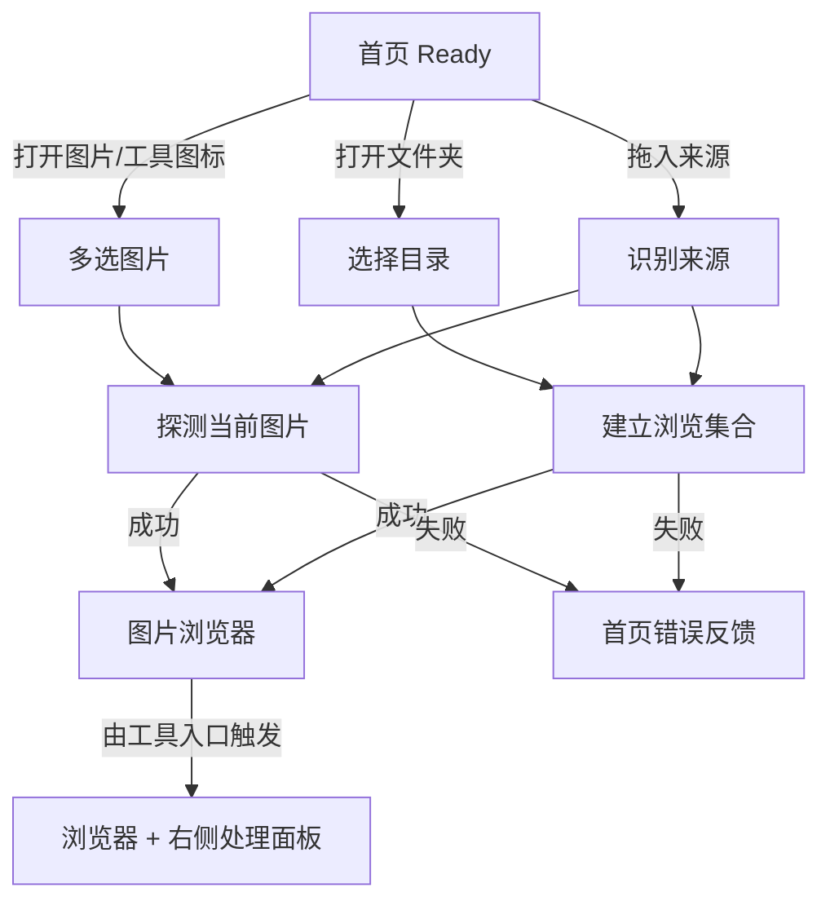
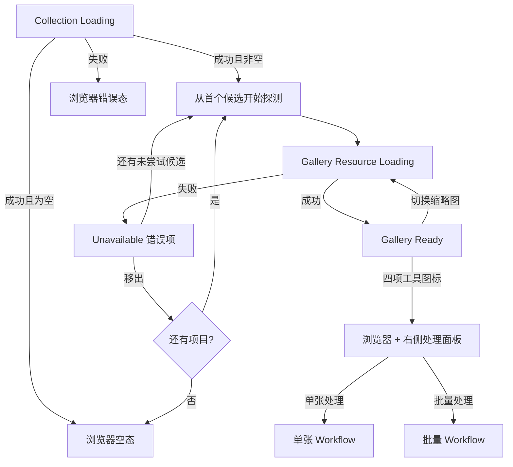
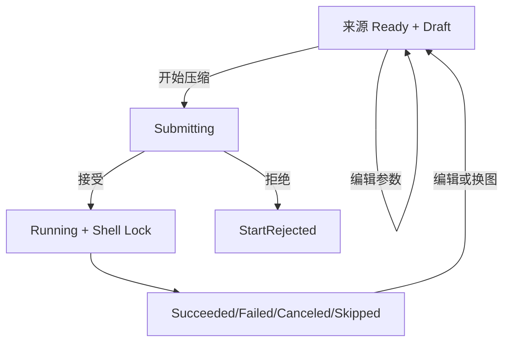
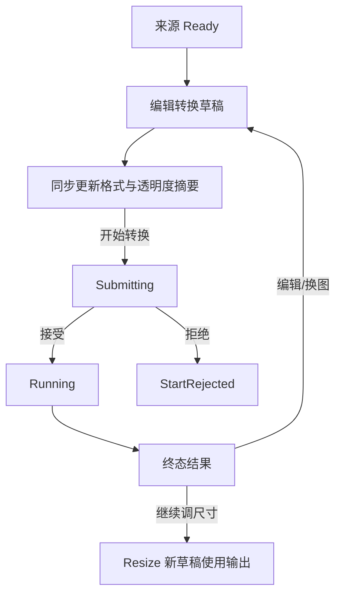
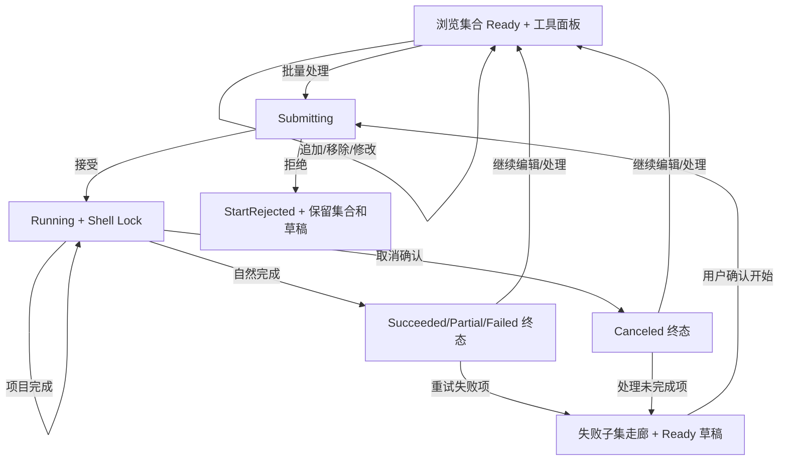
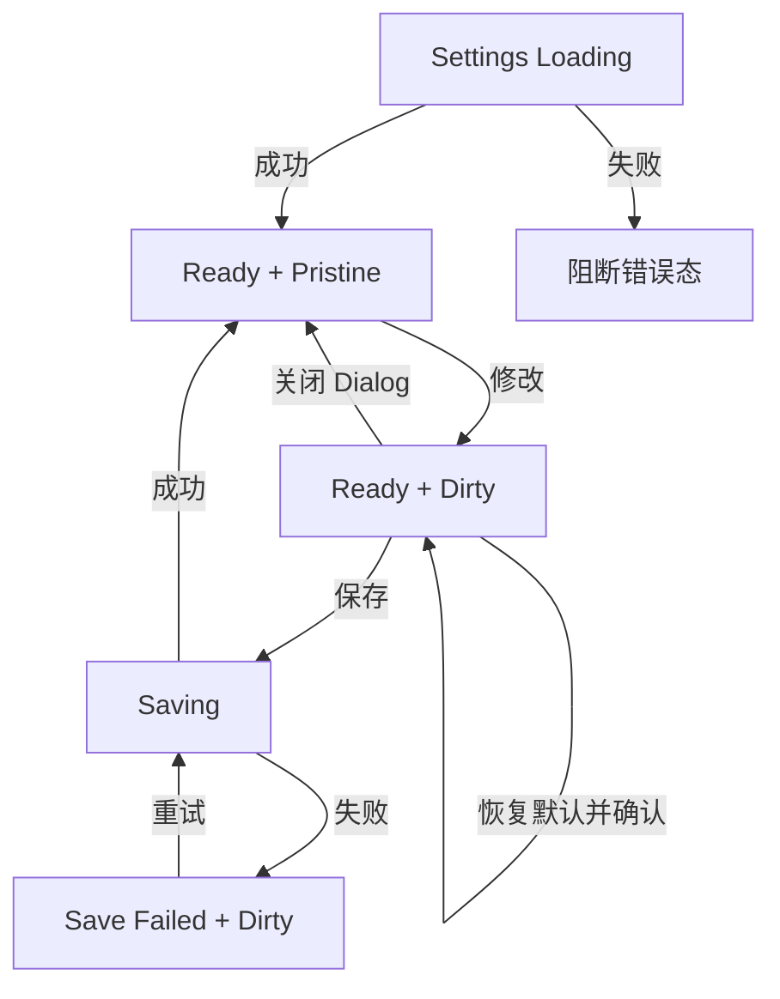
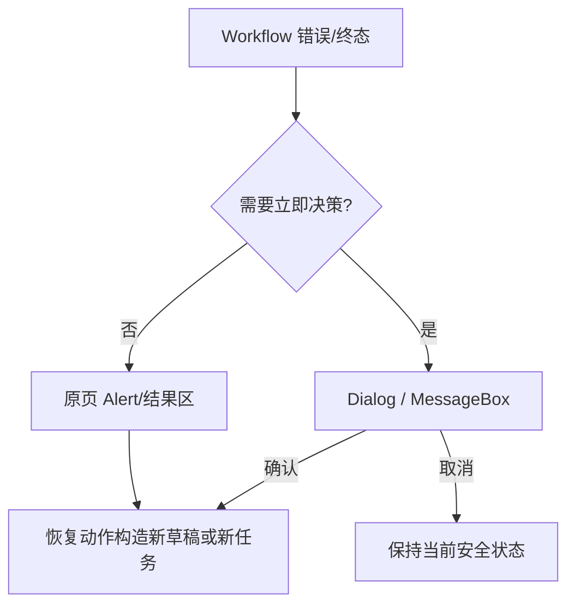
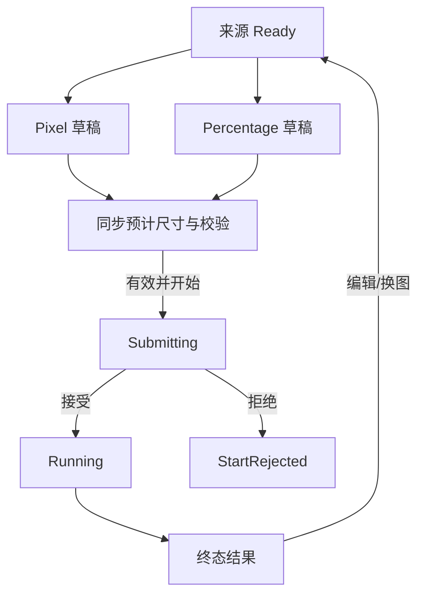
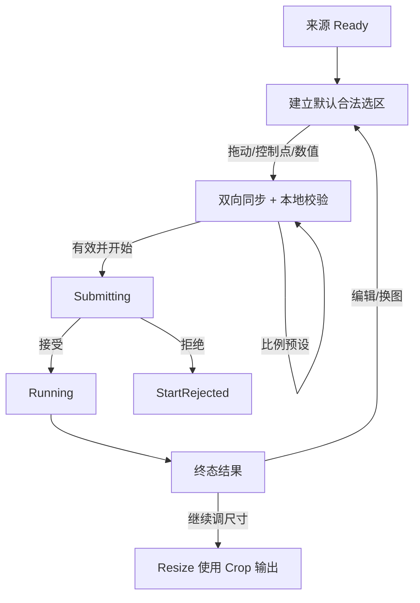

# AtomPix Desktop 交互状态与流转设计

> 文档状态：MVP UI 正式目标基线，新 Shell 布局待实现
>
> 基线时间：2026-08-23
>
> 适用范围：`AtomPix.Desktop` 页面、ViewModel 与可复用视图组件的交互状态契约；与具体视觉主题和页面像素布局无关

## 1. 目标与边界

本文档定义 AtomPix Desktop 层的页面状态、控件可用性、异步竞争处理、错误呈现和页面流转，作为 ViewModel 与 UI 测试的直接实现依据。

状态如何投影为 AtomUI 公开组件、独立包和必要的 AtomPix 自定义控件，以 [AtomUI 组件映射与实现基线](atomui-component-mapping.md) 为准；组件默认行为不得反向改变本文的状态规则。

本文件不定义 Core 状态机如何迁移，也不定义 Workflow 如何驱动 `ImageJob` / `BatchJob`。Desktop 只消费 Workflow 返回的拒绝、进度快照和终态结果，并将其投影为界面状态。

```text
用户操作 / 系统事件
        -> Desktop 本地状态
        -> Workflow Request
        -> Workflow 进度或结果
        -> Desktop 界面投影
```

强约束：

- 同一窗口同一时间最多运行一个正式图片任务。
- 正式任务运行时锁定图标轨、任务输入和参数，只保留取消与安全的只读操作。
- UI 不直接修改 Core `ImageJob` / `BatchJob`，也不把可变任务对象暴露给 View。
- `Succeeded`、`Failed`、`Canceled` 等只描述任务终态，不作为整个页面的唯一状态。
- 所有 `CanExecute`、`IsVisible` 和 `IsLoading` 均从状态派生，不保存互相重复的可写布尔值。

## 2. 公共状态模型

### 2.1 内容加载状态

图片、文件夹、设置和最近记录统一使用以下语义：

```text
ContentState<T>
  Empty
  Loading(previousValue?)
  Ready(value)
  Failed(error, previousValue?)
```

- `Loading` 允许携带旧值，用于换图或刷新时避免界面闪空；旧值必须标记为不可执行目标。
- `Failed` 可以保留旧值用于恢复展示，但不得把失败的新来源当作当前有效输入。
- 新请求开始时递增版本号并取消旧请求；完成回调只有版本号仍为最新时才能写入状态。

### 2.2 表单草稿与校验

草稿不是单一枚举，因为 `Dirty` 与 `Invalid` 可以同时成立：

```text
Draft<T>
  OriginalValue
  CurrentValue
  ValidationErrors

IsDirty = CurrentValue != OriginalValue
IsValid = ValidationErrors.Count == 0
```

- Desktop 可以做即时格式和联动校验，Workflow 仍必须执行正式业务校验。
- 页面离开不清除单张功能草稿；草稿仅在当前应用会话内保留。
- 关闭应用不持久化压缩、转换、Resize 或 Crop 草稿。
- 设置草稿采用显式保存：关闭按钮、Escape、“取消”或应用退出均静默撤销未保存草稿；只有“保存设置”会写入持久化配置。

### 2.3 原图预览与预计结果

- `CreatePreviewWorkflow` 仍是可用的通用 Workflow 契约，但生产 Browser/Crop 不再调用它：主图与缩略图由 ImageGallery 文件 Source 解码，Crop 借用 Gallery 当前资源 Lease。处理参数不会进入显示解码。
- 第一阶段压缩和转换参数变化只更新草稿、校验及格式/透明度摘要，不触发处理后效果预览，也不估算输出文件体积。
- 压缩或转换成功后，Desktop 根据 Workflow 返回的实际输入、输出字节数显示体积变化；运行前不展示伪造的预计值。
- Resize 预计尺寸与 Crop 选区摘要是 Desktop 本地同步计算，不调用正式图片处理 Workflow，因此继续实时显示。
- 用户命名压缩预设与处理效果预览都属于后续优化范围，不进入第一阶段 ViewModel 状态模型。

### 2.4 正式任务执行状态

```text
ExecutionUiState
  Idle
  Submitting
  Running(JobProgressView)
  Ended(ExecutionEndView)

ExecutionEndView
  StartRejected(ErrorView)       // 尚未形成 Core Job
  JobCompleted(JobResultView)    // Core Job 的终态投影
```

`JobResultView.Status` 允许：

```text
Succeeded
PartiallySucceeded   // 仅批量
Failed
Canceled
Skipped
```

- 点击开始后立即进入 `Submitting`，防止重复提交。
- Workflow 接受任务并返回运行快照后进入 `Running`。
- 输入探测、设置加载或输出路径等前置失败映射为 `StartRejected`。
- `StartRejected` 与 `JobCompleted(Failed)` 都在原页结果区域展示，但诊断信息保留两者差异。
- 终态后修改参数或更换图片会回到新草稿；上次输出只读保留，不删除磁盘文件。

终态体积变化是结果视图的可选只读投影：

- `Reduced` 显示“减少 {Abs(SizeDeltaBytes)}（{Abs(SizeDeltaRatio)}）”。
- `Unchanged` 显示“文件大小未变化”。
- `Increased` 显示“增加 {SizeDeltaBytes}（{SizeDeltaRatio}）”，任务仍保持成功并展示输出动作。
- 变化类型或差值为空时不显示体积文案；不能把缺失数据解释为 `0 B`。
- 批量结果面板直接使用 `BatchResult.TotalSizeChangeKind` 和成功可比较项统计。没有可比较项时显示“暂无可比较结果”；失败、取消、跳过和未开始项只进入各自状态计数。

### 2.5 Shell 前台任务锁

Shell 的可见工作区由三个正交状态组成：

```text
ShellBackground = Home | Browser
ActiveTool = None | Compress | Convert | Resize | Crop
WorkspaceLayout = Browse | Operate  // 由 ActiveTool 只读派生
SettingsPageState = Inactive | Loading | Ready | Leaving
```

- `ActiveTool=None` 时 `WorkspaceLayout=Browse`：ImageGallery 占满标题栏下方内容区，右侧处理面板不存在且不预留空白。`ActiveTool != None` 时 `WorkspaceLayout=Operate`：内容区切换为 ImageGallery/Crop 工作区与右侧处理面板两列；切换工具只替换右列内容，不替换 Browser 会话。
- 再次点击当前工具或点击面板关闭按钮把 `ActiveTool` 设为 `None`。Logo 同样清除 ActiveTool，并在通过运行任务检查后返回 Home。
- 设置使用 Shell 普通内容页，不占用 ActiveTool。进入和返回设置不清空浏览集合或各工具的会话草稿；保存的新默认值只影响以后新建的草稿。
- 浏览态与操作态的窗口默认/最小尺寸始终为 `1180 × 760 / 960 × 640 px`。操作态右列约 `380 px` 并从内容区顶部延伸到底部；它参与普通布局、不覆盖主图、不改变顶层窗口尺寸。ImageGallery 接收左列的真实 Bounds 并重新布局，WorkspaceLayout 不另存一份可能与 ActiveTool 冲突的可写状态。

```text
ShellInteractionState
  Normal
  ForegroundTaskLocked(jobId, jobType)
```

处于 `ForegroundTaskLocked` 时：

- 禁用图标轨、当前项切换、参数、追加/移除输入和设置入口。
- 单张任务保留直接取消；批量任务取消前确认。
- 允许查看当前进度、已产生的只读结果，以及打开已经存在的输出目录。
- 关闭窗口时确认取消；确认后等待 Workflow 返回终态再关闭。
- 不支持导航后后台继续、暂停、恢复或并行正式任务。

### 2.6 命令派生基线

```text
CanStart =
  Input is Ready
  && Draft.IsValid
  && Execution is not Submitting/Running

CanCancel = Execution is Running

CanChangeInput = Execution is not Submitting/Running

CanEditParameters = Execution is not Submitting/Running
```

ViewModel 不得额外维护可写的 `IsStartEnabled`、`IsCancelEnabled`、`IsParameterEnabled`，避免与真实状态漂移。

## 3. 反馈与恢复层级

| 情况 | UI 载体 | 规则 |
| --- | --- | --- |
| 字段格式、范围、必填错误 | 窗口顶部中央 Message | 内容 Ready 时处理按钮保持可提交；点击后统一校验并明确反馈，不允许 `CanExecute` 静默吞掉操作。 |
| 预览失败、追加跳过统计、保存成功 | Alert / 轻量通知 | 不阻断当前编辑。 |
| 正式任务失败或取消 | 原页结果区域 | 展示原因、状态和恢复动作。 |
| 覆盖选择、批量取消、恢复默认 | AtomUI `Dialog` / `MessageBox` | 明确主次动作；关闭等同取消。设置未保存离页不属于阻断确认。 |
| 文件/目录选择 | 系统选择器 | 用户取消时恢复原状态，不显示错误。 |
| 未预期异常 | 原页错误 + 可复制诊断编号 | 显示 `APX-` + 12 位十六进制 DiagnosticId；不展示 OperationId、底层异常或日志原文。 |

错误文案根据 `AtomPixErrorCode` 本地化；`OperationCanceled` 使用中性提示，不使用红色严重错误样式。

普通校验、已知可恢复错误、Skip 和用户取消不生成诊断编号。`Unexpected`、`Unknown` 或 Desktop 全局错误边界才显示 DiagnosticId；复制动作只复制编号本身。日志默认脱敏且只保存在本地，第一阶段不提供日志浏览器、自动上传或遥测开关。完整规则见 [诊断与本地日志设计](../infrastructure/diagnostics-and-logging.md)。

## 4. 首页 / 空态

状态组成：

```text
OpenSourceState
DragDropState
```

| 控件 | 显示 | 启用 | Loading | 动作与流转 | 失败与恢复 |
| --- | --- | --- | --- | --- | --- |
| 拖入图片或文件夹 | 始终 | Shell Normal | 拖入时高亮 | 判断单文件/单目录，进入 `OpenSourceState.Loading` | 类型不支持时原地 Alert；不导航。 |
| 打开图片 | 始终 | Shell Normal 且未打开选择器 | 按钮 Loading | 系统多选；按返回顺序建立浏览/批量集合并进入浏览器 | 取消无反馈；没有可用图片时留在首页并显示恢复动作。 |
| 打开文件夹 | 始终 | Shell Normal 且未打开选择器 | 按钮 Loading | 系统单目录；成功后进入浏览器 | 取消无反馈；不可访问时留在首页。 |
| 贴左图标轨 | Home/Browser | Shell Normal | 选择器打开时禁用 | Logo 返回首页；四项工具在无图片时先触发多选，成功后进入浏览器并自动展开目标面板；设置切换到普通内容页 | 选择器取消时保持首页；设置加载失败进入设置页错误态。 |



## 5. 图片浏览器

状态组成：

```text
CollectionState = ContentState<BrowserCollection>
CurrentSelection
Gallery.ImageState = Empty | Loading | Ready | Error
Gallery.ZoomMode / CustomZoomFactor
AppendState = Idle | Picking | Appending
ActiveTool = None | Compress | Convert | Resize | Crop
```

浏览器不提供搜索或拖入追加。缩略图走廊最左侧固定提供“追加图片”，只调用多选图片选择器；更换或追加文件夹必须点击 Logo 返回首页。

文件夹来源通过 `OpenFolderWorkflow` 建立轻量候选集合。Desktop 不自行枚举、过滤、排序或去重。可变浏览集合只有在点击批量开始时才按当前顺序冻结为 `BatchInputPlan`；集合成功但没有候选图片时直接进入浏览器空态。

| 控件 | 显示 | 启用 | Loading | 动作与流转 | 失败与恢复 |
| --- | --- | --- | --- | --- | --- |
| Logo | 始终 | Shell Normal | 无 | 收起处理面板、释放浏览会话并返回首页 | 运行任务时按 Shell 锁规则确认。 |
| 追加图片 | 走廊始终 | Shell Normal 且 Append Idle | Picking/Appending | 系统多选并把新增合法项追加到集合末尾 | 取消保持集合；重复、不支持和不可读项按原因提示。 |
| 缩略图 | 集合非空 | 项目非当前且非 Loading | 项目骨架屏 | 设为当前项并启动最新优先预览 | 失败项保留错误占位。 |
| 主图左/右边缘点击区 | 仅普通 Browser 模式且集合至少两项；Crop 模式不进入视觉树/命中树 | 存在对应项目、当前预览非 Loading、非 Crop 且未被任务锁定 | 无 | Pointer Released 时移动量低于阈值才改变当前索引；不循环 | 图标轨和顶部工具栏截断命中；Crop 时等价于 `IsHitTestVisible=false`，不得透明隐藏后继续截获 Pointer；拖动不触发；跳到错误项时显示错误预览。 |
| 走廊上一张/下一张 | 集合至少两项 | 存在对应项目、当前预览非 Loading 且未被任务锁定 | 无 | 改变当前索引并将当前缩略图滚入可见范围 | 固定在走廊两端控制区，不随缩略图滚动；Crop 模式仍可使用并按切图规则重建选区。 |
| 缩小/放大 | Gallery 当前资源 Ready | 未达到组件最小/最大缩放 | 无 | 执行 ImageGallery 原生命令并更新其 ZoomMode/CustomZoomFactor | 无。 |
| 适应 | 当前预览 Ready | 当前不是 Fit | 无 | 设置 Fit | 窗口变化时重新计算。 |
| 1:1 | 当前预览 Ready | 当前不是 ActualSize | 无 | 设置 ActualSize | 无。 |

“缩小/放大”和“1:1”只改变固定图片视口内部的图片 Extent、滚动范围与滚动偏移，不得写入顶层窗口的 `Width`、`Height`、`ClientSize`、`MinWidth` 或 `MinHeight`，也不得通过子控件 `DesiredSize`、`SizeToContent` 或上一帧图片尺寸间接推动窗口变大。连续点击“+”直到 `400%` 时，窗口外框和当前工作区尺寸必须保持不变；超出视口的部分仅由视口内部滚动承载。Fit 模式继续根据已经分配的视口 Bounds 重新计算完整图像矩形。
| 压缩/转换/Resize/Crop 图标 | 始终 | Shell Normal；存在当前项时还需满足对应格式能力 | 面板首次载入短 Loading | 打开或切换右侧处理面板；再次点击当前图标则收起 | 当前文件不可用时面板保留原因；Resize/Crop 对 GIF、多帧 WebP、TIFF 禁用并提示先转换。 |
| 单张处理 | 处理面板打开且当前项 Ready | Shell Normal；提交边界校验草稿 | Submitting/Running | 校验成功后捕获当前路径和面板草稿并调用单张 Workflow | 校验失败显示顶部中央 Message；终态留在同一面板，不改变走廊其他项目。 |
| 批量处理 | Compress/Convert/Resize 面板打开且集合至少两张 | Append Idle、Shell Normal；提交边界校验草稿 | Submitting/Running | 校验成功后按走廊顺序冻结全部输入和共享参数并调用批量 Workflow | 校验失败显示顶部中央 Message；Crop 永不显示；终态由 BatchResult 校正。 |
| 在文件夹中显示（暂不展示） | 隐藏，AXAML 结构保留 | 不适用 | 无 | 当前版本不进入自动化树或交互流 | 后续恢复时仍调用 Desktop 系统交互。 |
| 移出错误项 | 当前项 Unavailable | Shell Normal | 无 | 只移出浏览集合并选择最近有效项 | 列表空时进入浏览器空态。 |



### 5.1 文件夹集合、探测与缩略图调度

- `OpenFolderWorkflow` 返回候选列表后，Desktop 从排序后的首项开始调用 `OpenImageWorkflow`；失败项标记为 `Unavailable` 并继续尝试下一项，直到找到首个可用项或所有候选项均失败。
- 当前选中项的业务 Probe 由 `OpenImageWorkflow` 完成；主图、可见缩略图与少量预取由 ImageGallery 按优先级、有界并发和虚拟化窗口调度，不能因为大目录一次性启动无界任务。
- Desktop 为每项提供稳定路径 Key 与文件 Source，不生成 Preview 字节、不把 Bitmap 放进 ViewModel，也不维护第二套缩略图队列。
- 打开另一个来源、返回首页或页面销毁时，业务 Probe 使用 AtomPix latest-wins 代次；Gallery 加载使用组件自己的 descriptor/lifecycle generation，迟到结果不得覆盖新选择。
- 走廊追加图片不清空当前项。新增合法项按选择器顺序追加到末尾；规范化路径已存在时跳过。新增 Source 进入同一 Gallery 资源预算。
- 当前项快速切换时业务 Probe 和 Gallery 选择各自 latest-wins；二者通过稳定 adapter item 双向投影，旧结果不能错误改变 `CurrentSelection`。
- 损坏、伪装格式、加载期间被删除或读取失败的项目保留为 `Unavailable` 占位。用户移出它时只修改内存浏览集合，不操作磁盘文件。
- 第一阶段图片缓存仅属于 ImageGallery 运行期；离开视觉树后组件释放内部当前槽、缓存和请求，外部 Crop Lease 由 View 释放。不建立持久化磁盘缩略图缓存；业务错误仍由 AtomPix 拥有。
- 第一阶段不监听目录变化。文件新增不会自动追加；文件删除或替换在对应项下次 Probe/Preview 时投影为不可用或新结果。

### 5.2 内嵌预览器与页面边界

- 标题栏是独立布局层，使用稳定浅色 Surface、主题默认前景和弱底部分隔线。Home、Browser、Crop 与批量页面均从标题栏下方开始；不再维护 `IsBrowserBackdropVisible`、图片亮度渐变或按页面切换 Caption 前景色的视觉状态。
- 浏览态中，Browser 主图视口覆盖标题栏下方内容区的宽度与高度 `100%`；图片内容默认以 `Contain / Uniform` 完整居中显示，比例不一致时允许左右或上下白色留白，不进行视觉裁切。图片走廊最大宽 `900 px`、高 `68 px`、距 ImageGallery 底部 `8 px` 并在其 Bounds 内水平居中，不建立底部固定布局行。旧右侧图片信息列彻底删除。
- 操作态中，Shell 通过普通两列布局把内容区分为可伸缩左列和约 `380 px` 右列。ImageGallery 只占左列并按新 Bounds 重新计算 Fit、响应式工具栏和画廊宽度；右侧面板不覆盖图片，画廊无需知道面板坐标或执行遮挡避让。
- 用户拖动窗口边缘放大或缩小时，Browser 主图和缩略图只响应新的可用 Bounds，不向 Shell 窗口写回尺寸约束；只要目标尺寸不低于窗口声明的 `960 × 640 px` 最小值，缩小必须连续完成，不得出现窗口在新旧尺寸之间闪烁或被图片自然像素尺寸弹回。
- 贴左图标轨固定 `50 px` 宽、左边贴内容边界并垂直居中，允许覆盖主图视觉内容；主图不再提供两侧翻页按钮或透明热区，因此不存在与轨道重叠或点击穿透。图标轨只显示图形，选中态、禁用态和 Tooltip 使用公开主题能力。轨道与画廊共享浮层视觉语言；轨道、追加图片、走廊上一张和走廊下一张的 AtomUI Button 共享无边框透明 Style，悬停/按下不变色。
- 图片浏览器生产实现使用 AtomUI.Labs 公开 `ImageGallery`。外部可通过标准尺寸、最小尺寸和 Stretch 控制最外层容器；组件不得拥有 Shell 图标轨、右侧业务面板、Crop 业务画布或设置页面。旧内置 Gallery 已删除。
- ImageGallery 负责主图片呈现、走廊固定上一张/下一张按钮、虚拟化缩略图集合、选中同步、当前项滚入可见范围、工具栏、图片 lease、加载调度和内存缓存。AtomPix 显式设置 `IsViewportNavigationEnabled=false`，只通过公开属性、命令、`IImageGalleryItem`/`IImageGallerySource` 与 Appearance API 接入；不得反射 internal 控件或复制 Template Part。
- 组件可以通过公开属性控制工具栏、走廊和导航是否出现；颜色、圆角、间距与浮层关系由 AtomPix Theme 和 Shell 布局约束配置。组件默认开启但产品未定义的旋转、循环导航、滚轮/触控缩放不得自动成为新功能。
- Desktop-only gallery item adapter 把业务项映射为稳定 Key、完整文件名、主图源与缩略图源；AtomUI.Labs/Avalonia 数据契约不得泄漏到 `BrowserItemViewModel` 的可复用业务接口，更不得进入 Core/Workflow。
- `SelectedItem`/`SelectedIndex` 双向投影 `CurrentItem`；无论选择来自导航命令还是缩略图点击，当前项都必须进入可见范围。组件只实现 UI 选择，不拥有来源去重、任务输入冻结或批量状态真源。
- 压缩、转换、调整尺寸、剪裁四项入口属于 Shell/页面业务，不属于通用浏览组件。四项命令根据当前图片能力分别启用或禁用，并只切换 `ActiveTool`；正式输入在用户点击单张或批量开始时才冻结。
- 组件不枚举目录、不决定支持格式、不执行图片处理 Workflow，也不建立第二套业务状态机。`ImageBrowserViewModel` 继续拥有 Items、CurrentItem、追加/移除命令、集合代次、业务可用性、批量状态和恢复动作；ImageGallery 拥有纯展示加载、Bitmap lease、虚拟化与内存预算。Browser 不再建立右侧元信息检查器。
- `ImagePresentationMode` 是由 `ActiveTool` 派生的 Desktop 只读投影：非 Crop 为 `BrowseFit`，Crop 为 `CropEdit`，不得再维护一个可独立写入并可能与 `ActiveTool` 矛盾的状态。`BrowseFit` 使用 ImageGallery 当前 Bounds 内的 `Uniform` 完整显示；`CropEdit` 在左列前景安全工作区使用 `Uniform` 完整显示可编辑原图。
- Overlay/SafeArea 属于 View 布局事实而不是 ViewModel 业务状态。左列的统一布局协调者只收集 ImageGallery 顶部工具栏、图标轨和浮动画廊的实际 Bounds，计算 CropCanvas 可用矩形；独立标题栏和右侧处理面板已被 Shell Grid 排除，不作为覆盖矩形重复扣减。控件不得以设计图固定坐标、重复 Margin 或 Core 模型推导安全区域，生产实现必须响应窗口、DPI、左列宽度和画廊约束变化。
- 进入 Crop 时先同步初始化 CropEditor 的当前输入身份，再把 ImageGallery 切换为 `ResourceOnly`：保留走廊、选择、当前主图加载和缓存，只停止默认主图呈现、Viewport 输入与默认图片工具。一次浏览集合必须向 Gallery 暴露稳定的 ItemsSource 快照；VM→Gallery 的选择采用单向投影，View 只把真实 `SelectionChanged` 回写为业务 CurrentItem。View 通过 `TryAcquireCurrentImage(expectedItem)` 持有独立 Lease，前景 CropCanvas 只借用其中的 `IImage`，不触发第二次完整解码。若 6.0.8 动态多项首次绑定留下与当前 descriptor 不匹配的 Ready 资源，进入 Crop 时允许通过公开 SelectedIndex 在抑制业务回写期间重提一次原选择；若同一 expected item 因 SafeArea/解码尺寸提示变化短暂进入清晰度升级，View 必须继续持有并显示上一份有效 Lease，待 `CurrentImageResourceChanged` 提交新 Lease 后再原子替换。只有切图、离场、退出 Crop 或输入身份失配时才清空并释放旧 Lease，禁止出现必须再次点击缩略图才能恢复的空白画布。
- AtomUI `ImagePreviewer` 只允许用于可选弹层查看，不替代 AtomUI.Labs `ImageGallery` 或 CropCanvas，也不得通过反射、internal 类型或复制私有模板复用其内部实现。

### 5.3 右侧处理面板与窗口边界

- 处理配置使用 Shell 内容区中的普通右列容器，目标宽度约 `380 px`。面板从标题栏下方内容区顶部延伸到底部，使用不透明 Surface 和左侧弱分隔线；不使用 Drawer、Popup、遮罩、浮动圆角、外投影或从窗口边缘滑入的 Motion。
- 工具点击的首帧顺序固定为：校验当前项 → 编辑器同步进入 Loading/清除旧结果 → 设置 `ActiveTool` 并提交 Operate 两列布局 → 创建或绑定当前面板内容 → 异步等待设置或 Gallery 资源。右列首帧不得依赖 `LoadAsync` 完成。Compress、Convert、Resize 不消费独立图片预览；Crop 把 Gallery 切为 `ResourceOnly` 并通过 expected item Lease 驱动画布，禁止重复执行 `CreatePreviewWorkflow`。
- 面板 Header 显示工具名称与关闭按钮；正文使用独立 ScrollViewer；底部执行区可以固定，但不得遮挡正文最后一项。点击 ImageGallery 不自动关闭面板。切换工具时右列保持存在并只替换内容；再次点击当前工具或关闭按钮清空 ActiveTool，使右列退出布局并恢复全宽浏览态。
- 布局切换不播放抽屉式位移动画，也不改变窗口 `ClientSize`。ImageGallery 只能响应 Shell 分配的新 Bounds，图片 Fit、工具栏与走廊随之重新布局；图片自然尺寸和内部 Extent 均不得反向推动 Window 或右侧列。
- 工具草稿在同一浏览会话内按工具分别保留。切换工具不会丢失尚未提交的合法参数；返回首页会结束浏览会话并释放草稿。运行中的任务禁止切换或收起面板。
- 统一工具面板发起批量处理时，以当前可见面板的完整草稿作为唯一参数来源。批量执行适配器不得在点击后再次加载默认设置，也不得让默认设置读取结果成为启动门槛；默认设置只用于创建新面板草稿，提交后使用冻结快照。
- 单张终态与批量终态都留在当前工具面板。批量运行时面板展示总体进度、完成/成功/失败/跳过计数和当前项；缩略图展示逐项状态。最终以 `BatchResult` 校正全部标记。
- 设置图标切换到普通内容页。进入设置时保留原主页面、ActiveTool 和面板草稿并暂时隐藏图标轨与工具面板；设置保存的新默认值不回写已经存在的工具草稿或运行快照。

## 6. 压缩处理面板

状态组成：当前图片、浏览集合、压缩草稿、正式任务和上次结果。主图预览由浏览器持有，不跟随压缩参数重新编码。

| 控件 | 显示 | 启用 | Loading | 动作与流转 | 失败与恢复 |
| --- | --- | --- | --- | --- | --- |
| 当前图片目标 | 面板打开 | 只读 | 当前项 Loading | 跟随走廊 CurrentItem；提交前切换图片保留模式/质量/元数据/输出策略 | 当前项不可用时禁用单张开始。 |
| 压缩模式 | 来源 Ready | `CanEditParameters` | 无 | 在 Smart/高质量/平衡/极限/自定义间切换并更新 Draft；会话内保留最近合法的自定义质量 | Smart 内部参数不可编辑；只提交当前模式的有效参数。 |
| 自定义质量滑块/整数输入 | Custom 且当前输出使用有损质量 | `CanEditParameters` | 无 | `1..100` 双向同步，只更新 Draft；可见滑杆轨道与面板内容左边界对齐 | 空值、非整数或越界时草稿无效；提交后由顶部中央 Message 说明；无损输出隐藏或禁用并说明原因。 |
| 元数据 | 来源 Ready | `CanEditParameters` | 无 | 更新独立 MetadataPolicy | ICC 不受该开关控制。 |
| 输出位置/子目录/自定义目录 | 来源 Ready | `CanEditParameters` | 目录选择时短 Loading | 在子目录、原目录、自定义目录间切换；自定义目录由系统选择器写回；只在提交时构造不可变 `OutputPolicy` | 当前模式要求的目录为空或非法时，提交后使用窗口顶部中央 Message；选择器失败同样使用窗口级 Message；取消选择保留原值。 |
| 文件命名方式/相关输入/冲突策略 | 来源 Ready | `CanEditParameters` | 无 | 三段式选择保留原名、添加后缀或自定义格式；上下文区域实时展示名称示例；开始时冻结为本次请求快照 | 当前模式的后缀或模板非法时，提交后使用窗口顶部中央 Message；输出与源文件同路径时由 Workflow 拒绝，Desktop 弹窗引导改为自动重命名，不自动重试。 |
| 压缩当前图片 | 面板打开且 CurrentItem Ready | `CanStart` | Submitting/Running | 捕获当前路径与参数快照并锁定 Shell；底部操作区原位显示处理中与取消 | 终态不离开当前 View；轻量结果通过窗口顶部中央 Message 展示。 |
| 批量压缩全部 N 张 | 集合至少两张 | `CanStartBatch` | Submitting/Running | 冻结走廊顺序和一套共享参数并锁定 Shell；同一面板底部显示权威进度与取消 | 终态不替换 View；窗口右上角 Notification 展示摘要并可打开详情 Dialog。 |
| 取消 | Running | 是 | 取消中 | 单张直接取消 | 终态为中性 Canceled。 |
| 再次处理/编辑参数 | Ended | 是 | 无 | 回到新草稿并清除上次临时反馈 | 不删除旧输出。 |

单张压缩、转换、Resize 与 Crop 共用同一套窗口级终态反馈规则：

- 配置面板只表达草稿和运行状态，不承载浮动 MessageCard；运行期间底部操作区原位切换为状态、进度和取消，终态后恢复原动作。
- Workflow 返回实际输出处置 `Created / AutoRenamed / Overwritten / SkippedExisting`。Desktop 必须按实际处置组织文案，不能仅按草稿中选择的 `OverwritePolicy` 推测是否发生过冲突。
- 单张成功、跳过、取消和普通短反馈使用 MainWindow 顶部中央的 AtomUI `WindowMessageManager`；使用官方自动关闭和动效，不自行拼接关闭按钮或计时器。
- 批量终态使用 MainWindow 右上角 AtomUI `WindowNotificationManager`：全部成功 6 秒自动关闭；部分成功、失败、跳过或取消保持到用户关闭。点击通知打开批量结果 Dialog。
- 参数、输出目录和命名草稿错误在用户点击单张或批量处理后统一通过 MainWindow 顶部中央 Message 呈现；右侧面板底部不得保留重复红字。需要立即决策的源文件冲突和取消确认使用居中 Dialog；未预期错误继续进入全局异常 Dialog。
- 当前版本不展示“打开输出目录”按钮。跨功能动作仅在产品明确保留时按结果可用性启用。
| 继续调尺寸 | Succeeded | 输出存在且该工具支持 | 短 Loading | 以本次输出进入 Resize | 输出被删除时提示并禁用跨功能。 |



## 7. 转换处理面板

转换面板复用公共执行状态；运行前摘要只展示确定的输出格式、尺寸是否变化和透明度处理规则，不展示预计文件体积。

| 控件 | 显示 | 启用 | Loading | 动作与流转 | 失败与恢复 |
| --- | --- | --- | --- | --- | --- |
| 当前图片目标 | 面板打开 | 只读 | 当前项 Loading | 跟随走廊 CurrentItem；保留目标格式、质量、透明背景色、元数据和输出策略 | 当前项不可用时禁用单张开始。 |
| 输出格式 | 来源 Ready | `CanEditParameters` | 无 | 同步更新扩展名、质量适用性和透明度提示 | 不支持组合内联说明。 |
| 输出质量 | JPEG/WebP 且适用 | `CanEditParameters` | 无 | 更新 Draft | PNG 时隐藏或禁用且不提交质量。 |
| 透明区域背景色 | `Probe.HasTransparency && OutputFormat == JPEG` | `CanEditParameters` | 无 | 色块打开颜色选择器；支持 `#RRGGBB` 输入及白/黑快捷项 | 非法 HEX 内联报错并使 `CanStart = false`；PNG/WebP 隐藏但保留草稿值。 |
| 拍摄信息 | 来源 Ready | `CanEditParameters` | 无 | “移除拍摄信息与位置数据”勾选映射 `Remove`，未勾选映射 `Preserve`；ICC 不受该开关控制 | 说明色彩配置仍会保留。 |
| 输出位置/子目录/自定义目录 | 来源 Ready | `CanEditParameters` | 目录选择时短 Loading | 在子目录、原目录、自定义目录间切换；自定义目录由系统选择器写回；只在提交时构造不可变 `OutputPolicy` | 当前模式要求的目录为空或非法时，提交后使用顶部中央 Message；选择失败使用窗口级 Message；取消选择保留原值。 |
| 文件命名方式/相关输入/冲突策略 | 来源 Ready | `CanEditParameters` | 无 | 三段式选择保留原名、添加后缀或自定义格式；上下文区域实时展示名称示例；扩展名由目标格式决定 | 当前模式的后缀或模板非法时在命名区域内联说明；源文件冲突由 Workflow 拒绝并进入统一恢复弹窗。 |
| 转换当前图片/取消 | CurrentItem Ready/Running | `CanStart`/Running | 正式任务 Loading | 捕获当前路径；与单张公共流程一致 | 终态使用窗口顶部中央 Message。 |
| 批量转换全部 N 张 | 集合至少两张 | `CanStartBatch` | Submitting/Running | 冻结走廊顺序并共享格式、质量、透明背景和输出策略 | 面板汇总结果，缩略图投影逐项终态。 |
| 再次处理/继续调尺寸 | Ended/Succeeded | 对应条件 | 无 | 新任务；跨功能使用本次输出 | 不修改旧输出。 |



透明度交互基线：

- Desktop 使用 `HasTransparency` 而不是 `HasAlphaChannel`；完全不透明的 RGBA 图片不显示背景色控件或透明警告。
- 背景色为不透明 sRGB，文本只接受六位 `#RRGGBB`；失焦或提交前规范成大写形式。
- 目标 PNG / WebP 时始终提示“保留透明区域”，不提供主动铺底开关。
- 目标 JPEG 时，输出预览在透明图下绘制当前背景色；这只是 UI 预览，最终文件仍由 Workflow 和图片处理器生成。
- 成功摘要使用 `TransparencyProcessingResult` 显示“无透明区域”“已保留透明区域”或“已使用 `#RRGGBB` 填充”，不得仅根据草稿推断。
- `MetadataPolicy` 在 UI 上是一个互斥二选一复选框：勾选“移除拍摄信息与位置数据”为 `Remove`，未勾选为 `Preserve`；辅助文案说明 ICC 色彩配置始终尽量保留，方向信息在 AutoOrient 后规范化。

## 8. 集成式批量处理

状态组成：

```text
BrowserCollectionState = Empty | Appending | Ready | AppendFailed
BatchDraft
BatchExecutionState = Idle | Submitting | Running | Ended
BatchItemView[] = Pending | Running | Succeeded | Failed | Skipped | Canceled
```

批量不是独立页面、路由或第二套配置 View。Compress、Convert、Resize 始终显示各自当前工具 View；用户点击“批量处理”时才把当前走廊集合投影为 `BatchInputPlan` 和不可变提交快照。点击前后的配置 View 实例、滚动位置和参数布局保持不变，禁止通过 `ActiveContent` 切换到 `BatchTaskView`，也不提供“返回单张配置”。

单张和批量共享 `Ready -> Submitting -> Running -> Ended` 执行生命周期。差异仅在于单张冻结 `CurrentItem`，批量冻结全部走廊输入及顺序；单张运行使用不确定反馈，批量运行在同一面板底部增量显示总体进度、完成数与成功/失败/跳过统计。终态后都解除锁定并恢复同一组动作，批量额外发布可点击的窗口级 Notification。

| 控件 | 显示 | 启用 | Loading | 动作与流转 | 失败与恢复 |
| --- | --- | --- | --- | --- | --- |
| 工具类型 | Compress/Convert/Resize 面板 | 非运行 | 无 | 通过图标轨切换工具并使用该工具独立草稿 | Crop 不显示批量按钮。 |
| 追加图片 | 走廊始终 | 非 Appending 且非运行 | 按钮 Loading | 多选并追加到浏览集合 | 取消无反馈；跳过统计用通知。 |
| 移出图片 | 集合有项目 | 非 Appending 且非运行 | 无 | 只修改浏览集合 | 不触碰源文件；运行/终态快照不回写。 |
| 修改处理设置 | 工具面板草稿 | 非运行 | 无 | 编辑当前工具 Draft | 运行时只读展示提交快照。 |
| 输出位置/子目录/自定义目录 | 草稿 | 非运行 | 目录选择时短 Loading | 全批次共享一套位置策略；自定义目录由系统选择器写回；提交时冻结到批量请求快照 | 当前模式要求的目录为空或非法时，提交后使用顶部中央 Message；取消目录选择保留原值。 |
| 文件命名方式 | 草稿 | 非运行 | 无 | 用三段式控件编辑 `KeepOriginalName`、`AppendSuffix` 或 `CustomPattern`；默认基础策略为 `{name}_atompix` | 当前模式所需输入为空或非法时，提交后使用顶部中央 Message。 |
| 后缀/自定义格式上下文区域 | 对应命名模式 | 非运行 | 无 | 只显示当前模式需要的 AtomUI Input，并实时展示名称示例；自定义格式可在光标位置插入 `{name}` / `{index}` | `{index}` 已存在时禁用重复插入；批量多项缺少序号时提示实际执行会自动追加。 |
| 冲突策略 | 草稿 | 非运行 | 无 | 全批次选择跳过、覆盖或自动重命名并展示当前值 | 输出与任一输入同路径时 Workflow 阻断整批启动；Desktop 弹窗可把草稿改为自动重命名，但不自动再次提交。 |
| 实际格式与输出示例 | 集合非空 | 只读 | 追加/移除时短 Loading | 显示 EffectivePattern 和前两至三项名称 | 多项格式缺少 `{index}` 时提示将自动追加；不作为最终业务裁判。 |
| 批量转换透明背景色 | 转换草稿、目标 JPEG、至少一项 `HasTransparency` | 非运行且 HEX 有效 | Probe 未完成项显示统计中 | 编辑全批次共享颜色并显示受影响项数量 | 无透明项或 PNG/WebP 时隐藏；探测失败项不计入预计数量，仍由 Workflow 正式校验。 |
| 批量处理 | 集合至少两张、当前工具支持批量 | 非 Appending；提交边界校验参数 | Submitting | 校验成功后按走廊顺序创建不可变请求快照并锁定 Shell | 校验失败显示顶部中央 Message；StartRejected 保留浏览集合和草稿。 |
| 取消任务 | Running | 是 | 取消中 | 弹窗确认；已完成结果保留 | 关闭弹窗继续运行。 |
| 批量运行区 | 批量 Submitting/Running | 只读，取消可用 | 权威进度 | 原工具 View 底部显示进度条、完成数、成功/失败/跳过统计与取消；参数区保持原位并锁定 | 不替换配置内容，不改变滚动位置。 |
| 批量结果 Notification | 批量终态 | 是 | 无 | 窗口右上角显示汇总；全部成功 6 秒关闭，其他终态常驻；点击打开详情 Dialog | 关闭通知不改变草稿、图片或输出。 |
| 批量结果 Dialog | 用户点击结果 Notification | 是 | 无 | 滚动列表显示逐项状态与安全原因；不使用 DataGrid | 恢复动作建立新草稿并关闭 Dialog，不自动执行。 |
| 总体体积变化 | 终态或运行中已有可比较成功项 | 只读 | 无 | 投影 Core 批量体积统计，显示比较项数和减少/不变/增加 | 无可比较项显示“暂无可比较结果”；不从行重新求和。 |
| 使用自动重命名处理 | Skipped 且原因为目标已存在 | 任务已终态 | 无 | 复制该输入和原参数，以 AutoRename 建立新 Ready 草稿 | 不修改旧任务；用户再次点击开始后才创建任务。 |
| 重试失败项 | 有 Failed | 任务已终态 | 无 | 按原顺序复制 Failed 输入和已提交参数，建立新 Ready 草稿 | 允许先重新定位、移除或修改输出设置；不修改旧任务。 |
| 处理未完成项 | Canceled 或批量级中止且存在未完成输入 | 任务已终态 | 无 | 排除旧任务中 Succeeded/Skipped，建立预填新草稿 | 与空白的“继续处理其他图片”区分。 |
| 继续编辑/处理 | 任务已终态 | 是 | 无 | 清空当前结果投影，保留浏览集合并进入当前工具 Ready 草稿 | 不删除磁盘输出。 |

批量压缩选择 Custom 时只维护一个共享质量值。混合批次存在 JPEG/WebP 等有损项目时显示质量控件并说明受影响项目数；全部输入都是无损格式时禁用控件并提示“不使用质量参数”。第一阶段不提供逐项质量覆盖，运行和恢复草稿都复制提交时的完整 `CompressionProfile` 快照。

### 8.1 实时批量进度投影

- 点击开始时，Desktop 冻结走廊输入顺序并按索引建立全部 `Pending` 投影，然后调用批量 Workflow 并传入本次调用专属的 `IProgress<BatchExecutionProgress<TItemResult>>`。
- `Submitting` 期间等待 Workflow 完成权威 `BatchOutputPlan`；任务接受后，每行立即使用计划中的固定序号和 OutputPath，运行期间不再根据完成状态重新命名。
- 第一条合法进度表示 Core BatchJob 已经存在且进入 Running；Desktop 保存 BatchId、进入 `Running + Shell Lock`，并把其 `Sequence` 记为当前最大序号。
- 后续消息必须同时满足：属于当前调用代次、BatchId 一致、`Sequence` 严格增大、Index 在冻结输入范围内、InputPath 与该索引一致。违反任一条件时忽略消息并记录诊断。
- `ChangedItem = null` 只用于初始汇总。当前版本的 Running 变化更新右侧面板“当前处理项”和不确定状态；终态变化使用 Result 更新面板明细中的输出、大小和错误原因。缩略图状态投影属于第 8.1.2 节后期 TODO。
- 面板整体进度条使用 `Summary.CompletionRatio`，但关闭 ProgressBar 自带百分比文字；精确进度统一由“已完成 N/M”以及成功、失败、跳过和取消数量表达，不从可见缩略图重新计算。
- 用户确认取消后，Desktop 本地显示“取消中”，但不得提前把当前行或父任务写成 Canceled；等待 Workflow 完成 Core 迁移并返回终态。
- `ExecuteAsync` 返回后，Desktop 进入 `Ended`，以完整 `BatchResult` 重建并校正终态行。此后即使 UI 调度队列仍收到旧进度，也必须忽略。
- 进度回调只负责快速复制不可变消息并调度到 UI 线程，不执行文件 IO、图片解码或可能阻塞 Workflow 的工作；展示异常由 Desktop 错误边界处理，不能反馈为任务失败。
- 第一阶段没有单张图片内部百分比。当前行显示不确定进度动画，整体比例只在项目进入终态时阶梯式增加。

#### 8.1.1 画廊活动项跟随状态与流转（TODO，后期迭代）

本节不属于当前 ImageGallery 迁移验收。当前批量执行继续在右侧面板显示当前处理项，画廊不维护 `ActiveBatchIndex`，也不因 Workflow 的 Running 项变化自动滚动；以下状态与流转保留为未来目标设计。

`CurrentItem` 与批量活动项不得合并为同一个可写状态。`CurrentItem` 继续决定主图和单张命令目标；批量开始后它被冻结。Desktop 从当前调用经过合法性校验的 `ChangedItem.Status = Running` 消息派生只读 `ActiveBatchIndex`，仅供缩略图状态和滚动跟随使用。该索引是 Workflow 进度的 UI 投影，不进入 Core/Workflow 请求，也不是第二套业务任务状态机。

画廊使用以下 UI 内部状态：

| 状态 | 进入条件 | 行为 | 退出条件 |
| --- | --- | --- | --- |
| `Idle` | 未运行批量任务 | 普通导航只跟随 `CurrentItem` | 合法批量首项 Running |
| `FollowingBatch` | 批量 Running，且没有直接滚动手势 | 活动项不可见时执行最短距离平滑滚动；可见时不移动 | 用户直接滚动、任务终态或离场 |
| `UserScrollSuspended` | Running 期间收到滚轮、触控板或滚动条拖动 | 用户输入优先；只投影进度与状态，不修改偏移 | 手势结束并连续 `1200 ms` 无直接滚动 |
| `Retargeting` | 跟随动画中收到更新的合法 Running 索引 | 从当前视觉偏移取消并改投最新目标，同帧更新合并 | 最新目标完整可见或任务终态 |
| `ReducedMotion` | 系统减少动态效果或应用动效关闭 | 使用相同可见性算法立即设置目标偏移 | 动效设置恢复或任务终态 |

定位规则如下：

1. Running 状态标记先提交到 UI，再于下一次布局有效后读取缩略图视口与目标项目边界。
2. 目标项目完整可见时不改变偏移；部分遮挡或不可见时，仅移动隐藏宽度所需的最短距离，使项目成为最靠近原进入方向的完整可见项。
3. 默认持续时间 `200 ms`，跨多个槽位上限 `280 ms`，使用无回弹 Ease-out；增加索引时内容向左移动，减小索引时内容向右移动。固定的追加图片/上一张/下一张、画廊外框、主图与右侧处理面板不参与变换。
4. 以 20 项、视口完整显示 6 项为验收基准，索引 `0..5` 依次 Running 不滚动；索引 `6` Running 时内容从偏移 `0` 平滑移动一个缩略图槽位，使第 7 项从右侧进入并完整可见。
5. 动画期间收到多个合法 Running 更新时不排队；以当前视觉偏移为新起点，只保留最新 `Sequence` 对应目标。同一 UI 帧的通知合并为一次定位，过期、乱序或其他 BatchId 消息不改变状态、偏移或动画目标。
6. 用户直接滚动期间及结束后的 `1200 ms` 暂停期不自动夺回偏移；暂停期结束后只追踪当时最新活动项。新批次和恢复批次重置为 `FollowingBatch`。
7. Skipped/Failed/Succeeded/Canceled 等终态变化只替换缩略图标记，不单独触发滚动；任务终态保持最后偏移。执行“继续编辑/处理”回到 Ready 时，才恢复 `CurrentItem` 的普通滚入可见行为。
8. 自动跟随不得加载主图、修改 `CurrentItem`、执行文件 IO、等待图片解码或阻塞进度回调；容器尚未实现时由虚拟化列表和稳定 Index/项目尺寸计算目标，不能为定位强制实例化全部缩略图。

未来实现时，画廊动效参数由 Desktop Theme 中的 AtomPix Motion Token 提供，并通过 AtomUI.Labs ImageGallery 的正式公开 Follow/Bring-Into-View API 消费。`6.0.8` 尚未公开与 CurrentItem 分离的活动 Index 跟随能力；在 Labs 正式补充并重新打包前，本 TODO 不得进入 AtomPix。AtomPix 不得反射访问 internal ScrollViewer/Presenter，也不得给单个缩略图附加伪位移来冒充真实滚动。

#### 8.1.2 缩略图任务状态 Presenter（TODO，后期迭代）

本节不属于当前 ImageGallery 迁移验收。当前批量任务只要求右侧面板完整表达总体进度、当前项、失败/跳过原因和最终结果；不得为了提前实现本 TODO 而访问 ImageGallery internal 缩略图类型或复制模板。以下规则仅在未来获得正式公开扩展点后启用。

每个冻结批量输入只保存一个可空的 `BatchItemVisualStatus` 投影，不维护 `IsPending`、`IsRunning`、`IsFailed` 等互相可能矛盾的布尔字段。其值由当前调用中最新合法进度消息和最终 `BatchResult` 单向派生：

```text
null
  └─ 批量快照建立 ─> Pending

Pending ─> Running ─> Succeeded | Failed | Skipped | Canceled
Pending ────────────> Failed | Skipped | Canceled

任意执行态 ── 最终 BatchResult 校正 ─> 对应权威终态
```

- `null` 表示不属于当前执行快照，不显示状态槽；不能把输入收集阶段 `BatchInputPlan.SkippedItems` 伪装成执行期 Skipped。
- Submitting 建立不可变输入快照后，批次内项目按冻结 Index 同步显示 Pending。StartRejected 没有 Core Job，Desktop 清除这些临时状态并回到 Ready；任务一旦被接受，状态保留至新草稿或会话结束。
- Running 只来自 `ChangedItem.Status = Running`；对应 Presenter 启动不确定旋转，并把同一 Index 交给 `ActiveBatchIndex` 自动跟随。终态先停止旋转，再替换语义图形；Pending 直接终态是合法路径。
- 状态槽统一位于缩略图右上角，直径 `20 DIP`、上/右内缩 `2 DIP`、白色 `2 DIP` keyline、内部图形 `12 DIP`。默认语义为：Pending 灰色时钟、Running 品牌蓝 Spinner、Succeeded 绿色对勾、Failed 红色叉号、Skipped 琥珀色感叹号、Canceled 中性灰横线。
- Running 使用 `800 ms` 线性顺时针无限旋转；状态替换使用 `120 ms` Ease-out 交叉淡化。Reduced Motion 下两者都立即完成。同帧出现 Running 与终态时，最新合法 Sequence 胜出，不设置最短 Spinner 展示时间，也不延迟真实终态。
- Presenter 的 ZIndex 高于 CurrentItem 蒙版和底部选中条，并随缩略图真实滚动。它不接受点击、不改变 CurrentItem、不触发 IO 或解码；状态变化不得重新创建缩略图 Bitmap。
- 状态色、尺寸、描边、旋转周期和切换时长全部来自 Desktop Theme 的 AtomPix 语义/Motion Token。ViewModel 只暴露状态与安全文案，不暴露颜色、Path、动画对象或 Avalonia 类型。
- `AutomationProperties.Name` 在缩略图容器上组合冻结 Index、显示名和状态文本；失败/跳过 Tooltip 只能使用面向用户且经过脱敏的原因。状态 Presenter 不单独进入 Tab 顺序，右侧汇总区承担节流后的 LiveRegion 播报。
- 容器回收必须停止旧 Running 动画并清除所有状态视觉，再绑定新 Index；重新实现的容器从当前 `BatchItemVisualStatus` 恢复正确静态图形或 Running 动画。不得因离开可见区把业务状态重置为 Pending。

### 8.2 终态恢复草稿

- Desktop 在提交时保留 `SubmittedBatchSnapshot`，内容与实际传给 Workflow 的任务类型、输入顺序和参数一致。任务接受后，运行中的 UI 编辑或默认设置变化不得回写该快照。
- “重试失败项”只复制 `BatchResult.Items` 中的 Failed；“处理未完成项”还需要用提交快照补回 Canceled 和从未产生结果的输入；两者都保持原顺序。
- `Skipped` 不是失败。MVP 中只有 `OutputFileAlreadyExists + OverwritePolicy.Skip` 产生该状态，行级动作使用“使用自动重命名处理”，而不是“重试失败”。
- 恢复动作把走廊集合替换为目标子集，并把当前工具面板切换为新的 Ready 草稿，不进入 Submitting。用户再次点击开始时才冻结新快照、创建新任务并锁定 Shell。
- 新草稿默认复制旧提交参数，不重新加载当前默认设置；用户主动修改后使用新值。原失败原因作为草稿提示保留，但 Workflow 仍执行全部正式校验。
- 新任务拥有独立 JobId、进度和结果。旧任务保持只读，新旧成功/失败/跳过统计不合并；第一阶段不持久化重试来源关系。
- 恢复动作形成的新草稿按其当前输入顺序重新编号；旧任务的序号和文件名只读保留。
- “继续编辑/处理”保留当前集合并清空结果投影；“处理未完成项”用未完成子集替换走廊并形成预填 Ready 草稿，不能复用同一命令语义。

批量 Resize 的 `BatchDraft` 只保存一套共享 `ResizePolicy`，不为列表项目保存逐项覆盖：

- 默认勾选“保持比例”。
- 保持比例时，`BatchDraft` 额外保存最后编辑轴。Width 为锚点时共享 Width，Height 为锚点时共享 Height；界面中的另一边只是按当前图片比例联动得到的显示值，不进入共享 `ResizePolicy`。
- 批量提交时冻结“锚点 + 权威值”；同一规则应用到每个输入自己的逻辑原始尺寸，逐项调用 Core 解析另一边。
- 关闭保持比例后 Width / Height 都必须为正整数，并持续显示非阻断变形警告；用户确认有效参数后仍可开始。
- 参数、输入列表或某项 Probe 信息变化时，只重算预计尺寸，不生成真实处理预览。
- 无法预探测的项目显示“预计尺寸不可用”，不伪造数值；Workflow 执行结果是最终事实。
- 任务进入 `Submitting` 时冻结共享规则、编码策略、输出策略和输入顺序；运行期间所有预计值切换为只读提交快照。

批量转换同样只保存一套共享 `TransparencyPolicy`。目标 JPEG 时，各项目按自己的真实透明探测结果决定是否铺底；目标 PNG / WebP 时透明度保留。终态恢复草稿复制旧提交颜色，不重新加载当前默认设置。



## 9. 设置页面

点击图标轨底部设置图标后，把 Shell 主工作区切换为设置页面；不创建 Dialog、遮罩或 Overlay。设置期间隐藏全局图标轨和右侧图片处理面板，但保留进入前的 Home/Browser、ActiveTool 与工具草稿供返回时恢复。设置采用显式保存，不显示“自动保存”文案。

页面固定为左右两列：左列具有独立浅灰背景，以“图标 + 文案”展示“压缩配置、转换配置、输出配置、关于”四个分区，并用单独背景表达选中态；右列只有一个连续 ScrollViewer，四个分区始终同时存在。点击左列只触发约 220ms 的纵向定位滚动，不创建、销毁或切换右侧分区；用户手动滚动时左列选中态根据当前分区同步变化。

设置快照在主窗口首帧显示后以低优先级预加载并缓存在设置 ViewModel 中。预加载与用户提前点击设置必须共享同一个加载任务；加载结束后再切换主工作区，避免进入过程中替换完整表单。加载失败进入设置页的可恢复错误态。该预加载只读取小型配置文件，不预分配图像处理资源。

默认配置的生效边界固定为“新草稿/新任务”，不是“保存后全局热更新现有对象”：

- 点击保存只原子替换持久化 `AppSettings`；当前已经打开的 Compress、Convert、Resize、Crop 面板草稿保持原值，当前浏览项切换也只同步输入，不重新套用默认配置。
- 用户随后重新创建工具草稿时，Desktop 才重新读取最新默认 Profile、公共 `SameFormatEncodingPolicy` 和 `OutputPolicy`。Resize 与 Crop 必须同时取得同格式质量和公共元数据策略，不能只更新输出目录。
- 点击单张处理或批量处理时，把当前面板完整草稿冻结为不可变请求。任务进入提交/运行后再保存设置，不得改变活动任务、剩余批量项目、输出计划或恢复草稿。
- 恢复失败项/未完成项继续复制原提交快照；只有用户明确新建普通草稿，才使用后来保存的新默认配置。

```text
SettingsLoadState
SettingsDraft
SettingsSaveState = Idle | Saving | Saved | Failed
```

| 控件 | 显示 | 启用 | Loading | 动作与流转 | 失败与恢复 |
| --- | --- | --- | --- | --- | --- |
| 设置子菜单 | Load Ready | 非 Saving | 无 | 切换同一 SettingsDraft 的分区 | 不丢失未保存修改。 |
| 压缩配置 / 转换配置 / 输出配置 | Load Ready | 非 Saving | 无 | 更新对应处理默认值与公共输出 Draft | 字段错误内联；未暴露的设置字段保持加载值，不得因保存而被重置。 |
| 默认压缩模式/自定义质量 | Load Ready | 非 Saving | 无 | Custom 时显示 `1..100` 双向同步控件，并把模式与质量作为一个 DefaultCompressionProfile 保存 | Custom 缺少合法质量时阻止保存；Smart 不显示内部参数。 |
| 默认透明区域背景色 | Load Ready | 非 Saving | 无 | 使用 AtomUI `ColorPicker` 更新 `DefaultConversionProfile.TransparencyPolicy`；设置页不额外展示十六进制文本输入 | 颜色值由控件产生并通过适配层保存为配置字段。 |
| 默认移除拍摄信息与位置数据 | Load Ready | 非 Saving | 无 | 勾选写入 `Remove`，未勾选写入 `Preserve`；一次同步更新压缩、转换和同格式编码三个默认 Profile | 三处不一致的设置文件加载失败；ICC 始终尽量保留，不得把开关描述为删除所有 Profile。 |
| Resize/Crop 同格式编码摘要 | Load Ready | 只读 | 无 | 显示“有损质量 90、元数据跟随公共开关、ICC 保留” | 第一阶段不提供独立质量编辑控件。 |
| 默认文件名格式 | Load Ready | 非 Saving | 无 | 编辑不含扩展名的基础格式，默认 `{name}_atompix` | 批量多项自动派生 `{index}`；非法格式阻止保存。 |
| 保存设置 | Load Ready | Dirty、Valid、非 Saving | 按钮 Loading | 保存当前完整快照；成功更新 OriginalValue | 失败保留 Draft 与 Dirty。 |
| 恢复默认 | Load Ready | 非 Saving | 无 | 确认后只替换 Draft 并标记 Dirty | 用户仍需保存。 |
| 返回设置前页面 | 始终 | 非 Saving | 无 | Dirty 时静默丢弃本次未保存草稿并恢复最近一次已保存快照，然后恢复进入前的主页面与工具面板 | 不显示二次确认；浏览集合和工具草稿始终保留。 |

设置分区第一阶段只保留四项：

- 压缩配置：默认压缩模式、自定义质量和元数据策略。
- 转换配置：默认输出格式、转换质量和透明区域背景；背景色初始为白色 `#FFFFFF`。
- 输出配置：默认输出位置、文件命名和同名文件策略。
- 输出位置三段式选择器下方使用与四大操作面板相同的中性上下文区域：子目录模式显示可编辑子目录名及规则预览；原图目录模式显示同名策略说明；自定义目录模式显示只读路径输入与等高目录选择按钮。
- 关于分区使用品牌主视觉与紧凑运行信息两级结构；不提供隐私、许可证、付费权益或本地处理宣传入口。
- 关于 AtomPix：品牌、版本、图片引擎、Desktop 技术栈与运行平台，只读，不产生 Dirty。

“外观与语言”和“最近记录设置”暂不在设置页面中暴露，首页也不提供最近记录列表或抽屉。现有 `AppSettings` 中未暴露的兼容字段在加载和保存完整快照时必须原样往返，不能被默认值覆盖；内部存储能力的存在不构成当前 UI 功能入口。



## 10. 错误与边界状态

08 是错误呈现画板，不是独立页面。恢复动作必须路由回来源 ViewModel。

| 错误/状态 | 呈现 | 主要动作 | 次要动作 | 状态结果 |
| --- | --- | --- | --- | --- |
| `InvalidImageFile` | 原页错误卡或 `Dialog` | 选择其他图片 | 关闭 | 保留原文件；不创建任务。 |
| 动画/多帧 | 浏览器说明 | 仅查看预览 | 移出当前集合/任务 | 四类处理入口禁用。 |
| `OperationCanceled` | 当前处理面板中性终态 | 处理未完成项（批量） | 继续编辑/处理 | 前者用未完成子集建立新走廊和草稿，后者保留集合并清空结果；不显示为 Failed。 |
| 普通输出冲突 | `Dialog` / 策略表单 | Skip / Overwrite / AutoRename | 取消 | 重新提交明确策略。 |
| `OutputPathConflictsWithInput` | 阻断 `Dialog` | 改为自动重命名 | 返回修改 | 无 Job；修改 Draft 后回到 Idle，不自动开始，不提供继续覆盖。 |
| `SettingsLoadFailed` | 设置阻断态 | 打开设置位置 | 恢复默认并确认 | 未确认不得覆盖原文件。 |
| 批量部分完成 | 窗口级 Notification + 详情 Dialog | 重试失败项 | 关闭 | 新建失败项草稿，不自动执行。 |
| 输入文件缺失 | 行级错误详情 | 重新定位 | 移出后重试 | 更新新任务输入，不改旧任务。 |
| 输出权限失败 | 原页结果区 + 目录选择 | 选择其他目录 | 关闭 | 新输出策略产生新任务。 |
| `InputFileTooLarge` / `ImageDimensionsExceedLimit` | 原页错误卡；批量为行级失败 | 选择其他图片/移出 | 查看实际值与上限 | 单张无 Job；批量当前项 Failed 并继续。不得提供“自动缩小后继续”。 |
| `ImageResourceLimitExceeded` | 原页结果区；批量为行级失败 | 选择较小图片或降低合法目标尺寸后建立新任务 | 关闭其他程序后重试 | 旧任务保持 Failed；批量继续处理后续较小图片。 |
| `InsufficientDiskSpace` | 阻断错误区 | 释放空间或选择其他输出目录 | 处理未完成项 | 单张失败；批量中止并保留已完成结果，剩余项进入新草稿。 |



源文件冲突弹窗的单张标题为“无法覆盖原始图片”，正文说明当前输出位置和文件名会覆盖源文件。批量标题保持一致，正文使用 `ConflictCount` 显示“有 N 张图片的输出路径与任务输入相同”。主按钮把当前草稿的 `OverwritePolicy` 改为 `AutoRename` 并重新计算输出摘要；次按钮和关闭弹窗都保留原草稿等待用户修改。两条路径都不自动再次调用 Workflow。

资源错误文案必须展示可理解的实际值和上限，例如“图片为 180 MP，当前版本最多处理 128 MP”。运行上限属于内部保护，不在设置页面展示可编辑的 Memory/Map/Disk 数字。无任务时 Desktop 不显示或暗示 AtomPix 已经占用了这些额度。

## 11. 调整尺寸处理面板

Resize 预计尺寸由原图尺寸和草稿同步计算；不生成真实处理预览。Desktop 不实现第二套比例公式：输入联动、预计尺寸、单张提交和批量逐项预计都必须调用 Core `ResizePolicy.Resolve`。同一解析器可以在预览和正式执行阶段重复调用，但计算决策只能有一个实现。

Resize 面板展示尺寸规则、公共输出位置、命名和冲突策略编辑器，但不展示输出格式、编码质量或元数据控件。输出格式固定为输入格式；点击单张开始时构造不可变 `ResizeImageRequest`，点击批量开始时按走廊顺序构造 `BatchResizeRequest`。两者都冻结公共 `SameFormatEncodingPolicy`、`ResizePolicy` 和 `OutputPolicy`，任务接受后不受设置或面板变化影响。持久化边界必须通过受校验的 `ImageQuality` JSON 转换器恢复同格式有损质量，禁止让只读值对象的默认值 `0` 进入 Magick 编码请求；单张与批量的默认有损质量必须一致。

| 控件 | 显示 | 启用 | Loading | 动作与流转 | 失败与恢复 |
| --- | --- | --- | --- | --- | --- |
| 当前图片目标 | 面板打开 | 只读 | 当前项 Loading | 跟随走廊 CurrentItem；保留模式和用户约束，按新图重算单张预计尺寸 | 无法得到正尺寸时单张 Draft Invalid。 |
| Pixel/百分比 | 来源 Ready | `CanEditParameters` | 无 | 切换控件组；保留各模式会话值 | 只提交当前模式字段。 |
| Width/Height | Pixel | `CanEditParameters` | 无 | 输入和上下箭头统一显示整数；保持比例时，编辑 Width 将锚点设为 Width 并用 Core 单边策略回填 Height，编辑 Height 则反向处理 | 联动值不是第二个约束；不裁剪、不补边。 |
| 保持比例 | Pixel | `CanEditParameters` | 无 | 勾选后以 Width 为当前锚点立即同步 Height，后续由用户最后编辑的一边驱动另一边；锚点随单张/批量草稿往返同步 | 关闭后两边独立且均须为正整数。 |
| 小于目标尺寸时不放大 | Pixel | `CanEditParameters` | 无 | 默认不勾选；勾选后保持比例时禁止整体放大，不保持比例时分别钳制两边 | 只影响 Pixel；最终与原图同尺寸仍正常编码和写出。 |
| 百分比滑块/数值 | Percentage | `CanEditParameters` | 无 | 只展示一组滑块与整数输入，两者双向同步并实时重算 | 范围 `1..1000`，允许大于 `100%` 的放大；不展示快捷预设。 |
| 编码摘要 | 来源 Ready | 只读 | 无 | 显示“保留原格式”、当前拍摄信息策略及“ICC 保留”；不提供质量编辑 | 设置缺失或非法时禁止开始，并引导恢复默认设置。 |
| 输出位置/文件名/冲突策略 | 来源 Ready | `CanEditParameters` | 目录选择时短 Loading | 编辑公共 `OutputPolicy`；开始时连同尺寸和编码策略一起冻结 | 条件字段或模板非法时，提交后使用顶部中央 Message；源文件冲突进入统一恢复弹窗。 |
| 调整当前图片/取消 | CurrentItem Ready/Running | `CanStart`/Running | 正式任务 Loading | 捕获当前路径并执行单张流程 | 终态使用窗口顶部中央 Message。 |
| 批量调整全部 N 张 | 集合至少两张 | `CanStartBatch` | Submitting/Running | 冻结一套共享 Resize 规则并逐图解析尺寸 | 面板汇总结果，缩略图投影逐项终态。 |
| 再次处理/打开输出 | Ended/Succeeded | 对应条件 | 无 | 新任务/系统交互 | 不删除旧输出。 |



Pixel 模式采用紧凑逐行表单：Width 与 Height 各占一行，标签左对齐、AtomUI `NumericUpDown` 右对齐且使用整数格式；其后依次为“保持宽高比”和“小于目标尺寸时不放大”两个 AtomUI `CheckBox`，不再显示模式解释或较小约束说明。Percentage 模式删除模式解释、“调整比例”标题和三个快捷预设，只保留自由滑块与较宽的 `NumericUpDown`。两种模式、单张和批量共用同一个 ViewModel 草稿与 Core `ResizePolicy`；`PixelDimensionAnchor` 只是 Desktop 会话状态，不持久化、不暴露为 Core 契约，也不得在 View 中复制尺寸算法。

单张任务结束时，统一工具会话必须同时响应单张命令的 `CanExecuteChanged`。`AsyncCommand` 在 `finally` 中解除运行状态后，批量按钮必须立即重新计算；不得依赖用户再次修改任意参数来“唤醒”批量入口。

## 12. Crop 处理面板与浏览器画布

Crop 的画布选框、数值输入、选中比例和本地校验全部属于 Desktop；比例只约束选框编辑，提交时转换为自动方向校正后原图逻辑坐标系中的不可变 `CropRectangle`。

Crop 面板打开时，图片浏览器从 `BrowseFit` 派生切换为 `CropEdit`，浮动画廊继续保留。ImageGallery 进入 `ResourceOnly`，默认 Fit 主图停止绘制/命中但逻辑资源继续加载；前景 `AtomPixCropCanvas` 借用 expected item Lease，在统一 Overlay/SafeArea 工作区内以 Contain/Uniform 完整展示自动方向校正后的原图。底层背景、窗口坐标和屏幕截图不参与裁剪计算。

主图区域在所有模式下都没有翻页按钮或透明边缘导航；只有画廊固定按钮或缩略图可以切换图片。比例选择只保留“自定义、3:2、4:3、5:4、1:1”。固定比例后直接展示公共输出策略；只有自定义模式展示像素矩形与输出摘要。面板不展示输出格式、编码质量或元数据控件。点击“开始剪裁”时，CropCanvas 使用自己的像素到视口逆变换冻结自动方向校正后原图逻辑坐标系中的最终 `CropRectangle`，再与公共 `SameFormatEncodingPolicy`、`OutputPolicy` 构造 `CropImageRequest`。Crop 不显示批量按钮，Core/Workflow 不接收任何 Fit、SafeArea、浮层或 Avalonia 类型。

| 控件 | 显示 | 启用 | Loading | 动作与流转 | 失败与恢复 |
| --- | --- | --- | --- | --- | --- |
| Crop 背景层 | Crop 面板打开 | 永远只读且 `IsHitTestVisible=false` | 无 | 绘制与 Home 相同的浅灰 Surface | 不加载第二份图片、不参与裁剪坐标与命中。 |
| 前景完整原图 CropCanvas | Crop 面板打开且来源可用 | `CanEditParameters` | 当前预览 Loading | 在动态 SafeArea 内 Contain 完整原图，维护选框、遮罩、控制点和像素逆变换 | SafeArea 变化后保持比例意图并钳制为合法选区；不能得到正尺寸时 Draft Invalid。 |
| 主图左/右边缘翻页热区 | Crop 模式永不显示/不挂入命中树 | 永不启用 | 无 | 不执行任何导航，Pointer 直接进入 CropCanvas | 禁止用透明度模拟禁用；自动化树中不得暴露可执行翻页动作。 |
| 切换当前图片 | 走廊至少两项 | `CanChangeInput` | 当前项 Loading | 保留比例意图，为新图重置最大合法选区 | 旧图绝对坐标不复用。 |
| 拖动选框 | 来源 Ready | `CanEditParameters` | 无 | 更新 X/Y；边界内钳制 | 数值输入实时同步。 |
| 8 个控制点 | 来源 Ready | `CanEditParameters` | 无 | 更新 W/H 和必要的 X/Y；比例锁定时保持锚点 | 最小 1×1，不能越界。 |
| 比例预设 | 来源 Ready | `CanEditParameters` | 无 | 仅提供自定义、3:2、4:3、5:4、1:1；固定比例采用居中的最大合法区域 | 切换回自定义时保留当前矩形，不重置选区。 |
| W/H/X/Y | 仅自定义比例 | `CanEditParameters` | 无 | 使用单列四行 AtomUI `NumericUpDown`，整数显示并与画布实时双向同步 | 非法草稿在提交后使用顶部中央 Message，不能静默吞掉处理点击。 |
| 剪裁输出摘要 | 仅自定义比例 | 只读 | 无 | 显示当前选区宽高 | 固定比例下收起并直接进入输出位置。 |
| 编码摘要 | 来源 Ready | 只读 | 无 | 显示“保留原格式”、当前拍摄信息策略及“ICC 保留”；不提供质量编辑 | 设置缺失或非法时禁止开始，并引导恢复默认设置。 |
| 输出位置/文件名/冲突策略 | 来源 Ready | `CanEditParameters` | 目录选择时短 Loading | 编辑公共 `OutputPolicy`；开始时连同选区和编码策略一起冻结 | 条件字段或模板非法时，提交后使用顶部中央 Message；源文件冲突进入统一恢复弹窗。 |
| 开始剪裁/取消 | CurrentItem Ready/Running | `CanStart`/Running | 正式任务 Loading | 捕获当前路径和选区；执行单张公共流程 | 终态使用窗口顶部中央 Message。 |
| 继续调尺寸 | Succeeded | 输出存在 | 无 | 本次 Crop 输出进入 Resize 新草稿 | 输出失效时禁用并提示。 |

Crop 第一阶段仅支持单张；Crop 面板永远不显示批量执行按钮。

Crop Inspector 不显示“区域与位置”二级标题、操作说明或“重置为完整图片区域”。自定义模式的 Width、Height、Position X、Position Y 采用与 Resize Pixel 相同的逐行视觉网格：标签左对齐、宽 `112 px` 的整数输入右对齐、行间弱分隔。固定比例模式隐藏整个精确参数容器及摘要，不留下占位高度。



## 13. ViewModel 测试基线

Desktop 项目出现后，状态逻辑应在不创建窗口的情况下测试：

- 每个控件矩阵至少有一个 `CanExecute` 正例和反例。
- Shell 在 `Submitting/Running` 锁定，在所有终态恢复。
- 图标轨顺序固定为 Logo、Compress、Convert、Resize、Crop、Settings，导航语义名称依次为“压缩体积、转换格式、调整尺寸、剪裁尺寸”；容器按内容包裹、在主内容区垂直居中并只保留右侧圆角。轨道和按钮无边框，按钮默认/悬停/按下不改变背景、边框或前景色，设置上方无额外分割线；当前工具由独立选中指示表达。无图片点击工具会先多选图片，取消不改变 Shell；同一工具再次点击收起面板，切换工具只替换右侧内容。
- 浏览态/操作态都保持 `1180 × 760 / 960 × 640 px` 默认/最小尺寸；操作态右侧面板约 `380 px`、参与普通两列布局并独立滚动，关闭后 ImageGallery 恢复全宽。右列不覆盖图片，也不通过展开动画改变窗口尺寸。
- 图片缩放保持顶层窗口 `ClientSize` 不变；`+`、`-`、`1:1` 只能改变固定视口内部 Extent 与滚动范围，任何图片像素尺寸都不能反馈为窗口期望尺寸。
- 首页多选、文件夹打开和走廊追加形成同一集合；追加只接受图片并稳定去重。集合一张时隐藏批量按钮，两张以上时三类工具显示单张与批量并列按钮，Crop 始终只有单张。
- 用户快速换图或快速改变压缩参数时，旧请求不能覆盖新状态。
- 自定义压缩质量的滑块/输入双向同步、边界校验、无损格式适用性、批量共享快照和默认设置持久化符合本文规则；Smart 参数不可编辑。
- 预览失败不禁用正式开始；正式任务失败进入原页终态区。
- 单张取消不弹确认；批量取消和关窗必须确认。
- 单张终态编辑创建新草稿且不删除旧输出。
- 转换处理面板只按 `HasTransparency` 条件显示背景色；HEX 校验、格式切换草稿保留和三种透明结果文案符合本文规则。
- 批量运行期间输入和参数不可变；失败项、未完成项和 Skipped 冲突恢复先产生新草稿，再由用户启动新任务。
- 批量进度同时投影到右侧面板汇总和缩略图逐项状态，最终 `BatchResult` 必须校正二者；容器回收不得串行状态。
- 批量 JPEG 转换只保存一套共享背景色，并正确统计真实透明项目；恢复草稿复制旧颜色快照。
- 设置关闭时静默放弃 Dirty 草稿，显式保存、保存失败和恢复默认符合本文规则。
- 设置以 Shell 普通内容页呈现；进入/返回不清空原主页面、ActiveTool 或工具草稿，保存的新默认值不回写已有草稿。
- 浏览器错误项保留、禁用四项处理并可以移出集合。
- 文件/文件夹选择和打开目录通过可替换的 Desktop 适配服务测试，不创建真实窗口或系统对话框；分别覆盖选择成功、用户取消、平台不可用和调用失败。
- 用户取消选择保持原页面和原草稿，不进入 `Failure`；选择成功的路径才交给对应 Workflow。拖放与选择器入口最终复用同一组 ViewModel 命令语义。
- 未预期异常显示的 DiagnosticId 能定位唯一脱敏日志事件；已知错误和用户取消不显示编号。复制编号不得混入路径、异常消息或其他剪贴板内容。
- 07 不注册导航路由或 ViewModel。

## 14. Workflow 输入依赖

截至 2026-08-26，当前 Shell 已采用独立标题栏、Browse/Operate 两种工作区布局和普通设置内容页。设置显式保存；返回设置前页面时不询问并静默恢复最近一次已保存快照。右侧处理面板、浏览集合、批量状态与 Crop 命中隔离继续保持现行实现。

Desktop 实现本文状态需要 Workflow 最终提供三类稳定输入：

```text
StartRejected(error)
RunningSnapshot(jobId, jobType, progress, currentInput?)
JobCompleted(result)
```

本节只定义 UI 所需语义，不在 Desktop 中伪造业务状态。Workflow 驱动 Core Job 的创建边界、迁移顺序、批量父子关系、取消和终态汇总，以 [Workflow 任务状态机编排设计](../workflows/job-state-orchestration.md) 为准；具体 C# 进度接口已经在 [Workflows 设计](../workflows/overview.md) 的 `BatchExecutionProgress<TItemResult>` 中冻结，Desktop 也已实现批量 UI 线程投影、防乱序与权威终态校正。
