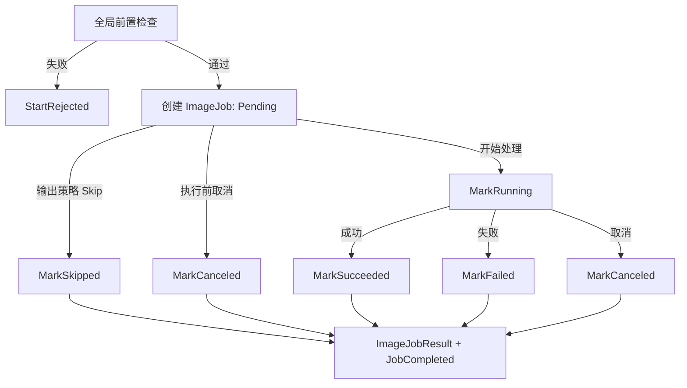

# AtomPix Workflow 任务状态机编排设计

> 文档状态：MVP 业务状态编排基线
>
> 基线时间：2026-08-06
>
> 适用范围：单张压缩、转换、调整尺寸、裁剪，以及批量压缩、转换、调整尺寸 Workflow；批量裁剪不进入 MVP

## 1. 目标与边界

本文档定义 Workflow 如何创建并驱动 Core `ImageJob` / `BatchJob`，如何区分启动拒绝与已接受任务的终态，如何发布进度快照，以及如何把 Core 状态投影为 Desktop 所需的稳定结果语义。

本文档只形成设计约束，不代表当前代码已经完成对应改造。

三层各自拥有不同状态：

| 层 | 状态所有权 | 职责 |
| --- | --- | --- |
| Desktop | 内容加载、草稿、预览、Submitting、页面终态 | 控件、反馈和页面流转。 |
| Workflows | 流程内部阶段和不可变执行上下文 | 在正确时点调用 Core 状态迁移并发布快照。 |
| Core | `ImageJobStatus`、`BatchJobStatus` | 判断业务状态迁移是否合法并维护不变量。 |

强约束：

- Core 是任务业务状态的唯一权威。
- Workflows 不定义与 Core 一一重复的公开任务状态机。
- Workflows 不直接写 `Status`，只能调用 Core 提供的意图型迁移操作。
- Desktop 不直接取得或修改活动的 Core Job。
- `ImageJobResult.Status` 和 `BatchResult.Status` 必须来自对应 Core Job 的最终状态，不能由 Workflow 另行手工决定。
- 已经创建的 Job 必须尽最大努力进入终态，不能因可映射错误永久遗留在 `Pending` 或 `Running`。

## 2. 对 Desktop 的稳定输出语义

Desktop 只依赖三类业务语义：

```text
StartRejected(error)
RunningSnapshot(jobId, jobType, progress, currentInput?)
JobCompleted(result)
```

语义如下：

| 输出 | Core Job 是否存在 | 含义 |
| --- | --- | --- |
| `StartRejected` | 否 | 请求在接受前被拒绝，没有业务任务历史。 |
| `RunningSnapshot` | 是 | Core Job 已接受并处于运行期；快照只读。 |
| `JobCompleted` | 是 | Core Job 已进入终态；结果是不可变快照。 |

Desktop 的 `Submitting` 是 UI 状态，不等同于 Core `Pending`。Workflow 正在做前置检查时，Core Job 尚不存在。

批量 `RunningSnapshot` 的正式 C# 载体是 Workflows 定义的 `BatchExecutionProgress<TItemResult>`；其中复用 Core `BatchProgressSnapshot` 作为汇总，并通过 `Sequence` 与 `ChangedItem` 表达消息顺序和单项变化。单张任务暂不需要持续百分比通知，`RunningSnapshot` 仍只表达已经开始执行。

## 3. Job 创建边界

### 3.1 创建前的全局前置检查

以下检查失败时返回 `StartRejected`，不创建 Core Job：

- 请求结构、必填参数或策略模型不合法。
- 设置无法加载。
- 单张输入在检查时不存在、不可读取、不是有效图片或格式不受支持。
- 单张输入与目标操作的能力组合不受支持。
- 输出策略无效，或整个任务共用的输出目录无法准备。
- `Overwrite` 解析出的计划输出路径命中本次任务的输入路径；返回 `OutputPathConflictsWithInput`。
- 批量输入为空，或批量请求的共享 Profile / OutputPolicy 不合法。
- Workflow 开始前 `CancellationToken` 已取消。

前置检查通过后，Workflow 构造不可变执行上下文，再创建 Core Job。这一时点表示任务已经被接受。

### 3.2 创建后的失败

Core Job 创建之后发生的错误必须形成任务终态，例如：

- Probe 后输入又被删除或变得不可读取。
- 图片处理器读取、编码或写入失败。
- 实际执行时输出目录权限或磁盘状态改变。
- 已接受的批量任务中某个输入自己的检查失败。
- 已接受后收到取消。
- 可映射为 `AtomPixError` 的批量级运行异常。

这些情况返回 `JobCompleted`，而不是回退为 `StartRejected`。

### 3.3 图片资源边界与批量影响范围

单张 Workflow 在创建 `ImageJob` 前使用轻量 Probe 结果和 `IImageProcessor.Capabilities.Resources` 完成资源预检：

- 输入实际字节数超过 `MaxInputFileSizeBytes` 时返回 `StartRejected(InputFileTooLarge)`。
- 输入逻辑宽高或总像素数超限时返回 `StartRejected(ImageDimensionsExceedLimit)`。
- Resize 已解析目标尺寸超过公共或 Resize 专用能力时同样启动拒绝。
- 不允许通过自动缩小、裁剪、降低质量或改变格式绕过资源边界。

批量任务不在输入收集阶段把资源超限项目记入 `BatchInputPlan.SkippedItems`。批次接受并建立父子 Job 后，各项按顺序 Probe 和检查：

- 某项静态尺寸/文件体积超限，或实际处理触发内存、map、像素缓存上限：该 `ImageJob` 进入 `Failed`，发布终态进度并继续下一项。
- 输出卷或公共 Magick 私有缓存位置空间不足：当前项进入 `Failed`，随后使用 `BatchJob.Abort(InsufficientDiskSpace)` 中止批次；已有成功、失败和跳过项保留，剩余 Pending 项不产生伪造结果。
- 用户释放磁盘空间后，“处理未完成项”建立新的普通草稿和新任务，不恢复或修改旧 Job。

静态边界是创建前/单项前检查，Magick 运行上限仍是最后一道防御；Workflow 不能因为前置检查通过就吞掉处理器返回的资源错误。

## 4. 单张任务编排

单张压缩、转换、调整尺寸和裁剪使用同一套状态编排：



推荐顺序：

```text
1. 校验请求。
2. 加载任务需要的设置。
3. Probe 输入，检查格式、多帧和操作能力。
4. 单张纯计算计划输出路径；批量按冻结顺序生成完整 `BatchOutputPlan`。`Overwrite` 命中输入路径或命名格式无效时拒绝，随后再准备公共输出目录。
5. 构造不可变执行上下文。
6. 创建 ImageJob，初始状态为 Pending。
7. 如果策略决定 Skip，直接 MarkSkipped。
8. 如果任务已取消，直接 MarkCanceled。
9. MarkRunning，并发布 RunningSnapshot。
10. 调用对应 IImageProcessor 操作。
11. 根据结果 MarkSucceeded、MarkFailed 或 MarkCanceled。
12. 从 ImageJob 终态和处理统计构造 ImageJobResult。
13. 返回 JobCompleted。
```

图片处理器成功写出有效结果时必须进入 `Succeeded`，文件体积减小、不变或增加都不改变该终态。Workflow 只传递实际输入/输出大小；Core 从成功结果派生中性的体积变化。失败、取消和 Skip 没有实际输出时不得把缺失大小补成 `0`。

`Pending` 直接进入终态的合法场景：

| 迁移 | 场景 |
| --- | --- |
| `Pending -> Skipped` | 输出已存在且策略为 Skip，没有调用图片处理器。 |
| `Pending -> Canceled` | 任务已接受，但调用图片处理器前收到取消。 |
| `Pending -> Failed` | 接受后、真正处理前发生可归属到任务的运行错误。 |

`Running` 只表示已经开始真实图片处理，不表示 Workflow 刚刚收到用户请求。

## 5. 批量任务创建与父子关系

批量全局前置检查通过后，Workflow 一次性冻结输入顺序、共享参数和完整 `BatchOutputPlan`，并创建：

```text
BatchJob: Pending
├─ ImageJob 1: Pending
├─ ImageJob 2: Pending
├─ ImageJob 3: Pending
└─ ...
```

全部子任务在批次开始时创建，不采用“处理到一项再创建一项”的方式。这样可以保证：

- `TotalCount` 和输入顺序稳定。
- 每个输入从开始执行起拥有稳定的 `ImageJobId`。
- 批次运行期间不能添加、删除、换序或修改任务类型及共享参数。
- 进度快照可以稳定引用当前子任务。

创建完成后，Workflow 立即把 `BatchJob` 迁移到 `Running`，再顺序处理各个 `ImageJob`。第一阶段不并行执行，不支持暂停、恢复或原批次续跑。

批量全局前置检查必须在创建父子 Job 前计算每项不考虑磁盘并发变化的计划输出路径。`Overwrite` 下，只要任一输出路径与冻结输入集合中的任意路径相同，就整体 `StartRejected(OutputPathConflictsWithInput)`；不能只比较“该项自己的输入”，也不能先启动其余安全项。`AutoRename` 与 `Skip` 仍按既有文件冲突规则执行。

冻结输入数量大于 1 时，计划使用包含 `{index}` 的实际文件名格式；基础格式缺少该占位符时在末尾派生 `_{index}`。一基序号由冻结输入顺序确定，失败、跳过和取消都不使后续项改号。每个子 Job 从计划取得固定 `OutputPath`，执行期不得重新计算或把前项未使用的名称转交给后项。

## 6. 批量单项编排

每个子任务按输入顺序处理：

```text
ImageJob: Pending
  -> 单项检查失败                 -> Failed
  -> 冻结输出计划决定不处理       -> Skipped
  -> 真正处理前取消               -> Canceled
  -> 开始调用图片处理器           -> Running
       -> 成功                    -> Succeeded
       -> 失败                    -> Failed
       -> 取消                    -> Canceled
```

每个子任务进入终态后，Workflow 必须按顺序完成：

```text
1. 从 Core ImageJob 终态生成 ImageJobResult。
2. 把结果追加到本次 BatchResult 构造上下文。
3. 从终态结果集合派生新的 BatchProgressSnapshot。
4. 发布不可变进度快照。
5. 如果没有取消或批量级中止，继续下一项。
```

单项失败只结束当前 `ImageJob`；批次继续运行。只有明确的批量级错误或取消才能提前终止整个 `BatchJob`。

## 7. 批量取消

取消分为三个时点：

| 时点 | 结果 |
| --- | --- |
| Workflow 开始前已经取消 | `StartRejected(OperationCanceled)`，不创建 Job。 |
| Job 已接受、第一项开始前取消 | `BatchJob.Canceled`，`Items` 可以为空。 |
| 某项运行中取消 | 当前项 `Canceled`；已完成项保留；后续项不开始；父任务 `Canceled`。 |

批量取消后：

- 已完成子任务保持原终态。
- 当前正在执行的子任务先进入 `Canceled`，再结束父任务。
- 尚未开始的子任务保留 `Pending`，不伪造 `ImageJobResult`。
- 不允许存在 `Running` 子任务的终态 `BatchJob`。
- `BatchResult.TotalCount` 保留原始计划数量。
- `BatchResult.CompletedCount = BatchResult.Items.Count`。
- 允许 `TotalCount > CompletedCount`，甚至 `CompletedCount = 0`。
- 原批次不能恢复；再次处理必须创建新的 `BatchJob`。

父任务进入 `Canceled` 后，内部剩余 `Pending` 只表示“计划过但从未开始”，不表示仍可执行。

## 8. 自然完成与终态汇总

批次仍在处理时，父任务始终保持 `Running`。单项统计通过 `BatchProgressSnapshot` 表达，不能把父任务提前改为 `PartiallySucceeded`。

自然遍历完成时不允许存在 `Pending` 或 `Running` 子任务。Workflow 只表达“自然完成”，最终状态由 Core 根据子任务终态汇总：

| 子任务结果 | `BatchJobStatus` |
| --- | --- |
| 全部 `Succeeded` | `Succeeded` |
| `Succeeded` + `Skipped`，无失败 | `Succeeded` |
| 全部 `Skipped` | `Succeeded` |
| `Succeeded` + `Failed` | `PartiallySucceeded` |
| `Succeeded` + `Failed` + `Skipped` | `PartiallySucceeded` |
| `Failed` + `Skipped`，没有成功 | `Failed` |
| 全部 `Failed` | `Failed` |

`Skipped` 是用户输出策略产生的正常结果。MVP 唯一正式分支是目标文件存在且 `OverwritePolicy = Skip`：

```text
Skipped != Failed
Skipped != Canceled
```

因此 `Skipped` 本身不会把批次降级为 `PartiallySucceeded`。UI 必须单独展示跳过数量和原因。

该分支不调用图片处理器，结果保留已经解析出的目标路径，并携带 `OutputFileAlreadyExists` 作为解释信息。添加批量输入时被过滤的 `BatchInputSkip` 没有创建 ImageJob，不属于这里的 Skipped。

自然完成流程中出现任何 `Canceled` 子任务属于不合法组合；一旦有取消，父任务应使用取消流程结束。

## 9. 批量级中止与 Error

有些运行错误不属于单张图片，例如公共输出根目录在批次运行后失效，或批量编排在接受任务后发生可映射的系统错误。Core 需要在父级提供：

```text
BatchJob.Error
BatchResult.Error
```

该错误只表达批量级结束原因，不能替代 `ImageJobResult.Error`。

批量级中止前，Workflow 必须先结束当前 `Running ImageJob`：

- 错误可归属于当前图片时，把当前项迁移为 `Failed`。
- 错误纯属父级编排时，当前项仍必须退出 `Running`；具体使用父级错误的派生错误还是内部中止错误，在实现契约细化时冻结。
- 后续未开始项保持 `Pending`。

Core 根据中止前已经产生的结果决定父级终态：

| 中止时已有结果 | `BatchJobStatus` | `BatchResult.Error` |
| --- | --- | --- |
| 至少一个 `Succeeded` | `PartiallySucceeded` | 必须存在。 |
| 没有 `Succeeded` | `Failed` | 必须存在。 |

`BatchResult.Items` 在 `Canceled` 或携带批量级 Error 的 `Failed` 场景可以为空。例如任务接受后、第一项开始前立即取消：

```text
Status = Canceled
TotalCount = 8
CompletedCount = 0
Items = []
Error = OperationCanceled
```

## 10. Core 意图型迁移接口

本文档不冻结最终方法名，但 Core API 应表达结束原因，而不是允许 Workflow 任意指定终态。概念上使用：

```text
ImageJob.MarkRunning(...)
ImageJob.MarkSucceeded(...)
ImageJob.MarkFailed(...)
ImageJob.MarkCanceled(...)
ImageJob.MarkSkipped(...)

BatchJob.MarkRunning(...)
BatchJob.CompleteFromItems(...)
BatchJob.Cancel(error, ...)
BatchJob.Abort(error, ...)
```

其中：

- `CompleteFromItems` 只处理自然完成，并由 Core 汇总 `Succeeded / PartiallySucceeded / Failed`。
- `Cancel` 固定得到 `Canceled`，且错误必须属于 Cancellation 分类。
- `Abort` 必须携带批量级错误；已有成功项时得到 `PartiallySucceeded`，否则得到 `Failed`。
- Workflow 不调用类似 `Complete(BatchJobStatus status)` 的开放接口自行指定汇总状态。

## 11. 进度快照与事件顺序

进度快照是 Core 数据的只读投影，不是另一套任务状态机。

单张任务推荐顺序：

```text
MarkRunning
-> 发布 RunningSnapshot
-> 处理
-> 迁移终态
-> 发布 JobCompleted
```

单张 `Skipped` 可以从 Desktop `Submitting` 直接进入 `JobCompleted(Skipped)`，不要求虚构 Running 快照。

批量任务推荐顺序：

```text
BatchJob.MarkRunning
-> 发布 completed = 0 的 RunningSnapshot
-> 当前 ImageJob.MarkRunning
-> 发布 currentInput 快照
-> 当前项进入终态
-> 发布 completed + 1 的快照
-> ...
-> BatchJob 进入终态
-> 发布 JobCompleted
```

约束：

- 快照不可变，并通过 `Summary.BatchId` 携带同一 BatchId。
- `Sequence` 从 1 开始严格递增；初始消息在父 Job 进入 Running 后发布，单项消息以冻结输入索引定位。
- `CompletedCount` 单调不减且不能超过 `TotalCount`。
- 成功、失败、跳过、取消数量之和等于 `CompletedCount`。
- Workflow 必须先完成 Core 状态迁移，再发布对应快照。
- Desktop 丢弃不属于当前前台任务或序号早于已消费快照的消息。
- 进度观察者自身的展示错误不得反向修改 Core Job。
- 单项 Running 消息不携带结果；单项终态消息必须携带与状态一致的完整结果。
- 最终 `BatchResult` 是权威结果；任务终态后不再消费迟到的运行消息。
- 第一阶段总进度按完成项目数计算，当前处理项为不确定进度，不表达单张图片内部百分比。

## 12. 结果与错误映射

| 执行结果 | Core 迁移 | Workflow 输出 |
| --- | --- | --- |
| 前置检查失败 | 不创建 Job | `StartRejected` |
| 图片处理成功 | `MarkSucceeded` | `JobCompleted(Succeeded)` |
| 预期业务或技术失败 | `MarkFailed` | `JobCompleted(Failed)` |
| 明确取消 | `MarkCanceled` / `BatchJob.Cancel` | `JobCompleted(Canceled)` |
| 输出策略 Skip | `MarkSkipped` | `JobCompleted(Skipped)` 或批量继续 |
| 批量级中止 | `BatchJob.Abort` | `JobCompleted(Partial/Failed)` |

预期失败使用 `OperationResult` / `AtomPixError` 传播，不依赖异常控制正常业务分支。Core 抛出的非法状态迁移异常表示编排缺陷，不能伪装成普通图片处理失败；实现阶段必须记录诊断并通过测试消除非法调用路径。

## 13. 设计验收与测试基线

后续实现至少覆盖：

- 前置拒绝不创建 Job。
- Job 创建后的所有可映射分支都得到终态。
- 单张 Skip 不进入 Running。
- 单张接受后、执行前取消得到 `Canceled`。
- 批量启动时一次性冻结全部子任务及输入顺序。
- 单项失败后批次继续，父任务仍为 Running。
- 成功与跳过混合得到 `Succeeded`。
- 成功与失败混合得到 `PartiallySucceeded`。
- 失败与跳过混合但没有成功得到 `Failed`。
- 取消优先得到 `Canceled`，不受此前成功数量影响。
- 第一项开始前取消允许空 `BatchResult.Items`。
- 批量中止前已有成功项时得到带父级 Error 的 `PartiallySucceeded`。
- 批量中止前没有成功项时得到带父级 Error 的 `Failed`。
- 终态父任务不存在 Running 子任务。
- 自然完成不存在 Pending 或 Running 子任务。
- 进度快照计数单调且与终态结果一致。

## 14. 批量终态恢复与新任务边界

Core 终态不可逆。第一阶段没有 `Retrying`、恢复原 BatchJob 或把新结果合并回旧 BatchResult 的行为。

Desktop 在提交批量请求时保留不可变 `SubmittedBatchSnapshot`，至少包含任务类型、冻结输入顺序、处理参数、同格式编码策略和输出策略。该快照说明“提交了什么”，`BatchResult` 说明“最终完成了什么”；取消或批量级中止时，未开始项不会出现在 `BatchResult.Items`，因此只靠最终结果无法重建剩余输入。

恢复选择规则：

```text
重试失败项
  = SourceResult.Items 中 Status = Failed 的输入

处理未完成项
  = SourceSnapshot.InputPaths
    - 已经产生 Succeeded 或 Skipped 终态的输入

使用自动重命名处理
  = Status = Skipped
    且 Error.Code = OutputFileAlreadyExists 的输入
```

所有选择保持原提交顺序并形成新的普通 BatchCompressRequest、BatchConvertRequest 或 BatchResizeRequest。默认复制已提交参数，而不是调用默认设置 Workflow 重新解析当前设置；用户在新草稿中确认修改后，以修改后的新快照为准。

恢复动作只构造新草稿，不直接创建 Job。用户再次点击开始并通过前置检查后，Workflow 创建全新的 BatchJob 和 ImageJob，实时进度 Sequence 从 1 重新开始。旧任务、旧结果和旧统计保持只读；第一阶段不要求 Core 保存 `RetrySourceBatchId` 等父子关系，Desktop 可以仅以展示上下文说明新草稿来源。

`StartRejected` 没有 Core Job，不适用上述终态恢复；Desktop 保留原草稿并在原地修正。输入缺失、图片损坏或输出无权限等失败项进入新草稿后可以显示原错误并允许重新定位、移除或修改输出策略，但 Desktop 不另建一套绝对可重试分类，正式校验仍由 Workflow 执行。

## 15. 与其他设计文档的关系

- Core 状态、结果模型和不变量以 [Core 模块设计](../core/overview.md) 为准。
- Workflow 模块职责和用户流程以 [Workflows 模块设计](overview.md) 为准。
- Desktop 如何消费拒绝、快照和终态，以 [Desktop 交互状态设计](../desktop/interaction-state-design.md) 为准。
