# AtomPix MVP UI 原型

> 文档状态：Desktop / UI 原型基线
>
> 基线时间：2026-08-05
>
> 范围：第一阶段 MVP 的桌面信息架构、核心页面、主要状态和底层契约映射

本目录提供 AtomPix 第一阶段 MVP 的中保真桌面 UI 原型。原型采用统一工作台、简体中文、中性灰阶和少量蓝色交互强调，目标是先冻结信息架构和交互语义，再进入 Avalonia / AtomUI 实现与最终品牌视觉设计。

原型是产品与 Desktop 层的设计基线，不改变 Core、Workflows、Imaging 或 Infrastructure 的既有职责。

逐页面的状态定义、控件启用条件、异步竞争规则和恢复动作，以 [Desktop 交互状态设计](../modules/desktop/interaction-state-design.md) 为准；本目录中的状态板是该文档的可视化投影。

## 1. 原型总览

| 原型 | 主要内容 | 关键需求 |
| --- | --- | --- |
| [01 首页 / 空态](01-home-empty.svg) | 统一工作台、打开图片/打开文件夹、最近记录和四项入口 | 进入图片浏览器、拖拽和最近记录 |
| [02 图片浏览](02-image-browser.svg) | 缩略图列表、大图预览、缩放、拍摄信息、色彩配置、当前图片快捷操作 | 四项操作只针对当前图片；不提供搜索和追加图片入口 |
| [03 单张压缩](03-single-compress.svg) | 原图预览、五种模式、自定义质量、拍摄信息策略、输出策略及底部操作区 | Custom 的 1–100 双向输入、Smart 参数只读、尺寸不变、开始压缩；实际体积变化在完成后显示 |
| [04 单张转换](04-single-convert.svg) | 原图预览、JPEG/PNG/WebP 选择、透明背景色、质量和输出摘要 | 单张转换、格式能力、透明度确定性处理；实际体积变化在完成后显示 |
| [05 批量处理](05-batch-processing.svg) | 三类任务、序号文件名、总进度、单项状态及右侧集中操作区 | 只统计成功可比较项的总体体积变化、冻结输出计划、运行期锁定、取消、重试、打开输出目录；MVP 不含批量裁剪 |
| [06 设置](06-settings.svg) | 默认压缩、Custom 质量、转换、透明背景色、同格式编码和公共输出策略 | Custom 模式与质量共同保存、JPEG 默认白色铺底、Resize/Crop 有损质量 90、拍摄信息策略与 ICC 保留、显式保存与失败恢复 |
| [08 错误与边界状态](08-error-and-edge-states.svg) | 损坏图片、多帧、取消、源文件覆盖阻断、设置损坏和写入失败 | 结构化错误、自动重命名恢复、非破坏性失败 |
| [09 单张调整尺寸](09-resize-controls.svg) | 主窗口内容页、Pixel 宽高、保持比例、百分比预设与自定义值 | 左侧同级导航、不裁剪、保留原格式、预计输出尺寸；页面不提供质量控件 |
| [10 单张裁剪](10-crop-image.svg) | 可拖拽选框、精确宽高与位置、比例预设、裁剪摘要 | 独立单张裁剪、选区同步、边界校验、继续调整尺寸 |
| [11 首页与浏览器状态](11-home-and-browser-states.svg) | 打开来源、最近记录抽屉、浏览集合和失效项目 | Loading、来源切换、缺失文件恢复、浏览器当前项约束 |
| [12 单张编辑器状态](12-single-editor-states.svg) | 四类编辑器公共草稿、运行、终态和输出冲突 | 前台锁定、体积增加仍成功并保存、同页结果、冲突策略形成新提交 |
| [13 批量与设置状态](13-batch-and-settings-states.svg) | 批量共享参数/命名草稿、运行、取消、终态及设置保存 | 批量 Custom 共享质量、`{name}/{index}` 编辑、运行快照、Partial 恢复、Dirty 和保存失败 |

原型 03 和 06 为便于展示 Custom 控件而使用“已编辑为 Custom 76”的代表性草稿，不表示工厂默认值；新安装和恢复默认后的压缩模式仍为 Smart。

### 首页 / 空态

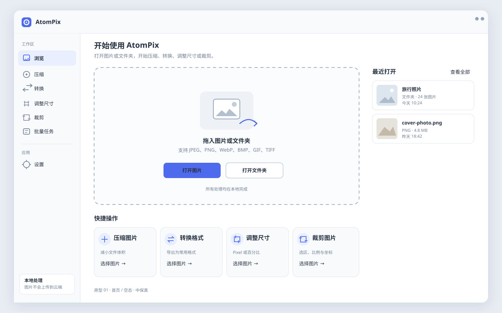

### 图片浏览

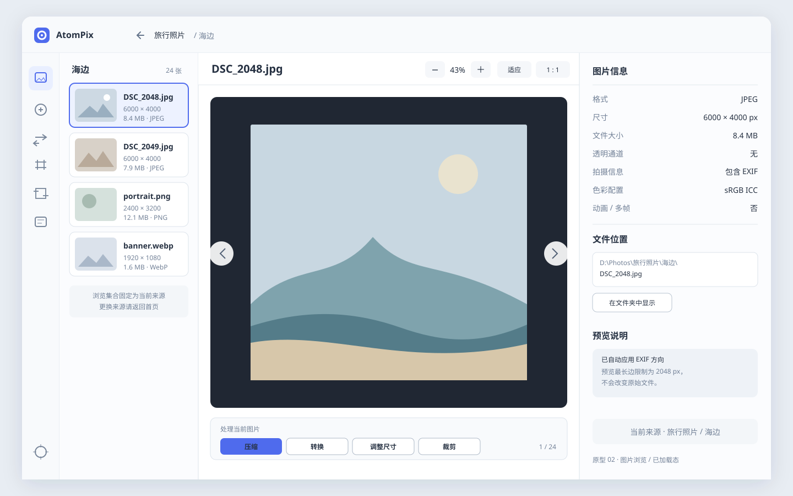

### 单张压缩

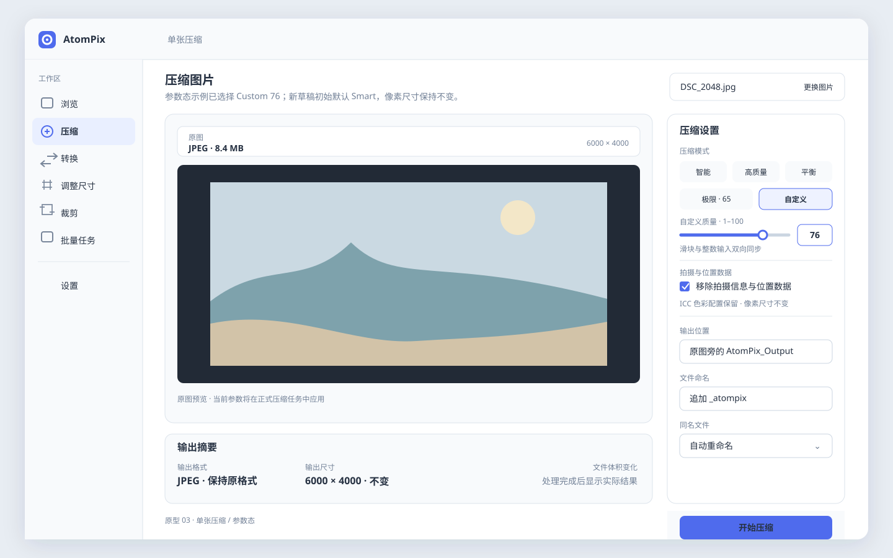

### 单张转换

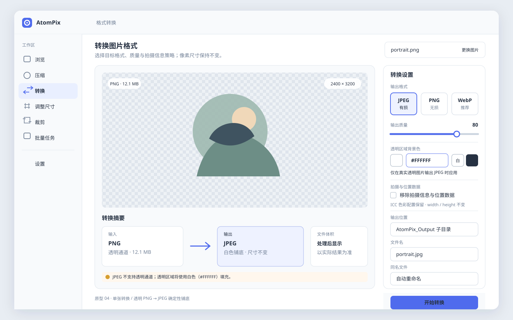

### 批量处理

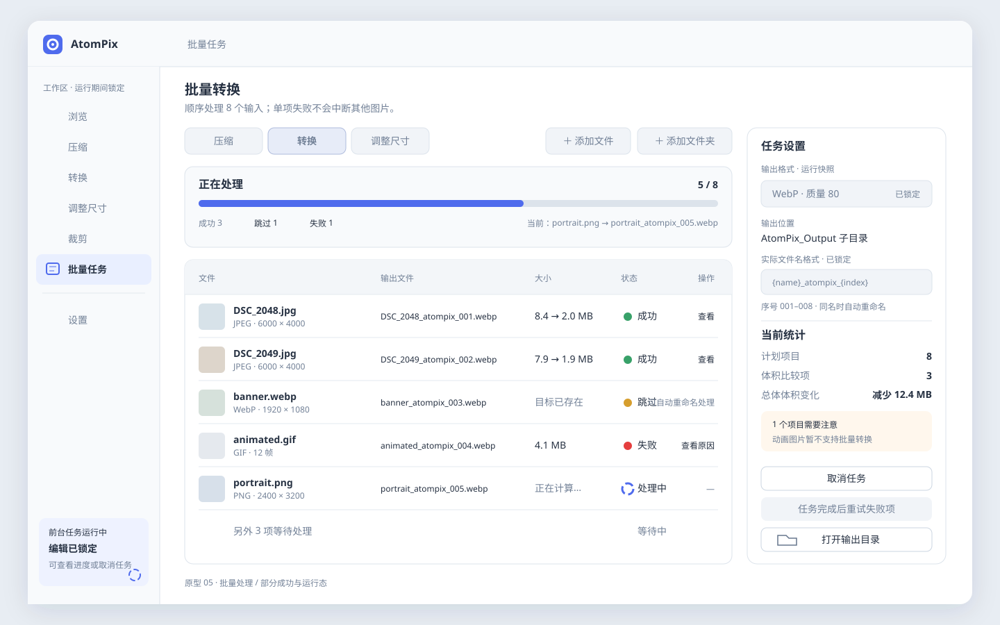

### 设置

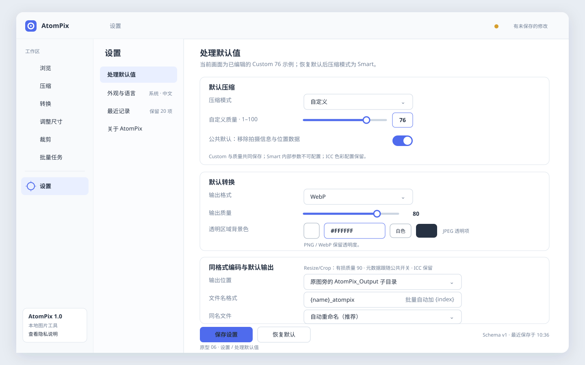

### 错误与边界状态

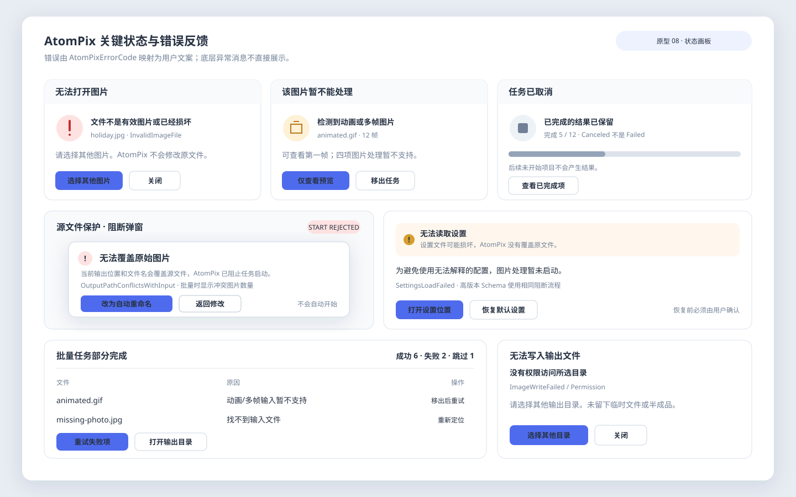

### 单张调整尺寸

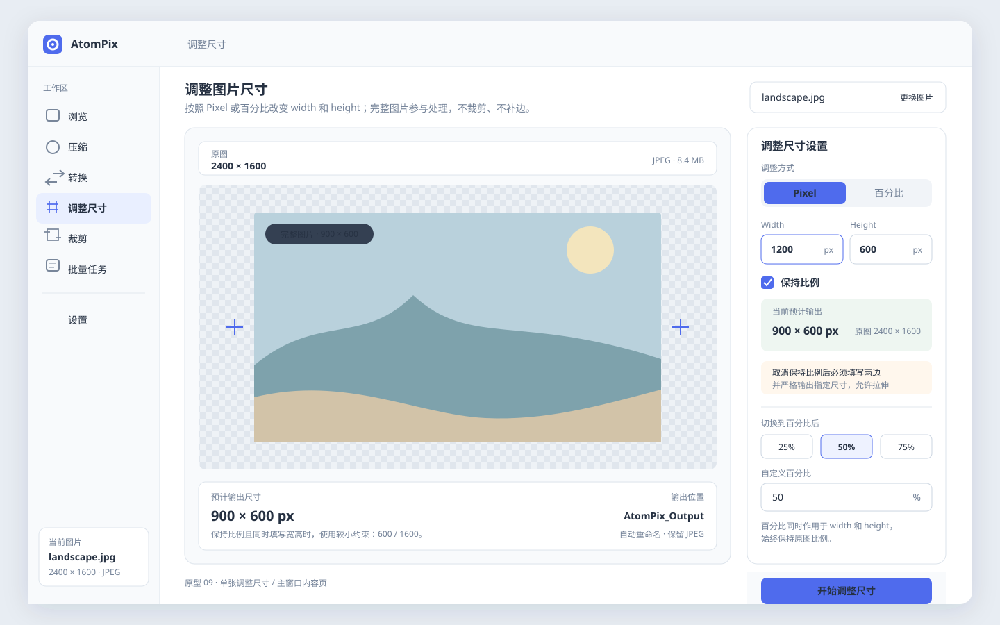

### 单张裁剪

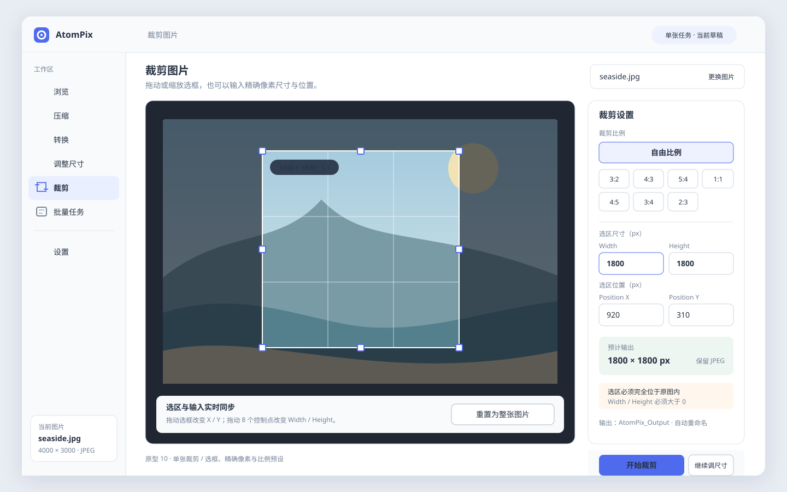

### 首页与图片浏览器状态

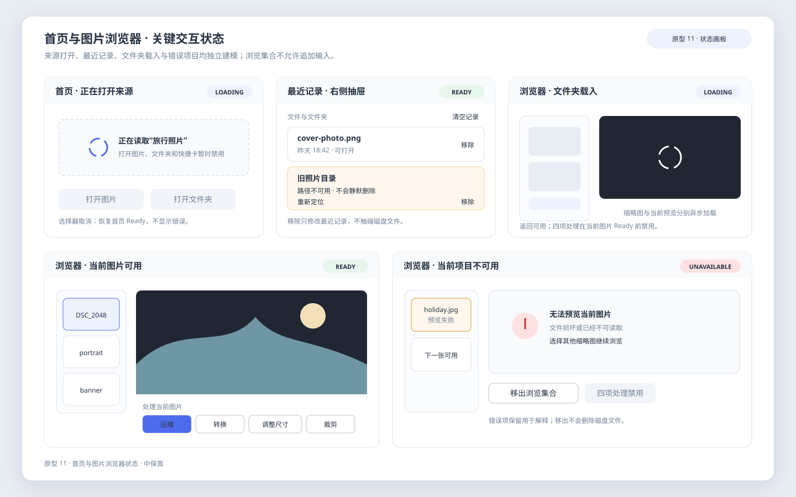

### 四类单张编辑器公共状态

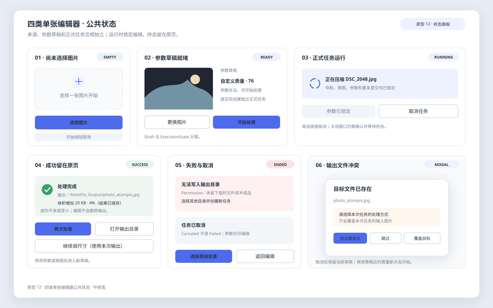

### 批量任务与设置状态

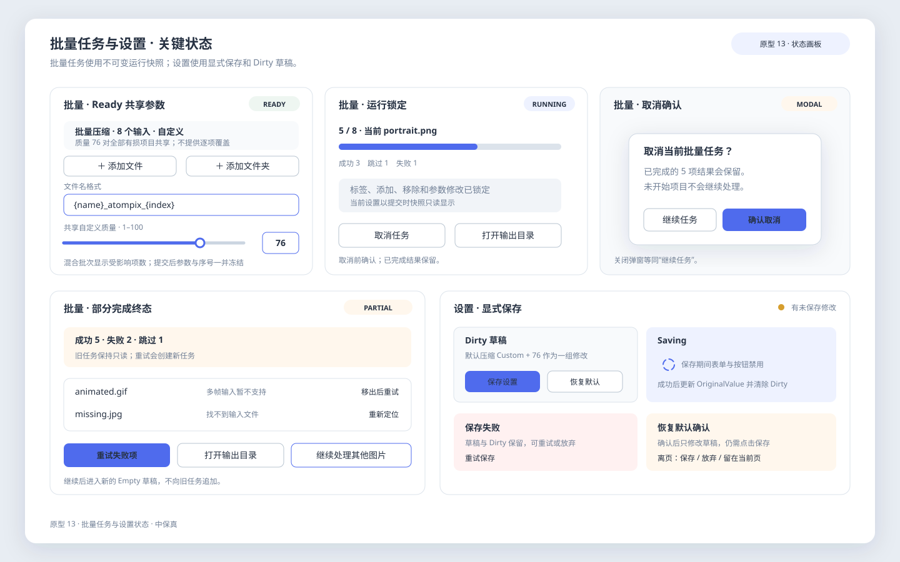

## 2. 信息架构

第一阶段采用单窗口统一工作台：

```text
AtomPix Shell
├─ 浏览
│  ├─ 首页 / 空态
│  └─ 文件夹缩略图 + 当前图片预览
├─ 压缩
│  ├─ 单张压缩
│  └─ 跳转批量压缩
├─ 转换
│  ├─ 单张转换
│  └─ 跳转批量转换
├─ 调整尺寸（Resize）
│  ├─ Pixel / 百分比
│  └─ 跳转批量调整尺寸
├─ 裁剪
│  └─ 单张选框 / 精确像素 / 比例预设
├─ 批量任务
│  ├─ 压缩任务
│  ├─ 转换任务
│  └─ 调整尺寸任务
└─ 设置
   ├─ 处理默认值
   ├─ 外观与语言
   ├─ 最近记录
   └─ 关于
```

全局导航保持稳定，功能页使用“中央内容区 + 右侧参数/信息面板”。图片浏览页为适应大图预览而使用紧凑图标导航，并将缩略图列表、预览画布和图片信息分成三栏。

## 3. 主要用户流程

### 3.1 浏览图片

```text
首页打开图片
  -> 图片浏览器载入单张并设为 CurrentImagePath
首页打开文件夹
  -> OpenFolderWorkflow 建立当前层级、自然排序的轻量浏览集合
  -> Desktop 从首项起按需探测，跳过并保留 Unavailable 项
两条路径
  -> OpenImageWorkflow 探测当前图片
  -> CreatePreviewWorkflow 返回编码后的预览数据
  -> Desktop 展示预览、图片信息和四项单张快捷操作
  -> 点击快捷操作时捕获 CurrentImagePath 并进入对应单张页面
```

浏览文件夹不会创建批量任务。缩略图列表是浏览集合；预览底部的压缩、转换、调整尺寸和裁剪只处理当前图片。批量处理必须进入批量任务页显式添加输入。

### 3.2 压缩、转换、调整尺寸或裁剪

```text
选择图片和参数
  -> Desktop 构造 Workflow Request
  -> Probe 与 Capabilities 预检
  -> 根据 OutputPolicy 解析最终路径
  -> 调用对应的 IImageProcessor 操作
  -> 返回 ImageJobResult
  -> Desktop 展示状态、统计和恢复动作
```

界面不能直接调用 `MagickImageProcessor`、JSON Store 或文件系统实现。预览结果中的 `EncodedBytes` 只能由 Desktop 的框架图片展示适配器转换为 Avalonia 类型；可复用 ViewModel 不直接持有这些类型。

转换透明度采用明确规则：探测同时提供 `HasAlphaChannel` 与 `HasTransparency`，页面只用 `HasTransparency` 驱动产品逻辑。透明图片输出 PNG/WebP 时保留透明区域；输出 JPEG 时使用当前 `TransparencyPolicy.OpaqueBackgroundColor` 铺底，默认白色 `#FFFFFF`。单张页允许通过色块、六位 HEX 以及白/黑快捷项覆盖默认颜色；HEX 非法时禁用开始按钮。输出结果以 `TransparencyProcessingResult` 为准，不能依赖 Magick.NET 默认背景或由 Desktop 自行推断。

`MetadataPolicy.Preserve` 与 `MetadataPolicy.Remove` 是同一个策略字段的两个互斥值，不是两个可同时勾选的开关。页面统一使用“移除拍摄信息与位置数据”复选框映射：勾选为 `Remove`，未勾选为 `Preserve`。这里的策略只管理 EXIF/GPS/IPTC/XMP、注释和内嵌缩略图等隐私或描述性信息；ICC/ICM 色彩配置独立于该策略，在目标格式支持时始终保留。两种策略都会先应用自动方向，随后移除或规范化旧 Orientation，避免输出被再次旋转。图片浏览器分别展示 `HasMetadata` 与 `HasColorProfile`，不能把“有 ICC”归类成“有拍摄信息”。

压缩页必须完整提供 Smart、高质量、平衡、极限和 Custom 五种模式。Custom 选中后显示 `1..100` 的滑块与整数输入框，两者双向同步；空值、非整数或越界会使草稿无效。单张页面只对 JPEG/WebP 等有损输出显示或启用该控件；批量压缩对整个批次使用一个共享 Custom 质量，混合批次说明受影响的有损项目数，全部为无损格式时禁用并说明不使用质量参数。设置页可以保存完整的 `Custom + Quality` 默认值。页面会话切换模式时保留最近合法的 Custom 值，但非 Custom 请求不能提交它。

Smart 只是可选择的内置模式，不提供初始质量、步长、下限、重试次数等配置入口。JPEG 使用 `82 -> 77 -> 72 -> 67 -> 65`，WebP 使用 `80 -> 75 -> 70 -> 65`；采用第一个小于原图的候选，全部未变小时仍保存最小的有效候选。所有模式的有效输出即使未变小也必须保存，页面不提供“仅保留更小结果”选项。成功结果的实际质量来自 Workflow/Imaging 结果，Desktop 不根据模式反推；PNG 等无损输出显示“无损优化”。

单张结果使用 Core 中性的 `SizeDeltaBytes = OutputSizeBytes - InputSizeBytes`。UI 不直接显示正负号：负数显示“减少”，零显示“文件大小未变化”，正数显示“增加”；输出变大仍是成功结果。批量页只汇总 `Succeeded` 且输入、输出大小齐全的项目，显示比较项数和总体方向；Failed、Canceled、Skipped、未开始项不参与。没有可比较项时显示“暂无可比较结果”，不能显示为“变化 0 B”。

第一阶段压缩页和转换页只展示原图预览，不根据参数生成处理后效果预览，也不在正式处理前估算输出文件体积。正式任务成功后再根据实际 `InputSizeBytes / OutputSizeBytes` 展示体积变化。Resize 的预计输出宽高与 Crop 的选区摘要属于确定性本地计算，继续保留。用户命名压缩预设同样暂缓；第一阶段只提供内置压缩模式和一个可持久化的默认压缩配置。

AtomPix 不允许处理结果覆盖本次任务的输入图片。`Overwrite` 解析出的单张计划输出等于输入，或批量任一计划输出命中批次内任意输入时，Workflow 在创建 Job 前返回 `OutputPathConflictsWithInput`；Desktop 显示“无法覆盖原始图片”阻断弹窗。主按钮“改为自动重命名”只更新当前草稿并重新计算摘要，次按钮“返回修改”保留草稿，两者都不自动开始，也不提供继续覆盖入口。`AutoRename` 和 `Skip` 分别沿用新名称与正常 Skipped 语义。

四项单张功能在主导航中同级呈现；批量任务页只保留压缩、转换、调整尺寸。压缩不改变像素尺寸，转换不隐式调整尺寸；调整尺寸不裁剪，裁剪也不会隐式 Resize。裁剪完成后可以显示“继续调整尺寸”快捷动作，但这只是进入另一个独立任务。

调整尺寸保持输入格式。其页面不展示质量控件；Desktop 在提交时把公共 `SameFormatEncodingPolicy` 快照写入 `ResizeImageRequest`，有损质量初始默认 `90`，拍摄信息策略取设置页当前值，ICC 色彩配置仍独立保留。运行中的任务不受后续设置修改影响。

第一阶段 Resize/Crop 的原格式处理范围固定为 JPEG、PNG、BMP 和单帧 WebP。GIF、多帧 WebP 与 TIFF 暂不进入这两项处理范围；浏览器和单张页应根据能力禁用开始入口并提示先转换。

### 3.3 裁剪交互

```text
载入并自动校正方向后的图片
  -> 建立左上角为原点的像素坐标系
  -> 拖动/缩放选框，或输入 Width、Height、Position X、Position Y
  -> 选框与数值双向同步
  -> 校验 Width/Height > 0 且整个矩形位于图片内
  -> CropImageWorkflow 保留原格式并按 OutputPolicy 写出
```

比例预设锁定选框比例，包含 `3:2`、`4:3`、`5:4`、`1:1`、`4:5`、`3:4`、`2:3`。自由比例允许独立改变宽高。

### 3.4 批量处理

```text
添加文件（允许多选）或添加文件夹；两个入口可以反复、交替使用
  -> AppendBatchInputsWorkflow 枚举、过滤、规范化并去重
  -> 返回完整 BatchInputPlan 和新增/跳过统计
  -> Desktop 追加显示有效项目并反馈跳过原因
  -> 用户确认任务类型、参数和输出策略
  -> 顺序处理每个项目
  -> 单项失败保留错误并继续其他项目
  -> 汇总 BatchResult 和 FinalProgress
  -> 完成后允许把失败项或未完成项建立为新的可编辑草稿
```

第一阶段不设计 `Paused`、`Retrying` 状态。“重试失败项”只从 `BatchResult.Items` 提取 Failed；取消或批量级中止后的“处理未完成项”还会根据提交快照补回 Canceled 和未开始输入。二者都先建立新 Ready 草稿，用户再次点击开始后才创建新任务，不修改已结束任务。

执行期 `Skipped` 在 MVP 中只表示目标文件已存在且覆盖策略选择 Skip，它不是失败。对应行级动作使用“使用自动重命名处理”，以 AutoRename 建立新草稿。批量输入收集阶段因重复、不支持、缺失或不可读产生的 `BatchInputPlan.SkippedItems` 没有创建 Job，不显示为执行期 Skipped 状态。

批量页只呈现压缩、转换、调整尺寸三个任务标签。裁剪仍是主导航中的同级单张功能，但 MVP 不在批量页显示裁剪入口。

批量 Resize 在右侧任务设置中只编辑一套共享规则，不为每张图片分别输入参数。Percentage 和保持比例模式会根据各自原图得到不同预计尺寸；关闭保持比例并填写 Width / Height 时，所有项目强制输出为相同尺寸，界面持续提示可能变形。批量列表逐项展示可获得的预计尺寸，第一阶段不提供 Resize 逐项覆盖。

批量转换也只编辑一套共享透明背景色：目标 JPEG 且至少一个有效输入真实透明时显示颜色控件和受影响数量；目标 PNG/WebP 或没有透明项时隐藏。每项是否实际铺底由自己的 `HasTransparency` 决定，运行和恢复草稿都使用已提交的颜色快照。

批量页通过选择任务类型并添加文件或文件夹直接形成当前批量作业。取消、重试失败项、处理未完成项和打开输出目录统一放在右侧“任务设置”底部，并根据运行/终态条件显示；Skipped 的自动重命名处理是对应行的恢复动作。

批量输入列表是累积列表：文件选择器允许多选，文件与文件夹可以从不同位置反复追加。重复路径按规范化绝对路径跳过，文件夹第一阶段只扫描当前层级；每次追加显示新增、重复、不支持和不可读取数量。列表移除操作不影响源文件。

批量数量大于 1 时，文件名格式必须包含稳定序号。默认实际格式为 `{name}_atompix_{index}`；用户输入纯文本 `holiday` 时自动派生为 `holiday_{index}`。右侧草稿区提供 `{name}` / `{index}` 插入项、实际生效格式和输出示例；扩展名由任务格式决定。序号按提交时冻结顺序从 `001` 开始，失败、跳过和取消不改变后续名称。运行页只读展示 Workflow 返回的 `BatchOutputPlan`，不在 Desktop 内重新命名。

批量输入验收至少覆盖：

1. 一次选择多张图片并保持文件选择器返回顺序。
2. 连续添加来自不同目录或磁盘的文件，新增项目追加到列表末尾。
3. 先添加文件、再添加文件夹，或反向操作，最终得到同一个累积输入列表。
4. 同一文件通过不同入口重复添加时只保留一项，并显示重复计数。
5. 文件夹中的不支持文件、缺失文件和不可读取文件被跳过并显示分类统计。
6. 从列表移除项目不会删除磁盘文件，移除后可以再次添加。
7. 首页“打开文件夹”只进入浏览页，不创建或追加批量任务。

### 3.5 Desktop 状态投影

Desktop 不使用一个全局状态枚举表达所有页面行为。页面内容加载、参数草稿、预览生成和任务执行分别建模，再由组合状态派生控件的 `CanExecute`、`Visible`、`Loading` 与恢复动作。

第一阶段采用单前台任务模型：任务运行期间锁定主导航、输入替换和参数编辑，只允许查看进度与取消。单张任务结束后在原页面展示结果，修改参数会回到草稿并保留旧结果只读；批量任务结束后冻结该次任务快照，继续处理其他图片时创建新的批量草稿。设置页采用显式保存，重置默认值只修改草稿，不自动写入。

完整状态表和页面流转图见 [Desktop 交互状态设计](../modules/desktop/interaction-state-design.md)，对应可视稿为 11–13 状态板。

## 4. 页面与契约映射

| UI 行为 | Workflow / 契约 | Desktop 职责 |
| --- | --- | --- |
| 打开单张图片 | `OpenImageWorkflow` | 文件选择、`LocalPath` 转换、结果展示 |
| 打开文件夹 | `OpenFolderWorkflow` + `BrowserImageCandidate`（Headless 已实现，Desktop 首轮已接入） | 目录选择、集合代次、首个有效项选择和空态投影；不创建批量任务 |
| 创建预览 | `CreatePreviewWorkflow` | 框架图片展示适配器把 `EncodedBytes` 转为 Avalonia `Bitmap`，ViewModel 保持框架无关 |
| 浏览器四项快捷操作 | 四个单张 Workflow | 捕获 `CurrentImagePath` 并导航；不传入缩略图列表或文件夹 |
| 追加批量输入 | `AppendBatchInputsWorkflow` + `BatchInputPlan` | 多选文件/选择文件夹、提交已有列表、展示追加与跳过统计；Desktop 已接入多次、混合来源追加 |
| 单张压缩 | `CompressImageWorkflow` 或默认设置入口 | 表单状态、请求构造、结果统计 |
| 单张转换 | `ConvertImageWorkflow`、`ConversionProfile.TransparencyPolicy`、`ConvertImageResult.Transparency` | 格式控件、真实透明判定、条件背景色、结果统计 |
| Pixel / 百分比调整尺寸 | `ResizeImageWorkflow` + `ResizePolicy` + `SameFormatEncodingPolicy`（Headless 与 Desktop 首轮均已实现） | 宽高联动、保持比例、预计尺寸、公共编码策略快照和输入校验 |
| 单张裁剪 | `CropImageWorkflow` + `CropRectangle` + `SameFormatEncodingPolicy` | Desktop 已接入比例约束选框；最终提交确定矩形、编码策略快照、双向同步和边界校验 |
| 三类批量任务 | `BatchCompressWorkflow` / `BatchConvertWorkflow` / `BatchResizeWorkflow` + `BatchExecutionProgress<TItemResult>` | 标签切换、共享规则、逐项预计/实时状态、序号防乱序、取消和终态校正；MVP 不定义 `BatchCropWorkflow` |
| 批量文件名格式 | `OutputNamingPolicy` + `BatchOutputPlan` | `{name}` / `{index}` 编辑、实际格式提示、名称示例和运行期只读快照 |
| 加载/保存设置 | `LoadSettingsWorkflow` / `SaveSettingsWorkflow` | 表单与 `AppSettings` 互转 |
| 最近记录 | `LoadRecentItemsWorkflow` / `AddRecentItemWorkflow` / `RemoveRecentItemWorkflow` / `ClearRecentItemsWorkflow` 及最近记录端口 | 成功打开后显式写入；首页预览、Drawer 全量列表、打开、移除和确认清空 |
| 输出冲突 | `OutputPolicy` | 采集 Skip / Overwrite / AutoRename 选项 |
| 错误提示 | `AtomPixErrorCode` | 本地化文案、严重程度和恢复动作 |
| 页面交互状态 | Workflow 启动结果、运行快照和任务终态 | 组合正交状态并派生控件可用性、加载反馈和恢复动作 |

## 5. AtomUI 控件实现基线

01–13 原型到 AtomUI 公开组件、可选包、状态反馈和必要自定义控件的完整映射，以 [AtomUI 组件映射与实现基线](../modules/desktop/atomui-component-mapping.md) 为准。本目录继续冻结布局和可见交互，不再维护一份容易漂移的平行组件清单。

当前关键选型是：

- Shell 使用 AtomUI `Window` / `WindowTitleBar`、`NavMenu`、`Splitter` 和 `ScrollViewer`。
- 参数面板使用 `Form`、`Segmented`、`LineEdit`、`NumericUpDown`、`Slider`、`Select`、`CheckBox` 与 ColorPicker 独立包。
- 禁止使用 AtomUI DataGrid 包；批量列表使用主桌面包中的虚拟化 `ListView`，配合静态表头和五列行模板；总进度使用 `ProgressBar`，当前 Running 行使用 `Spin`。
- 页面反馈统一使用 `Skeleton`、`Empty`、`Alert`、`Result`、`Dialog`/`MessageBox`、`Message`、`Tag` 和 `Tooltip`。
- 主图片视口与裁剪画布是领域特有能力，使用很薄的 AtomPix 自定义控件；AtomUI `ImagePreviewer` 只用于结果/大图查看。
- AtomUI `Upload` 不作为批量输入真源，因为目录枚举、格式判断、规范化和去重必须保留在 Workflow。

批量表格必须验证容器回收。图片预览区应异步解码并及时释放旧 Bitmap，避免切换大图时累积内存。

## 6. 视觉与布局基线

- 设计画布：`1440 × 900`，内容模拟常规桌面窗口。
- 应用窗口：外边距 40 px，圆角仅代表原型容器，不要求实际窗口使用相同圆角。
- 展开导航宽度：190 px；紧凑导航宽度：68 px。
- 页面主体：24–36 px 外边距；卡片间距 16–20 px。
- 控件高度：常规输入 38–44 px，主按钮 38–46 px。
- 主色：`#4F6BED`，只用于当前导航、主操作、焦点和选中态。
- 成功：绿色；警告/跳过：琥珀色；失败：红色；取消：中性灰。
- 字体采用 AtomUI 注册字体与平台中文 fallback，不包含网络字体；最终排版以主题 Token 和本地化验收为准。

这些值用于实现初始布局和设计讨论，不是最终品牌视觉规范。正式 UI 应继续补充暗色主题、缩放和本地化长度验证；屏幕阅读器与全页面纯键盘操作不属于当前版本需求。

## 7. 错误与恢复原则

- `OperationCanceled` 是轻量状态，不显示为严重错误。
- 损坏图片优先展示 `InvalidImageFile`，不改写为笼统的压缩或转换失败。
- 多帧图片可展示第一帧预览，但四类处理入口应明确说明第一阶段暂不支持。
- 设置损坏或高版本 Schema 会阻断默认设置驱动的处理；未经用户确认不得覆盖原文件。
- 写入失败应说明没有留下临时文件或半成品。
- `AtomPixError.Message` 是诊断默认信息；最终用户文案根据 `AtomPixErrorCode` 本地化。

## 8. 当前施工状态

以下条目记录截至 2026-08-07 的正式契约与 Desktop 第一阶段施工状态：

1. **文件夹浏览**：`OpenFolderWorkflow`、当前层级目录枚举、自然排序和按需探测已实现；Desktop 已接入 Picker、浏览集合、首个有效项、当前预览、代次取消和 Bitmap 释放。
2. **批量输入计划**：`AppendBatchInputsWorkflow`、规范化去重、顺序保持、多次文件/目录追加和结构化跳过原因已实现；Desktop 列表复用该计划，不自行枚举或去重。
3. **实时批量进度**：三类批量 Workflow 提供带单调序号、冻结 `BatchOutputPlan`、运行中单项和终态校正的 `IProgress<BatchExecutionProgress<TItemResult>>`；Desktop 已实现 UI 线程投影、防乱序和权威终态回填。
4. **终态恢复**：Failed、Canceled、Skipped、未启动项和权威终态结果已稳定；Desktop 已实现失败项重试、未完成项继续和 Skipped 改用 AutoRename 后形成新草稿，旧任务快照保持只读。
5. **Desktop 系统交互适配**：文件/目录选择和打开输出目录均属于 Desktop，不进入 Core、Workflow 或 Imaging。框架无关 Picker/Launcher 接口及 Avalonia 实现已经落地；用户取消为正常无操作，选择成功后才把路径交给对应 Workflow。
6. **透明图片转换策略**：`RgbColor`、`TransparencyPolicy`、透明探测、确定性铺底/保留和专用结果包装已在 Core、Imaging、Workflow 与 Desktop 落地；背景色只在真实透明图片转 JPEG 时生效并展示结果。
7. **MetadataPolicy**：`Preserve / Remove`、ICC 独立保留、Orientation 规范化以及元数据/色彩配置分离已在 Magick 与契约测试中落地。
8. **源文件覆盖保护**：单张、批量冻结输入集合和 Imaging 防御性拒绝已实现；Desktop 按错误码显示阻断弹窗，AutoRename 只修改草稿且不自动重提。
9. **批量文件名格式**：`CustomPattern`、`{name}/{index}`、三位序号、自动补序号和冻结 `BatchOutputPlan` 已实现；Desktop 提供快捷插入、实际生效格式、冲突提示和输出示例。
11. **Resize / Crop**：独立 Core、Workflow 与 Magick 契约均已实现并覆盖真实像素输出；Desktop 两个内容页、Resize Pixel/百分比草稿、保持比例、预计尺寸，以及 Crop 画布、比例、精确坐标、执行/取消与结果均已落地。
12. **Custom / Smart 压缩**：五种模式、确定性候选算法与 `AppliedQuality` 已贯通；Desktop 提供模式、Custom 质量、Metadata 选项和实际质量展示，不提供首阶段已延期的预估体积/效果或预设入口。
13. **中性体积变化**：`SizeDeltaBytes / SizeDeltaRatio / FileSizeChangeKind` 与只统计可比较成功项的批量口径已替换旧 `Saved*` 实现。
14. **图片资源保护**：公共能力、Workflow 静态预检、Magick Ping 与进程运行上限、批量继续/磁盘不足中止已实现；16MP 并发预览、浏览器有界缓存和磁盘/权限故障注入已进入自动门禁。物理资源耗尽与真实用户超大图片集仍作为外部发布验收执行。
15. **诊断与本地日志**：OperationId / DiagnosticId、本地 JSON Lines 滚动、路径脱敏、故障隔离、Workflow/Magick 作用域、Desktop 全局错误边界与复制诊断编号均已实现。
16. **压缩格式隔离**：Compress 已强制保持输入格式并返回输入/输出格式，跨格式只进入 Convert。
17. **输出目录所有权**：Workflow 已在 Job 前准备目录；Magick 只接受既有目录并保持同目录原子提交。

实现某个 Desktop 页面前，所有会影响该页面请求、状态或恢复动作的正式目标契约必须先实现或提供等价适配。首轮至少包括文件夹浏览、批量输入、实时批量进度、独立 Resize/Crop、三类批量处理、冻结输出计划、透明度/元数据策略、压缩格式隔离、输出目录所有权、资源保护和诊断边界。

## 9. 裁剪参考与 AtomPix 取舍

本轮业务设计只引用 iLoveIMG 官方资料：

- [Crop IMAGE 官方页面](https://www.iloveimg.com/crop-image)公开了 `Width (px)`、`Height (px)`、`Position X (px)`、`Position Y (px)` 四个精确输入，并允许选择或拖入图片。
- [iLoveIMG 帮助文档](https://www.iloveimg.com/help/documentation)说明单张裁剪可拖动、缩放选框，也提供批量裁剪参考；AtomPix 只采用其单张交互启发，MVP 明确暂缓批量裁剪。
- [iLoveAPI Crop 指南](https://www.iloveapi.com/docs/image-guides/crop)定义了宽高与 `x/y` 原点的裁剪矩形语义。

因此 AtomPix 直接采用“可视选框 + 精确像素 + 比例预设”的单张业务骨架。自由比例、重置整图、输出摘要、边界错误、公共输出策略和裁剪后继续调整尺寸属于 AtomPix 为桌面体验补充的设计判断；批量时“居中最大裁剪并允许逐项调整”只保留为后续备忘。

当前会话的应用内浏览器运行时初始化失败，未能完成真实上传后的交互回放；以上外部行为均由官方页面、帮助文档、教程和 API 指南交叉确认，没有把未观察到的交互当作已验证事实。

## 10. 范围边界

本轮原型不包含：

- 滤镜、水印、画笔、图层等编辑器能力。调整尺寸与裁剪属于 MVP，但保持为两个独立功能。
- 用户命名压缩预设及其保存、覆盖、重命名和删除管理。
- 压缩或转换参数驱动的处理后效果预览，以及正式处理前的输出文件体积估算。
- GIF/WebP/TIFF 动画或多帧压缩、转换、调整尺寸与裁剪。
- HEIC、AVIF、PDF、PSD、AI、视频等格式。
- 账号、云同步和插件系统。
- 移动端、Web 端或响应式布局。
- 最终品牌 Logo、插画、动效和深色主题视觉稿。

产品范围以 [MVP 功能范围](../product/mvp-scope.md) 为准；模块边界以 [Desktop 模块设计](../modules/desktop/overview.md) 和 [顶层架构](../architecture/overview.md) 为准。
